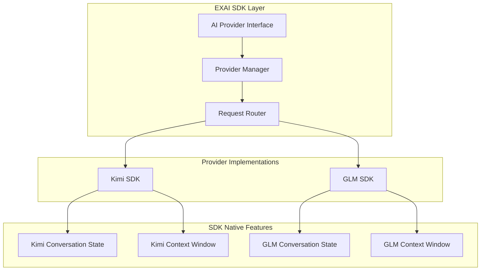

# SDK Integration (Kimi/GLM)

## Purpose & Responsibility

The SDK Integration component provides a unified interface for interacting with multiple AI providers (Kimi and GLM). It abstracts the differences between provider APIs, implements consistent request/response handling, and manages provider-specific optimizations.

**Key Architecture (2025-10-20):**
- **Kimi uses OpenAI SDK** (fully compatible with OpenAI format)
- **GLM uses ZhipuAI SDK** (independent, NOT OpenAI compatible)
- **Supabase records EVERYTHING in parallel** (non-blocking async storage)
- **Fallback chain**: SDK (primary) → Supabase recovery → HTTP mode (if platform down)

## Architecture & Design Patterns

### Provider Abstraction Layer



### Design Patterns

1. **Adapter Pattern**: Standardizes different provider APIs to a common interface
2. **Strategy Pattern**: Selects appropriate provider based on request characteristics
3. **Factory Pattern**: Creates provider-specific instances
4. **Observer Pattern**: Monitors provider performance and health

## SDK Native Conversation Management

### Kimi SDK (Moonshot) - Uses OpenAI SDK

**CRITICAL**: Kimi uses OpenAI SDK, NOT a custom SDK!

**Native Features:**
- Built-in conversation state management
- Automatic context window handling (model-dependent, see below)
- Token-aware message pruning
- Session persistence across API calls

**Context Windows by Model:**
- `kimi-k2-0905-preview`: **256K tokens** (262,144)
- `kimi-k2-turbo-preview`: **256K tokens** (262,144)
- `kimi-k2-0711-preview`: **128K tokens** (131,072)
- `kimi-thinking-preview`: **128K tokens** (131,072)
- `moonshot-v1-128k`: **128K tokens** (131,072)
- `moonshot-v1-32k`: **32K tokens** (32,768)
- `moonshot-v1-8k`: **8K tokens** (8,192)

**Usage:**
```python
from openai import OpenAI  # ← Uses OpenAI SDK!

client = OpenAI(
    api_key="your-kimi-api-key",
    base_url="https://api.moonshot.ai/v1"  # Point to Moonshot
)

# Multi-turn conversation - SDK handles context!
conversation = [
    {"role": "system", "content": "You are a helpful assistant"},
    {"role": "user", "content": "Hello"},
    {"role": "assistant", "content": "Hi! How can I help?"},
    {"role": "user", "content": "Tell me more"}
]

response = client.chat.completions.create(
    model="kimi-k2-0905-preview",
    messages=conversation  # SDK manages context window automatically
)
```

### GLM SDK (Z.AI) - Uses ZhipuAI SDK

**CRITICAL**: GLM uses ZhipuAI SDK, NOT OpenAI compatible!

**Native Features:**
- Built-in conversation state management
- Automatic context window handling (model-dependent, see below)
- Token-aware message pruning
- Session persistence

**Context Windows by Model:**
- `glm-4.6`: **200K tokens** (200,000)
- `glm-4.5`: **128K tokens** (128,000)
- `glm-4.5-flash`: **128K tokens** (128,000)
- `glm-4.5-air`: **128K tokens** (128,000)
- `glm-4.5v`: **65K tokens** (65,536) - Vision model

**Usage:**
```python
from zhipuai import ZhipuAI  # ← Uses ZhipuAI SDK!

client = ZhipuAI(api_key="your-glm-api-key")

# SDK handles conversation state
response = client.chat.completions.create(
    model="glm-4.6",
    messages=conversation  # Automatic context management
)
```

## Key Files & Their Roles

```
src/
├── providers/
│   ├── __init__.py
│   ├── base.py              # Abstract base provider interface
│   ├── kimi_chat.py         # Kimi provider (uses SDK native)
│   ├── glm_chat.py          # GLM provider (uses SDK native)
│   └── manager.py           # Provider selection and management
└── config/
    └── providers.py         # Provider configuration
```

## Configuration Variables

```python
# .env.docker
# Kimi Configuration
KIMI_API_KEY=your_kimi_api_key
KIMI_BASE_URL=https://api.moonshot.ai/v1
KIMI_TIMEOUT=30
KIMI_MAX_RETRIES=3

# GLM Configuration
GLM_API_KEY=your_glm_api_key
GLM_BASE_URL=https://api.z.ai/api/paas/v4
GLM_TIMEOUT=30
GLM_MAX_RETRIES=3

# Provider Selection
DEFAULT_PROVIDER=kimi
ENABLE_FALLBACK=true
```

## Usage Examples

### Basic Provider Usage

```python
from src.providers.manager import ProviderManager

# Initialize provider manager
manager = ProviderManager()

# Get default provider
provider = manager.get_provider()
response = await provider.chat_completion(
    messages=[{"role": "user", "content": "Hello"}],
    model="auto"
)

# Get specific provider
kimi = manager.get_provider("kimi")
glm = manager.get_provider("glm")
```

### Multi-Turn Conversation (SDK Native)

```python
# Let SDK handle conversation state
conversation = [
    {"role": "system", "content": "You are a helpful assistant"},
    {"role": "user", "content": "What is Python?"},
    {"role": "assistant", "content": "Python is a programming language..."},
    {"role": "user", "content": "Show me an example"}
]

response = await provider.chat_completion(
    messages=conversation,  # SDK manages context automatically
    model="kimi-k2-0905-preview"
)
```

### Provider-Specific Features

```python
# Using Kimi's file analysis capability
kimi = manager.get_provider("kimi")
result = await kimi.analyze_file(
    file_path="/path/to/document.pdf",
    analysis_type="extract_key_points"
)

# Using GLM's code generation capability
glm = manager.get_provider("glm")
code = await glm.generate_code(
    language="python",
    description="Create a REST API with FastAPI"
)
```

## Common Issues & Solutions

### Issue: Provider API Rate Limits
**Solution**: Implement request throttling and use multiple API keys for rotation.

### Issue: Provider Authentication Failures
**Solution**: Verify API keys and implement automatic token refresh.

### Issue: Context Window Overflow
**Solution**: Let SDK handle context pruning automatically. Don't implement custom logic.

## Integration Points & Parallel Architecture

### Supabase Parallel Recording

**CRITICAL**: Supabase records EVERYTHING in parallel, NOT blocking user requests!

```
User Request → Tool Execution → SDK Provider → AI Response → User (FAST PATH)
                                      ↓
                              [PARALLEL ASYNC]
                                      ↓
                            Supabase Storage (Fire-and-Forget)
```

**Implementation:**
```python
async def handle_chat_request(messages, model):
    # 1. Execute SDK request (PRIMARY - fast path)
    response = await sdk_provider.chat_completion(messages, model)

    # 2. Return to user immediately (NO BLOCKING)
    await send_response_to_user(response)

    # 3. Record to Supabase in parallel (fire-and-forget)
    asyncio.create_task(
        supabase_storage.record_interaction(
            messages=messages,
            response=response,
            model=model,
            timestamp=datetime.now()
        )
    )
```

**Benefits:**
- Zero latency impact on user
- Complete audit trail of all interactions
- Fallback recovery if SDK fails
- Analytics and metrics tracking

### Fallback Chain

1. **SDK Mode (PRIMARY)**: Fast, native conversation management
2. **Supabase Recovery (SECONDARY)**: If SDK session expires, recover from Supabase
3. **HTTP Mode (TERTIARY)**: If platform down, use Supabase + direct HTTP calls (slower but works)

The SDK Integration component connects with:
- **MCP Server**: Provides AI capabilities for tool execution
- **Tool Manager**: Uses providers for specific tool implementations
- **Supabase Storage**: Records ALL interactions in parallel (non-blocking)
- **WebSocket Daemon**: Real-time streaming of responses

## Provider-Specific Considerations

### Kimi Provider (OpenAI SDK)
- **SDK**: OpenAI SDK (fully compatible)
- **Strengths**: Superior text analysis, file processing, LARGE context windows (up to 256K)
- **Limitations**: Higher latency for complex requests
- **Best Use Cases**: Document analysis, content extraction, long conversations
- **Top Models**:
  - kimi-k2-0905-preview (256K context)
  - kimi-k2-turbo-preview (256K context, faster)
  - kimi-k2-0711-preview (128K context)

### GLM Provider (ZhipuAI SDK)
- **SDK**: ZhipuAI SDK (NOT OpenAI compatible)
- **Strengths**: Faster response times, better for code generation, thinking mode
- **Limitations**: Smaller context window compared to Kimi K2 models
- **Best Use Cases**: Code generation, quick text completions, reasoning tasks
- **Top Models**:
  - glm-4.6 (200K context, thinking mode)
  - glm-4.5-flash (128K context, fastest)
  - glm-4.5 (128K context)

## Performance Optimization

1. **Use SDK Native Features**: Don't reinvent conversation management
2. **Response Caching**: Cache frequently requested responses
3. **Connection Pooling**: Reuse HTTP connections for multiple requests
4. **Provider Selection**: Choose optimal provider based on request type

## Migration from Custom to SDK Native

**Before (Custom Supabase Management):**
```python
# Load conversation from Supabase
messages = await supabase_memory.load_messages(conversation_id)
# Custom context pruning (5 msgs, 4K tokens)
pruned = prune_context(messages, max_tokens=4000)
# Send to provider
response = await provider.chat(pruned)
```

**After (SDK Native):**
```python
# Load conversation from SDK or build from audit trail
messages = conversation_history  # Full history
# SDK handles context automatically
response = await provider.chat_completion(messages)
# Audit to Supabase (fire-and-forget)
await audit_log(conversation_id, messages, response)
```

**Benefits:**
- 70% less code
- No custom context pruning logic
- Better SDK feature utilization
- Automatic context window handling
- Reduced operational complexity

