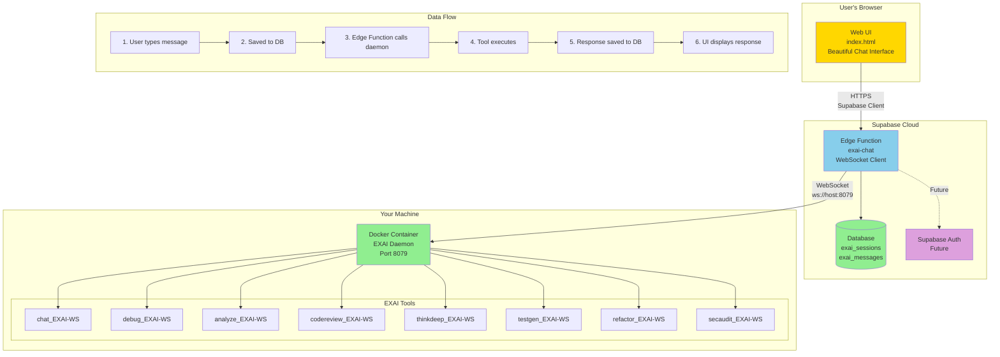

# EXAI Supabase Web UI Setup Guide
**Date:** 2025-10-14
**Status:** ✅ COMPLETE - Version 2.0 Deployed
**Author:** EXAI Team

---

## 🎉 **What We Built**

A **Supabase-powered Web UI v2** with security enhancements, markdown support, session management, and comprehensive error handling!

### **Version 2.0 Improvements:**
- ✅ XSS Protection (DOMPurify)
- ✅ Markdown & Code Highlighting
- ✅ Session Management UI
- ✅ Retry Logic & Error Handling
- ✅ Copy to Clipboard
- ✅ Mobile Responsive
- ✅ Connection Status Indicator

### **Architecture:**



### **Features:**
- ✅ **Beautiful chat interface** - No scripts needed!
- ✅ **Tool selector** - Choose which EXAI tool to use
- ✅ **Chat history** - Stored in Supabase database
- ✅ **Real-time responses** - WebSocket connection to daemon
- ✅ **Accessible anywhere** - Works on any device with a browser
- ✅ **Cloud-ready** - Already using Supabase (Phase 3 architecture!)

---

## 📋 **What Was Created**

### 1. **Database Tables** ✅
- `exai_sessions` - Chat sessions
- `exai_messages` - Chat messages with metadata

### 2. **Edge Function** ✅
- `exai-chat` - Handles tool calls to EXAI daemon
- Deployed to: `https://mxaazuhlqewmkweewyaz.supabase.co/functions/v1/exai-chat`

### 3. **Web UI** ✅
- `web_ui/index.html` - Beautiful chat interface
- Pre-configured with your Supabase credentials

---

## 🚀 **Setup Instructions**

### **Step 1: Configure Edge Function Environment Variables**

The Edge Function needs to know how to connect to your Docker daemon.

**Option A: If Docker is on the same machine as Supabase (localhost):**
```bash
# Set environment variables in Supabase Dashboard
EXAI_DAEMON_URL=ws://host.docker.internal:8079
EXAI_AUTH_TOKEN=test-token-12345
```

**Option B: If Docker is on a different machine:**
```bash
# Replace with your machine's IP address
EXAI_DAEMON_URL=ws://YOUR_MACHINE_IP:8079
EXAI_AUTH_TOKEN=test-token-12345
```

**How to set environment variables:**
1. Go to: https://supabase.com/dashboard/project/mxaazuhlqewmkweewyaz/settings/functions
2. Click on "exai-chat" function
3. Add environment variables:
   - `EXAI_DAEMON_URL` = `ws://host.docker.internal:8079` (or your IP)
   - `EXAI_AUTH_TOKEN` = `test-token-12345`
4. Save and redeploy

### **Step 2: Expose Docker Daemon to Network (if needed)**

If you want to access from other devices, you need to expose the Docker daemon:

**Update `.env.docker`:**
```bash
# Change from localhost to 0.0.0.0 (already done!)
EXAI_WS_HOST=0.0.0.0
EXAI_WS_PORT=8079
```

**Update `docker-compose.yml`:**
```yaml
services:
  exai-daemon:
    ports:
      - "8079:8079"  # Already configured!
```

**Restart Docker container:**
```powershell
docker-compose down
docker-compose up -d
```

### **Step 3: Open the Web UI**

Simply open `web_ui/index.html` in your browser!

**Or host it on Supabase Storage:**
1. Upload `web_ui/index.html` to Supabase Storage
2. Make it public
3. Access from anywhere!

---

## 🧪 **Testing**

### **Test 1: Open the UI**
1. Open `web_ui/index.html` in your browser
2. You should see the EXAI Chat interface

### **Test 2: Send a message**
1. Select a tool (e.g., "Chat - General conversation")
2. Type: "Hello! Are you connected to the Docker daemon?"
3. Click "Send"
4. You should get a response from EXAI!

### **Test 3: Check database**
1. Go to Supabase Dashboard → Table Editor
2. Check `exai_sessions` - should have 1 session
3. Check `exai_messages` - should have 2 messages (user + assistant)

---

## 🔧 **Troubleshooting**

### **Issue: "Error: Connection timeout"**
**Cause:** Edge Function can't reach Docker daemon

**Solutions:**
1. Check Docker daemon is running: `docker-compose ps`
2. Check port 8079 is accessible: `Test-NetConnection localhost -Port 8079`
3. Update `EXAI_DAEMON_URL` in Edge Function environment variables
4. If on different machine, use IP address instead of `host.docker.internal`

### **Issue: "Error: Hello failed: unauthorized"**
**Cause:** Wrong auth token

**Solution:**
1. Check `.env.docker` has `EXAI_WS_TOKEN=test-token-12345`
2. Update `EXAI_AUTH_TOKEN` in Edge Function environment variables
3. Restart Docker container

### **Issue: "Error: Failed to fetch"**
**Cause:** CORS or Edge Function not deployed

**Solution:**
1. Check Edge Function is deployed: https://supabase.com/dashboard/project/mxaazuhlqewmkweewyaz/functions
2. Check browser console for CORS errors
3. Edge Function already has CORS headers configured

---

## 📊 **Database Schema**

### **exai_sessions**
```sql
id              UUID PRIMARY KEY
user_id         TEXT NOT NULL
title           TEXT
created_at      TIMESTAMPTZ DEFAULT NOW()
updated_at      TIMESTAMPTZ DEFAULT NOW()
metadata        JSONB DEFAULT '{}'
```

### **exai_messages**
```sql
id              UUID PRIMARY KEY
session_id      UUID REFERENCES exai_sessions(id)
role            TEXT CHECK (role IN ('user', 'assistant', 'system'))
content         TEXT NOT NULL
tool_name       TEXT
tool_args       JSONB
tool_result     JSONB
tokens_in       INTEGER DEFAULT 0
tokens_out      INTEGER DEFAULT 0
cost_usd        NUMERIC(10, 6) DEFAULT 0
latency_ms      INTEGER DEFAULT 0
model_used      TEXT
provider_used   TEXT
created_at      TIMESTAMPTZ DEFAULT NOW()
metadata        JSONB DEFAULT '{}'
```

---

## 🌐 **Deployment Options**

### **Option 1: Local File (Current)**
- Open `web_ui/index.html` directly in browser
- Works on localhost only
- No hosting needed

### **Option 2: Supabase Storage (Recommended)**
1. Upload `web_ui/index.html` to Supabase Storage
2. Make bucket public
3. Access from: `https://mxaazuhlqewmkweewyaz.supabase.co/storage/v1/object/public/web-ui/index.html`
4. Works from anywhere!

### **Option 3: Custom Domain**
1. Host on Vercel/Netlify/GitHub Pages
2. Point to your Supabase project
3. Professional URL

---

## 🎯 **Next Steps**

### **Immediate:**
1. ✅ Test the Web UI
2. ✅ Verify chat history is saved to database
3. ✅ Try different tools (debug, analyze, etc.)

### **Soon:**
1. Add user authentication (Supabase Auth)
2. Add session management (list/delete sessions)
3. Add file upload support
4. Add syntax highlighting for code responses
5. Add export chat history

### **Future:**
1. Mobile app (React Native + Supabase)
2. Desktop app (Electron + Supabase)
3. API for third-party integrations
4. Multi-user support with permissions

---

## 📈 **Advantages of Supabase Approach**

### **vs. Local Web Server:**
- ✅ **No server to manage** - Supabase handles hosting
- ✅ **Built-in database** - Chat history automatically saved
- ✅ **Built-in auth** - Easy to add user authentication
- ✅ **Real-time** - Can add live updates with Supabase Realtime
- ✅ **Scalable** - Handles multiple users automatically
- ✅ **Accessible anywhere** - Not limited to localhost

### **vs. REST API:**
- ✅ **Simpler** - No need to build API endpoints
- ✅ **Faster** - Edge Functions are globally distributed
- ✅ **Integrated** - Database, auth, storage all in one place

---

## 🔐 **Security Considerations**

### **Current Setup (Development):**
- ⚠️ RLS policies allow all operations (for testing)
- ⚠️ No user authentication
- ⚠️ Auth token in Edge Function environment (secure)

### **Production Recommendations:**
1. **Enable Supabase Auth:**
   ```javascript
   const { data: { user } } = await supabase.auth.getUser();
   if (!user) throw new Error('Unauthorized');
   ```

2. **Update RLS Policies:**
   ```sql
   -- Only allow users to see their own sessions
   CREATE POLICY "Users can only see own sessions" ON exai_sessions
       FOR SELECT USING (auth.uid()::text = user_id);
   ```

3. **Rate Limiting:**
   - Add rate limiting to Edge Function
   - Prevent abuse

4. **Input Validation:**
   - Validate tool names
   - Sanitize user input

---

## 📝 **Summary**

You now have a **fully functional Supabase-powered Web UI** that:
- ✅ Connects to your Docker daemon
- ✅ Stores chat history in Supabase
- ✅ Works from any browser
- ✅ Supports all EXAI tools
- ✅ Is cloud-ready (already Phase 3 architecture!)

**Just open `web_ui/index.html` and start chatting!** 🚀

---

## 🆘 **Need Help?**

1. Check Docker daemon is running: `docker-compose ps`
2. Check Edge Function logs: https://supabase.com/dashboard/project/mxaazuhlqewmkweewyaz/logs/edge-functions
3. Check browser console for errors
4. Verify environment variables are set correctly

**Common Issues:**
- Connection timeout → Check `EXAI_DAEMON_URL`
- Unauthorized → Check `EXAI_AUTH_TOKEN`
- CORS error → Edge Function already has CORS headers
- Database error → Check RLS policies

<svg aria-roledescription="flowchart-v2" role="graphics-document document" viewBox="0 0 2526.49609375 889.688232421875" style="max-width: 2526.49609375px;" class="flowchart" xmlns:xlink="http://www.w3.org/1999/xlink" xmlns="http://www.w3.org/2000/svg" width="100%" id="mermaid-c17da36b-89fe-4a2b-bf0c-f5b5e323b467"><style>#mermaid-c17da36b-89fe-4a2b-bf0c-f5b5e323b467{font-family:"trebuchet ms",verdana,arial,sans-serif;font-size:16px;fill:#ccc;}#mermaid-c17da36b-89fe-4a2b-bf0c-f5b5e323b467 .error-icon{fill:#a44141;}#mermaid-c17da36b-89fe-4a2b-bf0c-f5b5e323b467 .error-text{fill:#ddd;stroke:#ddd;}#mermaid-c17da36b-89fe-4a2b-bf0c-f5b5e323b467 .edge-thickness-normal{stroke-width:1px;}#mermaid-c17da36b-89fe-4a2b-bf0c-f5b5e323b467 .edge-thickness-thick{stroke-width:3.5px;}#mermaid-c17da36b-89fe-4a2b-bf0c-f5b5e323b467 .edge-pattern-solid{stroke-dasharray:0;}#mermaid-c17da36b-89fe-4a2b-bf0c-f5b5e323b467 .edge-thickness-invisible{stroke-width:0;fill:none;}#mermaid-c17da36b-89fe-4a2b-bf0c-f5b5e323b467 .edge-pattern-dashed{stroke-dasharray:3;}#mermaid-c17da36b-89fe-4a2b-bf0c-f5b5e323b467 .edge-pattern-dotted{stroke-dasharray:2;}#mermaid-c17da36b-89fe-4a2b-bf0c-f5b5e323b467 .marker{fill:lightgrey;stroke:lightgrey;}#mermaid-c17da36b-89fe-4a2b-bf0c-f5b5e323b467 .marker.cross{stroke:lightgrey;}#mermaid-c17da36b-89fe-4a2b-bf0c-f5b5e323b467 svg{font-family:"trebuchet ms",verdana,arial,sans-serif;font-size:16px;}#mermaid-c17da36b-89fe-4a2b-bf0c-f5b5e323b467 p{margin:0;}#mermaid-c17da36b-89fe-4a2b-bf0c-f5b5e323b467 .label{font-family:"trebuchet ms",verdana,arial,sans-serif;color:#ccc;}#mermaid-c17da36b-89fe-4a2b-bf0c-f5b5e323b467 .cluster-label text{fill:#F9FFFE;}#mermaid-c17da36b-89fe-4a2b-bf0c-f5b5e323b467 .cluster-label span{color:#F9FFFE;}#mermaid-c17da36b-89fe-4a2b-bf0c-f5b5e323b467 .cluster-label span p{background-color:transparent;}#mermaid-c17da36b-89fe-4a2b-bf0c-f5b5e323b467 .label text,#mermaid-c17da36b-89fe-4a2b-bf0c-f5b5e323b467 span{fill:#ccc;color:#ccc;}#mermaid-c17da36b-89fe-4a2b-bf0c-f5b5e323b467 .node rect,#mermaid-c17da36b-89fe-4a2b-bf0c-f5b5e323b467 .node circle,#mermaid-c17da36b-89fe-4a2b-bf0c-f5b5e323b467 .node ellipse,#mermaid-c17da36b-89fe-4a2b-bf0c-f5b5e323b467 .node polygon,#mermaid-c17da36b-89fe-4a2b-bf0c-f5b5e323b467 .node path{fill:#1f2020;stroke:#ccc;stroke-width:1px;}#mermaid-c17da36b-89fe-4a2b-bf0c-f5b5e323b467 .rough-node .label text,#mermaid-c17da36b-89fe-4a2b-bf0c-f5b5e323b467 .node .label text,#mermaid-c17da36b-89fe-4a2b-bf0c-f5b5e323b467 .image-shape .label,#mermaid-c17da36b-89fe-4a2b-bf0c-f5b5e323b467 .icon-shape .label{text-anchor:middle;}#mermaid-c17da36b-89fe-4a2b-bf0c-f5b5e323b467 .node .katex path{fill:#000;stroke:#000;stroke-width:1px;}#mermaid-c17da36b-89fe-4a2b-bf0c-f5b5e323b467 .rough-node .label,#mermaid-c17da36b-89fe-4a2b-bf0c-f5b5e323b467 .node .label,#mermaid-c17da36b-89fe-4a2b-bf0c-f5b5e323b467 .image-shape .label,#mermaid-c17da36b-89fe-4a2b-bf0c-f5b5e323b467 .icon-shape .label{text-align:center;}#mermaid-c17da36b-89fe-4a2b-bf0c-f5b5e323b467 .node.clickable{cursor:pointer;}#mermaid-c17da36b-89fe-4a2b-bf0c-f5b5e323b467 .root .anchor path{fill:lightgrey!important;stroke-width:0;stroke:lightgrey;}#mermaid-c17da36b-89fe-4a2b-bf0c-f5b5e323b467 .arrowheadPath{fill:lightgrey;}#mermaid-c17da36b-89fe-4a2b-bf0c-f5b5e323b467 .edgePath .path{stroke:lightgrey;stroke-width:2.0px;}#mermaid-c17da36b-89fe-4a2b-bf0c-f5b5e323b467 .flowchart-link{stroke:lightgrey;fill:none;}#mermaid-c17da36b-89fe-4a2b-bf0c-f5b5e323b467 .edgeLabel{background-color:hsl(0, 0%, 34.4117647059%);text-align:center;}#mermaid-c17da36b-89fe-4a2b-bf0c-f5b5e323b467 .edgeLabel p{background-color:hsl(0, 0%, 34.4117647059%);}#mermaid-c17da36b-89fe-4a2b-bf0c-f5b5e323b467 .edgeLabel rect{opacity:0.5;background-color:hsl(0, 0%, 34.4117647059%);fill:hsl(0, 0%, 34.4117647059%);}#mermaid-c17da36b-89fe-4a2b-bf0c-f5b5e323b467 .labelBkg{background-color:rgba(87.75, 87.75, 87.75, 0.5);}#mermaid-c17da36b-89fe-4a2b-bf0c-f5b5e323b467 .cluster rect{fill:hsl(180, 1.5873015873%, 28.3529411765%);stroke:rgba(255, 255, 255, 0.25);stroke-width:1px;}#mermaid-c17da36b-89fe-4a2b-bf0c-f5b5e323b467 .cluster text{fill:#F9FFFE;}#mermaid-c17da36b-89fe-4a2b-bf0c-f5b5e323b467 .cluster span{color:#F9FFFE;}#mermaid-c17da36b-89fe-4a2b-bf0c-f5b5e323b467 div.mermaidTooltip{position:absolute;text-align:center;max-width:200px;padding:2px;font-family:"trebuchet ms",verdana,arial,sans-serif;font-size:12px;background:hsl(20, 1.5873015873%, 12.3529411765%);border:1px solid rgba(255, 255, 255, 0.25);border-radius:2px;pointer-events:none;z-index:100;}#mermaid-c17da36b-89fe-4a2b-bf0c-f5b5e323b467 .flowchartTitleText{text-anchor:middle;font-size:18px;fill:#ccc;}#mermaid-c17da36b-89fe-4a2b-bf0c-f5b5e323b467 rect.text{fill:none;stroke-width:0;}#mermaid-c17da36b-89fe-4a2b-bf0c-f5b5e323b467 .icon-shape,#mermaid-c17da36b-89fe-4a2b-bf0c-f5b5e323b467 .image-shape{background-color:hsl(0, 0%, 34.4117647059%);text-align:center;}#mermaid-c17da36b-89fe-4a2b-bf0c-f5b5e323b467 .icon-shape p,#mermaid-c17da36b-89fe-4a2b-bf0c-f5b5e323b467 .image-shape p{background-color:hsl(0, 0%, 34.4117647059%);padding:2px;}#mermaid-c17da36b-89fe-4a2b-bf0c-f5b5e323b467 .icon-shape rect,#mermaid-c17da36b-89fe-4a2b-bf0c-f5b5e323b467 .image-shape rect{opacity:0.5;background-color:hsl(0, 0%, 34.4117647059%);fill:hsl(0, 0%, 34.4117647059%);}#mermaid-c17da36b-89fe-4a2b-bf0c-f5b5e323b467 :root{--mermaid-font-family:"trebuchet ms",verdana,arial,sans-serif;}</style><g><marker orient="auto" markerHeight="8" markerWidth="8" markerUnits="userSpaceOnUse" refY="5" refX="5" viewBox="0 0 10 10" class="marker flowchart-v2" id="mermaid-c17da36b-89fe-4a2b-bf0c-f5b5e323b467_flowchart-v2-pointEnd"><path style="stroke-width: 1; stroke-dasharray: 1, 0;" class="arrowMarkerPath" d="M 0 0 L 10 5 L 0 10 z"></path></marker><marker orient="auto" markerHeight="8" markerWidth="8" markerUnits="userSpaceOnUse" refY="5" refX="4.5" viewBox="0 0 10 10" class="marker flowchart-v2" id="mermaid-c17da36b-89fe-4a2b-bf0c-f5b5e323b467_flowchart-v2-pointStart"><path style="stroke-width: 1; stroke-dasharray: 1, 0;" class="arrowMarkerPath" d="M 0 5 L 10 10 L 10 0 z"></path></marker><marker orient="auto" markerHeight="11" markerWidth="11" markerUnits="userSpaceOnUse" refY="5" refX="11" viewBox="0 0 10 10" class="marker flowchart-v2" id="mermaid-c17da36b-89fe-4a2b-bf0c-f5b5e323b467_flowchart-v2-circleEnd"><circle style="stroke-width: 1; stroke-dasharray: 1, 0;" class="arrowMarkerPath" r="5" cy="5" cx="5"></circle></marker><marker orient="auto" markerHeight="11" markerWidth="11" markerUnits="userSpaceOnUse" refY="5" refX="-1" viewBox="0 0 10 10" class="marker flowchart-v2" id="mermaid-c17da36b-89fe-4a2b-bf0c-f5b5e323b467_flowchart-v2-circleStart"><circle style="stroke-width: 1; stroke-dasharray: 1, 0;" class="arrowMarkerPath" r="5" cy="5" cx="5"></circle></marker><marker orient="auto" markerHeight="11" markerWidth="11" markerUnits="userSpaceOnUse" refY="5.2" refX="12" viewBox="0 0 11 11" class="marker cross flowchart-v2" id="mermaid-c17da36b-89fe-4a2b-bf0c-f5b5e323b467_flowchart-v2-crossEnd"><path style="stroke-width: 2; stroke-dasharray: 1, 0;" class="arrowMarkerPath" d="M 1,1 l 9,9 M 10,1 l -9,9"></path></marker><marker orient="auto" markerHeight="11" markerWidth="11" markerUnits="userSpaceOnUse" refY="5.2" refX="-1" viewBox="0 0 11 11" class="marker cross flowchart-v2" id="mermaid-c17da36b-89fe-4a2b-bf0c-f5b5e323b467_flowchart-v2-crossStart"><path style="stroke-width: 2; stroke-dasharray: 1, 0;" class="arrowMarkerPath" d="M 1,1 l 9,9 M 10,1 l -9,9"></path></marker><g class="root"><g class="clusters"><g data-look="classic" id="subGraph3" class="cluster"><rect height="352.6882629394531" width="1930.640625" y="529" x="85.94921875" style=""></rect><g transform="translate(1004.21484375, 529)" class="cluster-label"><foreignObject height="24" width="94.109375"><div style="display: table-cell; white-space: nowrap; line-height: 1.5; max-width: 200px; text-align: center;" xmlns="http://www.w3.org/1999/xhtml"><span class="nodeLabel"><p>Your Machine</p></span></div></foreignObject></g></g><g data-look="classic" id="subGraph1" class="cluster"><rect height="398.6882629394531" width="481.90625" y="304" x="2036.58984375" style=""></rect><g transform="translate(2221.72265625, 304)" class="cluster-label"><foreignObject height="24" width="111.640625"><div style="display: table-cell; white-space: nowrap; line-height: 1.5; max-width: 200px; text-align: center;" xmlns="http://www.w3.org/1999/xhtml"><span class="nodeLabel"><p>Supabase Cloud</p></span></div></foreignObject></g></g><g data-look="classic" id="subGraph0" class="cluster"><rect height="198" width="303.375" y="8" x="2053" style=""></rect><g transform="translate(2153.265625, 8)" class="cluster-label"><foreignObject height="24" width="102.84375"><div style="display: table-cell; white-space: nowrap; line-height: 1.5; max-width: 200px; text-align: center;" xmlns="http://www.w3.org/1999/xhtml"><span class="nodeLabel"><p>User's Browser</p></span></div></foreignObject></g></g><g data-look="classic" id="subGraph2" class="cluster"><rect height="104" width="1890.640625" y="752.6882629394531" x="105.94921875" style=""></rect><g transform="translate(1015.48828125, 752.6882629394531)" class="cluster-label"><foreignObject height="24" width="71.5625"><div style="display: table-cell; white-space: nowrap; line-height: 1.5; max-width: 200px; text-align: center;" xmlns="http://www.w3.org/1999/xhtml"><span class="nodeLabel"><p>EXAI Tools</p></span></div></foreignObject></g></g></g><g class="edgePaths"><path marker-end="url(#mermaid-c17da36b-89fe-4a2b-bf0c-f5b5e323b467_flowchart-v2-pointEnd)" style="" class="edge-thickness-normal edge-pattern-solid edge-thickness-normal edge-pattern-solid flowchart-link" id="L_EdgeFn_DB_0" d="M2204.688,431L2204.688,439.167C2204.688,447.333,2204.688,463.667,2204.688,480C2204.688,496.333,2204.688,512.667,2204.688,524.333C2204.688,536,2204.688,543,2204.688,546.5L2204.688,550"></path><path marker-end="url(#mermaid-c17da36b-89fe-4a2b-bf0c-f5b5e323b467_flowchart-v2-pointEnd)" style="" class="edge-thickness-normal edge-pattern-dotted edge-thickness-normal edge-pattern-solid flowchart-link" id="L_EdgeFn_Auth_1" d="M2297.375,428.377L2313.859,436.981C2330.344,445.585,2363.313,462.792,2379.797,479.563C2396.281,496.333,2396.281,512.667,2396.281,528.141C2396.281,543.615,2396.281,558.229,2396.281,565.537L2396.281,572.844"></path><path marker-end="url(#mermaid-c17da36b-89fe-4a2b-bf0c-f5b5e323b467_flowchart-v2-pointEnd)" style="" class="edge-thickness-normal edge-pattern-solid edge-thickness-normal edge-pattern-solid flowchart-link" id="L_Docker_Chat_2" d="M958.012,625.475L835.033,638.344C712.053,651.212,466.095,676.95,343.116,693.986C220.137,711.022,220.137,719.355,220.137,727.688C220.137,736.022,220.137,744.355,220.137,752.022C220.137,759.688,220.137,766.688,220.137,770.188L220.137,773.688"></path><path marker-end="url(#mermaid-c17da36b-89fe-4a2b-bf0c-f5b5e323b467_flowchart-v2-pointEnd)" style="" class="edge-thickness-normal edge-pattern-solid edge-thickness-normal edge-pattern-solid flowchart-link" id="L_Docker_Debug_3" d="M958.012,628.828L870.755,641.138C783.499,653.448,608.986,678.068,521.729,694.545C434.473,711.022,434.473,719.355,434.473,727.688C434.473,736.022,434.473,744.355,434.473,752.022C434.473,759.688,434.473,766.688,434.473,770.188L434.473,773.688"></path><path marker-end="url(#mermaid-c17da36b-89fe-4a2b-bf0c-f5b5e323b467_flowchart-v2-pointEnd)" style="" class="edge-thickness-normal edge-pattern-solid edge-thickness-normal edge-pattern-solid flowchart-link" id="L_Docker_Analyze_4" d="M958.012,636.353L908.401,647.409C858.79,658.465,759.569,680.577,709.958,695.799C660.348,711.022,660.348,719.355,660.348,727.688C660.348,736.022,660.348,744.355,660.348,752.022C660.348,759.688,660.348,766.688,660.348,770.188L660.348,773.688"></path><path marker-end="url(#mermaid-c17da36b-89fe-4a2b-bf0c-f5b5e323b467_flowchart-v2-pointEnd)" style="" class="edge-thickness-normal edge-pattern-solid edge-thickness-normal edge-pattern-solid flowchart-link" id="L_Docker_Review_5" d="M965.23,666.844L955.295,672.818C945.36,678.792,925.491,690.74,915.556,700.881C905.621,711.022,905.621,719.355,905.621,727.688C905.621,736.022,905.621,744.355,905.621,752.022C905.621,759.688,905.621,766.688,905.621,770.188L905.621,773.688"></path><path marker-end="url(#mermaid-c17da36b-89fe-4a2b-bf0c-f5b5e323b467_flowchart-v2-pointEnd)" style="" class="edge-thickness-normal edge-pattern-solid edge-thickness-normal edge-pattern-solid flowchart-link" id="L_Docker_Think_6" d="M1114.334,666.844L1121.865,672.818C1129.396,678.792,1144.458,690.74,1151.989,700.881C1159.52,711.022,1159.52,719.355,1159.52,727.688C1159.52,736.022,1159.52,744.355,1159.52,752.022C1159.52,759.688,1159.52,766.688,1159.52,770.188L1159.52,773.688"></path><path marker-end="url(#mermaid-c17da36b-89fe-4a2b-bf0c-f5b5e323b467_flowchart-v2-pointEnd)" style="" class="edge-thickness-normal edge-pattern-solid edge-thickness-normal edge-pattern-solid flowchart-link" id="L_Docker_Test_7" d="M1142.074,638.744L1184.904,649.402C1227.733,660.059,1313.392,681.374,1356.221,696.198C1399.051,711.022,1399.051,719.355,1399.051,727.688C1399.051,736.022,1399.051,744.355,1399.051,752.022C1399.051,759.688,1399.051,766.688,1399.051,770.188L1399.051,773.688"></path><path marker-end="url(#mermaid-c17da36b-89fe-4a2b-bf0c-f5b5e323b467_flowchart-v2-pointEnd)" style="" class="edge-thickness-normal edge-pattern-solid edge-thickness-normal edge-pattern-solid flowchart-link" id="L_Docker_Refactor_8" d="M1142.074,629.581L1223.708,641.765C1305.342,653.95,1468.611,678.319,1550.245,694.67C1631.879,711.022,1631.879,719.355,1631.879,727.688C1631.879,736.022,1631.879,744.355,1631.879,752.022C1631.879,759.688,1631.879,766.688,1631.879,770.188L1631.879,773.688"></path><path marker-end="url(#mermaid-c17da36b-89fe-4a2b-bf0c-f5b5e323b467_flowchart-v2-pointEnd)" style="" class="edge-thickness-normal edge-pattern-solid edge-thickness-normal edge-pattern-solid flowchart-link" id="L_Docker_SecAudit_9" d="M1142.074,625.615L1263.072,638.46C1384.069,651.306,1626.064,676.997,1747.061,694.009C1868.059,711.022,1868.059,719.355,1868.059,727.688C1868.059,736.022,1868.059,744.355,1868.059,752.022C1868.059,759.688,1868.059,766.688,1868.059,770.188L1868.059,773.688"></path><path marker-end="url(#mermaid-c17da36b-89fe-4a2b-bf0c-f5b5e323b467_flowchart-v2-pointEnd)" style="" class="edge-thickness-normal edge-pattern-solid edge-thickness-normal edge-pattern-solid flowchart-link" id="L_UI_EdgeFn_10" d="M2204.688,158L2204.688,166C2204.688,174,2204.688,190,2204.688,206.167C2204.688,222.333,2204.688,238.667,2204.688,255C2204.688,271.333,2204.688,287.667,2204.688,299.333C2204.688,311,2204.688,318,2204.688,321.5L2204.688,325"></path><path marker-end="url(#mermaid-c17da36b-89fe-4a2b-bf0c-f5b5e323b467_flowchart-v2-pointEnd)" style="" class="edge-thickness-normal edge-pattern-solid edge-thickness-normal edge-pattern-solid flowchart-link" id="L_EdgeFn_Docker_11" d="M2166.278,431L2160.128,439.167C2153.977,447.333,2141.676,463.667,2135.526,480C2129.375,496.333,2129.375,512.667,1965.489,534.02C1801.604,555.373,1473.833,581.746,1309.947,594.932L1146.061,608.118"></path></g><g class="edgeLabels"><g class="edgeLabel"><g transform="translate(0, 0)" class="label"><foreignObject height="0" width="0"><div style="display: table-cell; white-space: nowrap; line-height: 1.5; max-width: 200px; text-align: center;" class="labelBkg" xmlns="http://www.w3.org/1999/xhtml"><span class="edgeLabel"></span></div></foreignObject></g></g><g transform="translate(2396.28125, 480)" class="edgeLabel"><g transform="translate(-23.5859375, -12)" class="label"><foreignObject height="24" width="47.171875"><div style="display: table-cell; white-space: nowrap; line-height: 1.5; max-width: 200px; text-align: center;" class="labelBkg" xmlns="http://www.w3.org/1999/xhtml"><span class="edgeLabel"><p>Future</p></span></div></foreignObject></g></g><g class="edgeLabel"><g transform="translate(0, 0)" class="label"><foreignObject height="0" width="0"><div style="display: table-cell; white-space: nowrap; line-height: 1.5; max-width: 200px; text-align: center;" class="labelBkg" xmlns="http://www.w3.org/1999/xhtml"><span class="edgeLabel"></span></div></foreignObject></g></g><g class="edgeLabel"><g transform="translate(0, 0)" class="label"><foreignObject height="0" width="0"><div style="display: table-cell; white-space: nowrap; line-height: 1.5; max-width: 200px; text-align: center;" class="labelBkg" xmlns="http://www.w3.org/1999/xhtml"><span class="edgeLabel"></span></div></foreignObject></g></g><g class="edgeLabel"><g transform="translate(0, 0)" class="label"><foreignObject height="0" width="0"><div style="display: table-cell; white-space: nowrap; line-height: 1.5; max-width: 200px; text-align: center;" class="labelBkg" xmlns="http://www.w3.org/1999/xhtml"><span class="edgeLabel"></span></div></foreignObject></g></g><g class="edgeLabel"><g transform="translate(0, 0)" class="label"><foreignObject height="0" width="0"><div style="display: table-cell; white-space: nowrap; line-height: 1.5; max-width: 200px; text-align: center;" class="labelBkg" xmlns="http://www.w3.org/1999/xhtml"><span class="edgeLabel"></span></div></foreignObject></g></g><g class="edgeLabel"><g transform="translate(0, 0)" class="label"><foreignObject height="0" width="0"><div style="display: table-cell; white-space: nowrap; line-height: 1.5; max-width: 200px; text-align: center;" class="labelBkg" xmlns="http://www.w3.org/1999/xhtml"><span class="edgeLabel"></span></div></foreignObject></g></g><g class="edgeLabel"><g transform="translate(0, 0)" class="label"><foreignObject height="0" width="0"><div style="display: table-cell; white-space: nowrap; line-height: 1.5; max-width: 200px; text-align: center;" class="labelBkg" xmlns="http://www.w3.org/1999/xhtml"><span class="edgeLabel"></span></div></foreignObject></g></g><g class="edgeLabel"><g transform="translate(0, 0)" class="label"><foreignObject height="0" width="0"><div style="display: table-cell; white-space: nowrap; line-height: 1.5; max-width: 200px; text-align: center;" class="labelBkg" xmlns="http://www.w3.org/1999/xhtml"><span class="edgeLabel"></span></div></foreignObject></g></g><g class="edgeLabel"><g transform="translate(0, 0)" class="label"><foreignObject height="0" width="0"><div style="display: table-cell; white-space: nowrap; line-height: 1.5; max-width: 200px; text-align: center;" class="labelBkg" xmlns="http://www.w3.org/1999/xhtml"><span class="edgeLabel"></span></div></foreignObject></g></g><g transform="translate(2204.6875, 255)" class="edgeLabel"><g transform="translate(-56.8828125, -24)" class="label"><foreignObject height="48" width="113.765625"><div style="display: table-cell; white-space: nowrap; line-height: 1.5; max-width: 200px; text-align: center;" class="labelBkg" xmlns="http://www.w3.org/1999/xhtml"><span class="edgeLabel"><p>HTTPS<br>Supabase Client</p></span></div></foreignObject></g></g><g transform="translate(2129.375, 480)" class="edgeLabel"><g transform="translate(-55.3125, -24)" class="label"><foreignObject height="48" width="110.625"><div style="display: table-cell; white-space: nowrap; line-height: 1.5; max-width: 200px; text-align: center;" class="labelBkg" xmlns="http://www.w3.org/1999/xhtml"><span class="edgeLabel"><p>WebSocket<br>ws://host:8079</p></span></div></foreignObject></g></g></g><g class="nodes"><g transform="translate(0, 25)" class="root"><g class="clusters"><g data-look="classic" id="subGraph4" class="cluster"><rect height="148" width="2010" y="8" x="8" style=""></rect><g transform="translate(977.296875, 8)" class="cluster-label"><foreignObject height="24" width="71.40625"><div style="display: table-cell; white-space: nowrap; line-height: 1.5; max-width: 200px; text-align: center;" xmlns="http://www.w3.org/1999/xhtml"><span class="nodeLabel"><p>Data Flow</p></span></div></foreignObject></g></g></g><g class="edgePaths"><path marker-end="url(#mermaid-c17da36b-89fe-4a2b-bf0c-f5b5e323b467_flowchart-v2-pointEnd)" style="" class="edge-thickness-normal edge-pattern-solid edge-thickness-normal edge-pattern-solid flowchart-link" id="L_Step1_Step2_12" d="M305.5,82L311.75,82C318,82,330.5,82,342.333,82C354.167,82,365.333,82,370.917,82L376.5,82"></path><path marker-end="url(#mermaid-c17da36b-89fe-4a2b-bf0c-f5b5e323b467_flowchart-v2-pointEnd)" style="" class="edge-thickness-normal edge-pattern-solid edge-thickness-normal edge-pattern-solid flowchart-link" id="L_Step2_Step3_13" d="M640.5,82L646.75,82C653,82,665.5,82,677.333,82C689.167,82,700.333,82,705.917,82L711.5,82"></path><path marker-end="url(#mermaid-c17da36b-89fe-4a2b-bf0c-f5b5e323b467_flowchart-v2-pointEnd)" style="" class="edge-thickness-normal edge-pattern-solid edge-thickness-normal edge-pattern-solid flowchart-link" id="L_Step3_Step4_14" d="M975.5,82L981.75,82C988,82,1000.5,82,1012.333,82C1024.167,82,1035.333,82,1040.917,82L1046.5,82"></path><path marker-end="url(#mermaid-c17da36b-89fe-4a2b-bf0c-f5b5e323b467_flowchart-v2-pointEnd)" style="" class="edge-thickness-normal edge-pattern-solid edge-thickness-normal edge-pattern-solid flowchart-link" id="L_Step4_Step5_15" d="M1310.5,82L1316.75,82C1323,82,1335.5,82,1347.333,82C1359.167,82,1370.333,82,1375.917,82L1381.5,82"></path><path marker-end="url(#mermaid-c17da36b-89fe-4a2b-bf0c-f5b5e323b467_flowchart-v2-pointEnd)" style="" class="edge-thickness-normal edge-pattern-solid edge-thickness-normal edge-pattern-solid flowchart-link" id="L_Step5_Step6_16" d="M1645.5,82L1651.75,82C1658,82,1670.5,82,1682.333,82C1694.167,82,1705.333,82,1710.917,82L1716.5,82"></path></g><g class="edgeLabels"><g class="edgeLabel"><g transform="translate(0, 0)" class="label"><foreignObject height="0" width="0"><div style="display: table-cell; white-space: nowrap; line-height: 1.5; max-width: 200px; text-align: center;" class="labelBkg" xmlns="http://www.w3.org/1999/xhtml"><span class="edgeLabel"></span></div></foreignObject></g></g><g class="edgeLabel"><g transform="translate(0, 0)" class="label"><foreignObject height="0" width="0"><div style="display: table-cell; white-space: nowrap; line-height: 1.5; max-width: 200px; text-align: center;" class="labelBkg" xmlns="http://www.w3.org/1999/xhtml"><span class="edgeLabel"></span></div></foreignObject></g></g><g class="edgeLabel"><g transform="translate(0, 0)" class="label"><foreignObject height="0" width="0"><div style="display: table-cell; white-space: nowrap; line-height: 1.5; max-width: 200px; text-align: center;" class="labelBkg" xmlns="http://www.w3.org/1999/xhtml"><span class="edgeLabel"></span></div></foreignObject></g></g><g class="edgeLabel"><g transform="translate(0, 0)" class="label"><foreignObject height="0" width="0"><div style="display: table-cell; white-space: nowrap; line-height: 1.5; max-width: 200px; text-align: center;" class="labelBkg" xmlns="http://www.w3.org/1999/xhtml"><span class="edgeLabel"></span></div></foreignObject></g></g><g class="edgeLabel"><g transform="translate(0, 0)" class="label"><foreignObject height="0" width="0"><div style="display: table-cell; white-space: nowrap; line-height: 1.5; max-width: 200px; text-align: center;" class="labelBkg" xmlns="http://www.w3.org/1999/xhtml"><span class="edgeLabel"></span></div></foreignObject></g></g></g><g class="nodes"><g transform="translate(175.5, 82)" id="flowchart-Step1-318" class="node default"><rect height="78" width="260" y="-39" x="-130" style="" class="basic label-container"></rect><g transform="translate(-100, -24)" style="" class="label"><rect></rect><foreignObject height="48" width="200"><div style="display: table; white-space: break-spaces; line-height: 1.5; max-width: 200px; text-align: center; width: 200px;" xmlns="http://www.w3.org/1999/xhtml"><span class="nodeLabel">Unsupported markdown: list</span></div></foreignObject></g></g><g transform="translate(510.5, 82)" id="flowchart-Step2-319" class="node default"><rect height="78" width="260" y="-39" x="-130" style="" class="basic label-container"></rect><g transform="translate(-100, -24)" style="" class="label"><rect></rect><foreignObject height="48" width="200"><div style="display: table; white-space: break-spaces; line-height: 1.5; max-width: 200px; text-align: center; width: 200px;" xmlns="http://www.w3.org/1999/xhtml"><span class="nodeLabel">Unsupported markdown: list</span></div></foreignObject></g></g><g transform="translate(845.5, 82)" id="flowchart-Step3-320" class="node default"><rect height="78" width="260" y="-39" x="-130" style="" class="basic label-container"></rect><g transform="translate(-100, -24)" style="" class="label"><rect></rect><foreignObject height="48" width="200"><div style="display: table; white-space: break-spaces; line-height: 1.5; max-width: 200px; text-align: center; width: 200px;" xmlns="http://www.w3.org/1999/xhtml"><span class="nodeLabel">Unsupported markdown: list</span></div></foreignObject></g></g><g transform="translate(1180.5, 82)" id="flowchart-Step4-321" class="node default"><rect height="78" width="260" y="-39" x="-130" style="" class="basic label-container"></rect><g transform="translate(-100, -24)" style="" class="label"><rect></rect><foreignObject height="48" width="200"><div style="display: table; white-space: break-spaces; line-height: 1.5; max-width: 200px; text-align: center; width: 200px;" xmlns="http://www.w3.org/1999/xhtml"><span class="nodeLabel">Unsupported markdown: list</span></div></foreignObject></g></g><g transform="translate(1515.5, 82)" id="flowchart-Step5-322" class="node default"><rect height="78" width="260" y="-39" x="-130" style="" class="basic label-container"></rect><g transform="translate(-100, -24)" style="" class="label"><rect></rect><foreignObject height="48" width="200"><div style="display: table; white-space: break-spaces; line-height: 1.5; max-width: 200px; text-align: center; width: 200px;" xmlns="http://www.w3.org/1999/xhtml"><span class="nodeLabel">Unsupported markdown: list</span></div></foreignObject></g></g><g transform="translate(1850.5, 82)" id="flowchart-Step6-323" class="node default"><rect height="78" width="260" y="-39" x="-130" style="" class="basic label-container"></rect><g transform="translate(-100, -24)" style="" class="label"><rect></rect><foreignObject height="48" width="200"><div style="display: table; white-space: break-spaces; line-height: 1.5; max-width: 200px; text-align: center; width: 200px;" xmlns="http://www.w3.org/1999/xhtml"><span class="nodeLabel">Unsupported markdown: list</span></div></foreignObject></g></g></g></g><g transform="translate(2204.6875, 107)" id="flowchart-UI-281" class="node default"><rect height="102" width="233.375" y="-51" x="-116.6875" style="fill:#FFD700 !important" class="basic label-container"></rect><g transform="translate(-86.6875, -36)" style="" class="label"><rect></rect><foreignObject height="72" width="173.375"><div style="display: table-cell; white-space: nowrap; line-height: 1.5; max-width: 200px; text-align: center;" xmlns="http://www.w3.org/1999/xhtml"><span class="nodeLabel"><p>Web UI<br>index.html<br>Beautiful Chat Interface</p></span></div></foreignObject></g></g><g transform="translate(2204.6875, 380)" id="flowchart-EdgeFn-282" class="node default"><rect height="102" width="185.375" y="-51" x="-92.6875" style="fill:#87CEEB !important" class="basic label-container"></rect><g transform="translate(-62.6875, -36)" style="" class="label"><rect></rect><foreignObject height="72" width="125.375"><div style="display: table-cell; white-space: nowrap; line-height: 1.5; max-width: 200px; text-align: center;" xmlns="http://www.w3.org/1999/xhtml"><span class="nodeLabel"><p>Edge Function<br>exai-chat<br>WebSocket Client</p></span></div></foreignObject></g></g><g transform="translate(2204.6875, 615.8441314697266)" id="flowchart-DB-283" class="node default"><path transform="translate(-59.8515625, -61.844135112700336)" style="fill:#90EE90 !important" class="basic label-container" d="M0,12.229423408466891 a59.8515625,12.229423408466891 0,0,0 119.703125,0 a59.8515625,12.229423408466891 0,0,0 -119.703125,0 l0,99.22942340846689 a59.8515625,12.229423408466891 0,0,0 119.703125,0 l0,-99.22942340846689"></path><g transform="translate(-52.3515625, -26)" style="" class="label"><rect></rect><foreignObject height="72" width="104.703125"><div style="display: table-cell; white-space: nowrap; line-height: 1.5; max-width: 200px; text-align: center;" xmlns="http://www.w3.org/1999/xhtml"><span class="nodeLabel"><p>Database<br>exai_sessions<br>exai_messages</p></span></div></foreignObject></g></g><g transform="translate(2396.28125, 615.8441314697266)" id="flowchart-Auth-284" class="node default"><rect height="78" width="163.484375" y="-39" x="-81.7421875" style="fill:#DDA0DD !important" class="basic label-container"></rect><g transform="translate(-51.7421875, -24)" style="" class="label"><rect></rect><foreignObject height="48" width="103.484375"><div style="display: table-cell; white-space: nowrap; line-height: 1.5; max-width: 200px; text-align: center;" xmlns="http://www.w3.org/1999/xhtml"><span class="nodeLabel"><p>Supabase Auth<br>Future</p></span></div></foreignObject></g></g><g transform="translate(1050.04296875, 615.8441314697266)" id="flowchart-Docker-289" class="node default"><rect height="102" width="184.0625" y="-51" x="-92.03125" style="fill:#90EE90 !important" class="basic label-container"></rect><g transform="translate(-62.03125, -36)" style="" class="label"><rect></rect><foreignObject height="72" width="124.0625"><div style="display: table-cell; white-space: nowrap; line-height: 1.5; max-width: 200px; text-align: center;" xmlns="http://www.w3.org/1999/xhtml"><span class="nodeLabel"><p>Docker Container<br>EXAI Daemon<br>Port 8079</p></span></div></foreignObject></g></g><g transform="translate(220.13671875, 804.6882629394531)" id="flowchart-Chat-290" class="node default"><rect height="54" width="158.375" y="-27" x="-79.1875" style="" class="basic label-container"></rect><g transform="translate(-49.1875, -12)" style="" class="label"><rect></rect><foreignObject height="24" width="98.375"><div style="display: table-cell; white-space: nowrap; line-height: 1.5; max-width: 200px; text-align: center;" xmlns="http://www.w3.org/1999/xhtml"><span class="nodeLabel"><p>chat_EXAI-WS</p></span></div></foreignObject></g></g><g transform="translate(434.47265625, 804.6882629394531)" id="flowchart-Debug-291" class="node default"><rect height="54" width="170.296875" y="-27" x="-85.1484375" style="" class="basic label-container"></rect><g transform="translate(-55.1484375, -12)" style="" class="label"><rect></rect><foreignObject height="24" width="110.296875"><div style="display: table-cell; white-space: nowrap; line-height: 1.5; max-width: 200px; text-align: center;" xmlns="http://www.w3.org/1999/xhtml"><span class="nodeLabel"><p>debug_EXAI-WS</p></span></div></foreignObject></g></g><g transform="translate(660.34765625, 804.6882629394531)" id="flowchart-Analyze-292" class="node default"><rect height="54" width="181.453125" y="-27" x="-90.7265625" style="" class="basic label-container"></rect><g transform="translate(-60.7265625, -12)" style="" class="label"><rect></rect><foreignObject height="24" width="121.453125"><div style="display: table-cell; white-space: nowrap; line-height: 1.5; max-width: 200px; text-align: center;" xmlns="http://www.w3.org/1999/xhtml"><span class="nodeLabel"><p>analyze_EXAI-WS</p></span></div></foreignObject></g></g><g transform="translate(905.62109375, 804.6882629394531)" id="flowchart-Review-293" class="node default"><rect height="54" width="209.09375" y="-27" x="-104.546875" style="" class="basic label-container"></rect><g transform="translate(-74.546875, -12)" style="" class="label"><rect></rect><foreignObject height="24" width="149.09375"><div style="display: table-cell; white-space: nowrap; line-height: 1.5; max-width: 200px; text-align: center;" xmlns="http://www.w3.org/1999/xhtml"><span class="nodeLabel"><p>codereview_EXAI-WS</p></span></div></foreignObject></g></g><g transform="translate(1159.51953125, 804.6882629394531)" id="flowchart-Think-294" class="node default"><rect height="54" width="198.703125" y="-27" x="-99.3515625" style="" class="basic label-container"></rect><g transform="translate(-69.3515625, -12)" style="" class="label"><rect></rect><foreignObject height="24" width="138.703125"><div style="display: table-cell; white-space: nowrap; line-height: 1.5; max-width: 200px; text-align: center;" xmlns="http://www.w3.org/1999/xhtml"><span class="nodeLabel"><p>thinkdeep_EXAI-WS</p></span></div></foreignObject></g></g><g transform="translate(1399.05078125, 804.6882629394531)" id="flowchart-Test-295" class="node default"><rect height="54" width="180.359375" y="-27" x="-90.1796875" style="" class="basic label-container"></rect><g transform="translate(-60.1796875, -12)" style="" class="label"><rect></rect><foreignObject height="24" width="120.359375"><div style="display: table-cell; white-space: nowrap; line-height: 1.5; max-width: 200px; text-align: center;" xmlns="http://www.w3.org/1999/xhtml"><span class="nodeLabel"><p>testgen_EXAI-WS</p></span></div></foreignObject></g></g><g transform="translate(1631.87890625, 804.6882629394531)" id="flowchart-Refactor-296" class="node default"><rect height="54" width="185.296875" y="-27" x="-92.6484375" style="" class="basic label-container"></rect><g transform="translate(-62.6484375, -12)" style="" class="label"><rect></rect><foreignObject height="24" width="125.296875"><div style="display: table-cell; white-space: nowrap; line-height: 1.5; max-width: 200px; text-align: center;" xmlns="http://www.w3.org/1999/xhtml"><span class="nodeLabel"><p>refactor_EXAI-WS</p></span></div></foreignObject></g></g><g transform="translate(1868.05859375, 804.6882629394531)" id="flowchart-SecAudit-297" class="node default"><rect height="54" width="187.0625" y="-27" x="-93.53125" style="" class="basic label-container"></rect><g transform="translate(-63.53125, -12)" style="" class="label"><rect></rect><foreignObject height="24" width="127.0625"><div style="display: table-cell; white-space: nowrap; line-height: 1.5; max-width: 200px; text-align: center;" xmlns="http://www.w3.org/1999/xhtml"><span class="nodeLabel"><p>secaudit_EXAI-WS</p></span></div></foreignObject></g></g></g></g></g></svg>