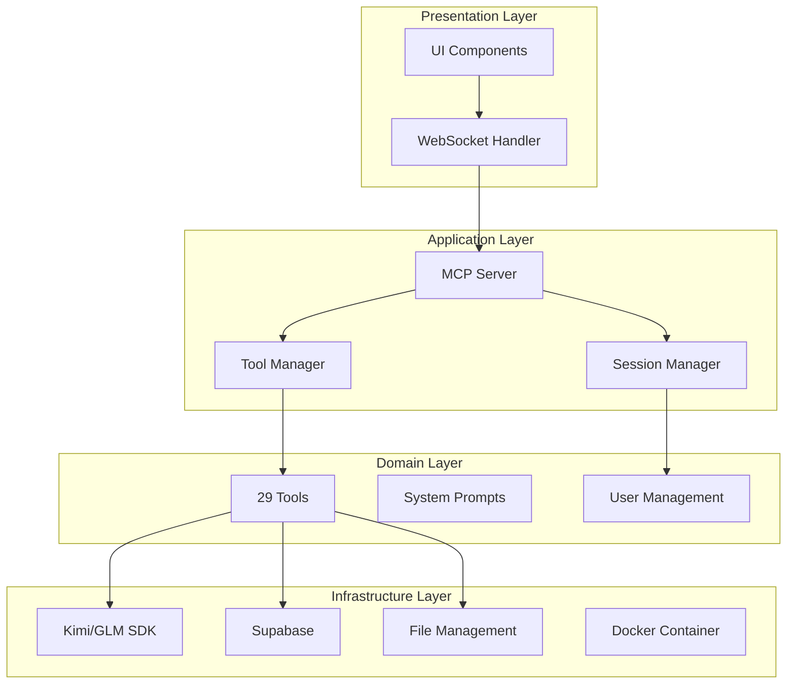

# EXAI MCP Server - System Overview & Architecture

## Purpose & Responsibility

The EXAI MCP Server is a Model Context Protocol (MCP) server that provides a unified interface for interacting with multiple AI providers (Kimi and GLM) through a WebSocket-based daemon. It implements a clean 4-tier layered architecture with top-down design principles, following the single responsibility principle and utilizing mixin composition patterns for enhanced modularity.

## Architecture Overview

### 4-Tier Layered Architecture



### Design Patterns

1. **Mixin Composition Pattern**: Used for combining functionality across different components
2. **Factory Pattern**: For creating appropriate tool instances based on request types
3. **Observer Pattern**: For monitoring system events and audit logging
4. **Strategy Pattern**: For selecting appropriate AI providers based on request characteristics

## Key Components

### Core Components
- **MCP Server**: Implements the Model Context Protocol for standardized AI interactions
- **WebSocket Daemon**: Manages real-time bidirectional communication
- **Tool Manager**: Orchestrates 29 tools across different categories (4 simple, 12 workflow, 13 others)
- **Session Manager**: Handles user sessions and authentication

### External Integrations
- **Kimi SDK**: Integration with Kimi AI provider
- **GLM SDK**: Integration with GLM AI provider
- **Supabase**: Database for audit trail and persistence
- **Docker**: Containerization platform for deployment

## Configuration

### Environment Variables

```bash
# Server Configuration
EXAI_SERVER_HOST=0.0.0.0
EXAI_SERVER_PORT=8080
EXAI_WS_PORT=8081

# AI Provider Configuration
KIMI_API_KEY=your_kimi_api_key
GLM_API_KEY=your_glm_api_key
DEFAULT_PROVIDER=kimi

# Database Configuration
SUPABASE_URL=your_supabase_url
SUPABASE_KEY=your_supabase_key

# File Management
FILE_STORAGE_PATH=/app/storage
MAX_FILE_SIZE=10MB
```

## Usage Examples

### Basic Server Initialization

```python
from exai.server import EXAIServer
from exai.config import Config

config = Config()
server = EXAIServer(config)
server.start()
```

### WebSocket Client Connection

```javascript
const ws = new WebSocket('ws://localhost:8081');

ws.onopen = () => {
    console.log('Connected to EXAI MCP Server');
};

ws.onmessage = (event) => {
    const response = JSON.parse(event.data);
    console.log('Received:', response);
};

// Send a request
ws.send(JSON.stringify({
    type: 'tool_call',
    tool: 'text_completion',
    params: {
        prompt: 'Hello, EXAI!',
        provider: 'kimi'
    }
}));
```

## Common Issues & Solutions

### Issue: WebSocket Connection Fails
**Solution**: Check if the WebSocket port (8081) is open and not blocked by firewall.

### Issue: AI Provider Authentication Errors
**Solution**: Verify API keys are correctly set in environment variables and have proper permissions.

### Issue: High Memory Usage
**Solution**: Implement session cleanup and limit concurrent requests per user.

## Integration Points

The EXAI MCP Server integrates with:
- **UI Components**: Through WebSocket API
- **SDK Integration**: Direct API calls to Kimi and GLM
- **Supabase**: For audit trail and data persistence
- **Docker**: For containerized deployment

## Next Steps

For detailed information about specific components, refer to their respective documentation:
- [SDK Integration](./02_SDK_Integration.md)
- [Supabase Audit Trail](./03_Supabase_Audit_Trail.md)
- [Daemon & WebSocket Management](../02_Service_Components/01_Daemon_WebSocket.md)

