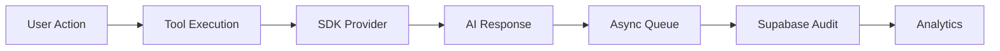

# Supabase Audit Trail

## Purpose & Responsibility

The Supabase Audit Trail component provides comprehensive tracking of all data modifications, user actions, and system events within the application. It ensures accountability, supports debugging, and enables compliance with data governance requirements.

**Key Architectural Shift (2025-10-20):**
- **Supabase is AUDIT TRAIL ONLY** - not for operational conversation management
- **Fire-and-forget async writes** - non-blocking audit logging
- **Fallback recovery** - restore conversations when SDK sessions expire
- **Analytics and metrics** - usage tracking and performance monitoring

## Architecture

The audit trail system is built on top of Supabase's real-time capabilities and uses a combination of database triggers and application-level logging to capture events. It follows an event sourcing pattern where all changes are recorded as immutable events.

### Audit Trail Flow



## Key Files & Their Roles

```
utils/
├── conversation/
│   ├── supabase_memory.py   # Audit logging (simplified from conversation mgmt)
│   └── conversation_queue.py # Async fire-and-forget writes
├── audit/
│   ├── logger.py            # Core audit logging functionality
│   └── analytics.py         # Usage analytics and metrics
└── supabase/
    └── client.py            # Supabase client wrapper
```

## Configuration

```python
# .env.docker
# Supabase Configuration
SUPABASE_URL=your_supabase_url
SUPABASE_KEY=your_supabase_key
SUPABASE_SERVICE_ROLE_KEY=your_service_role_key

# Audit Configuration
USE_ASYNC_SUPABASE=true
ENABLE_SUPABASE_WRITE_CACHING=true
AUDIT_LOG_LEVEL=INFO
AUDIT_RETENTION_DAYS=365
AUDIT_BATCH_SIZE=100
AUDIT_FLUSH_INTERVAL=30  # seconds
```

## Database Schema

### Audit Tables

```sql
-- conversations table (audit trail)
CREATE TABLE conversations (
    id UUID PRIMARY KEY DEFAULT uuid_generate_v4(),
    user_id TEXT NOT NULL,
    title TEXT,
    created_at TIMESTAMPTZ DEFAULT NOW(),
    updated_at TIMESTAMPTZ DEFAULT NOW(),
    metadata JSONB
);

-- messages table (audit trail)
CREATE TABLE messages (
    id UUID PRIMARY KEY DEFAULT uuid_generate_v4(),
    conversation_id UUID REFERENCES conversations(id),
    role TEXT NOT NULL,
    content TEXT NOT NULL,
    tokens INTEGER,
    model TEXT,
    provider TEXT,
    created_at TIMESTAMPTZ DEFAULT NOW(),
    metadata JSONB
);

-- audit_events table (system events)
CREATE TABLE audit_events (
    id UUID PRIMARY KEY DEFAULT uuid_generate_v4(),
    user_id TEXT,
    action TEXT NOT NULL,
    resource_type TEXT,
    resource_id TEXT,
    details JSONB,
    timestamp TIMESTAMPTZ DEFAULT NOW()
);

-- file_uploads table (file tracking)
CREATE TABLE file_uploads (
    id UUID PRIMARY KEY DEFAULT uuid_generate_v4(),
    user_id TEXT NOT NULL,
    filename TEXT NOT NULL,
    file_size INTEGER,
    mime_type TEXT,
    storage_path TEXT,
    moonshot_file_id TEXT,  # Link to Kimi file
    created_at TIMESTAMPTZ DEFAULT NOW(),
    metadata JSONB
);
```

## Usage Examples

### Recording Audit Events (Fire-and-Forget)

```python
from utils.audit.logger import log_event

# Non-blocking audit logging
await log_event(
    user_id="user123",
    action="TOOL_EXECUTION",
    resource_type="chat_tool",
    resource_id="chat_12345",
    details={
        "tool": "chat_EXAI-WS",
        "model": "glm-4.6",
        "tokens": 1500,
        "duration_ms": 2300
    }
)
```

### Conversation Audit Logging

```python
from utils.conversation.supabase_memory import SupabaseConversationMemory

memory = SupabaseConversationMemory()

# Audit conversation interaction (async, non-blocking)
await memory.audit_interaction(
    conversation_id="conv_456",
    user_message="What is Python?",
    assistant_message="Python is a programming language...",
    model="kimi-k2-0905-preview",
    provider="kimi",
    tokens_used=250
)
```

### Fallback Recovery

```python
# When SDK session expires, recover from Supabase audit trail
from utils.conversation.supabase_memory import SupabaseConversationMemory

memory = SupabaseConversationMemory()

# Recover conversation history
messages = await memory.recover_conversation(
    conversation_id="conv_456",
    max_messages=20  # Last 20 messages
)

# Rebuild SDK conversation state
conversation = [
    {"role": msg["role"], "content": msg["content"]}
    for msg in messages
]
```

### Analytics Queries

```python
from utils.audit.analytics import get_usage_metrics

# Get usage metrics for a user
metrics = await get_usage_metrics(
    user_id="user123",
    start_date=datetime(2025, 10, 1),
    end_date=datetime(2025, 10, 31)
)

# Returns:
# {
#     "total_conversations": 45,
#     "total_messages": 320,
#     "total_tokens": 125000,
#     "avg_tokens_per_message": 390,
#     "provider_usage": {
#         "kimi": 0.6,
#         "glm": 0.4
#     },
#     "model_usage": {
#         "glm-4.6": 0.5,
#         "kimi-k2-0905-preview": 0.3,
#         "glm-4.5-flash": 0.2
#     }
# }
```

## Common Issues & Solutions

### Issue: Performance Impact
**Problem**: Excessive audit logging can degrade database performance

**Solution**: Implement asynchronous logging and batch inserts
```python
# Use async queue for non-blocking writes
from utils.conversation.conversation_queue import ConversationQueue

queue = ConversationQueue()
await queue.enqueue_write(conversation_id, message_data)
```

### Issue: Storage Growth
**Problem**: Audit tables can grow rapidly

**Solution**: Implement automated archival and cleanup policies
```python
# Archive old conversations
from utils.audit.archival import archive_old_conversations

await archive_old_conversations(
    older_than_days=365,
    archive_to="cold_storage"
)
```

### Issue: Sensitive Data Exposure
**Problem**: Audit logs might contain sensitive information

**Solution**: Implement data masking for sensitive fields
```python
from utils.audit.masking import mask_sensitive_data

masked_content = mask_sensitive_data(
    content=message_content,
    fields_to_mask=["email", "phone", "ssn"]
)
```

## Integration Points

- **SDK Integration**: Audit all provider interactions
- **Tool Execution**: Log all tool calls and results
- **User Authentication**: Record login attempts and permission changes
- **File Management**: Track file uploads, downloads, and modifications
- **WebSocket Daemon**: Audit real-time communication events

## Async Write Architecture

### Fire-and-Forget Pattern

```python
# Main request flow (non-blocking)
async def handle_chat_request(request):
    # 1. Execute tool with SDK
    response = await provider.chat_completion(messages)
    
    # 2. Return response immediately
    await send_response(response)
    
    # 3. Audit in background (fire-and-forget)
    asyncio.create_task(
        audit_interaction(conversation_id, messages, response)
    )
```

### Batch Processing

```python
# Batch audit writes for efficiency
from utils.conversation.conversation_queue import ConversationQueue

queue = ConversationQueue()

# Queue writes
await queue.enqueue_write(conv_id_1, data_1)
await queue.enqueue_write(conv_id_2, data_2)
await queue.enqueue_write(conv_id_3, data_3)

# Batch flush every 30 seconds
await queue.flush_batch()
```

## Performance Optimization

1. **Async Writes**: All audit writes are non-blocking
2. **Batch Inserts**: Group multiple writes into single transaction
3. **Connection Pooling**: Reuse database connections
4. **Selective Logging**: Only log essential information
5. **Partitioning**: Partition tables by date for better query performance

## Monitoring & Observability

### Key Metrics to Track

- **Write Latency**: Time to write audit events
- **Queue Depth**: Number of pending audit writes
- **Storage Growth**: Rate of data accumulation
- **Query Performance**: Audit query response times
- **Error Rate**: Failed audit writes

### Monitoring Queries

```sql
-- Check audit write performance
SELECT 
    DATE_TRUNC('hour', timestamp) as hour,
    COUNT(*) as events,
    AVG(EXTRACT(EPOCH FROM (NOW() - timestamp))) as avg_delay_seconds
FROM audit_events
WHERE timestamp > NOW() - INTERVAL '24 hours'
GROUP BY hour
ORDER BY hour DESC;

-- Check storage growth
SELECT 
    pg_size_pretty(pg_total_relation_size('messages')) as messages_size,
    pg_size_pretty(pg_total_relation_size('conversations')) as conversations_size,
    pg_size_pretty(pg_total_relation_size('audit_events')) as audit_events_size;
```

## Best Practices

1. **Never Block on Audit Writes**: Always use async fire-and-forget
2. **Batch When Possible**: Group writes for efficiency
3. **Monitor Queue Depth**: Alert if queue grows too large
4. **Regular Archival**: Move old data to cold storage
5. **Selective Logging**: Don't log everything, focus on important events
6. **Data Retention**: Implement clear retention policies
7. **Privacy Compliance**: Mask sensitive data before logging

