# EXAI Web UI - Architecture Diagrams

**Date:** 2025-10-17  
**Purpose:** Visual representation of recommended architecture

---

## 📊 **CURRENT STATE (BROKEN)**

### **Current Architecture - Three Competing Approaches**

**Problem:** Three different schemas, none deployed, database is empty!

---

## ✅ **RECOMMENDED ARCHITECTURE**

### **High-Level System Architecture**

---

### **Data Flow - Sending a Message**

---

### **Database Schema - Unified Approach**

---

### **Component Architecture - Next.js App**

---

### **Authentication Flow**

---

### **File Upload Flow**

---

### **Real-time Updates Flow**

---

### **Deployment Architecture**

---

### **Security Architecture - Row Level Security (RLS)**

---

## 📊 **COMPARISON: BEFORE vs AFTER**

### **Before (Current Broken State)**

```mermaid
graph LR
    A[Single HTML File<br/>407 lines] --> B[❌ No Deployment]
    A --> C[❌ No Auth]
    A --> D[❌ No Scalability]
    A --> E[❌ No Security]
    
    style A fill:#ff6b6b
    style B fill:#ff6b6b
    style C fill:#ff6b6b
    style D fill:#ff6b6b
    style E fill:#ff6b6b
```

### **After (Recommended Architecture)**

```mermaid
graph LR
    A[Next.js App<br/>Modular Components] --> B[✅ Vercel Deployment]
    A --> C[✅ Supabase Auth]
    A --> D[✅ Horizontal Scaling]
    A --> E[✅ RLS Security]
    A --> F[✅ Real-time Updates]
    A --> G[✅ File Storage]
    A --> H[✅ Type Safety]
    
    style A fill:#a8e6cf
    style B fill:#a8e6cf
    style C fill:#a8e6cf
    style D fill:#a8e6cf
    style E fill:#a8e6cf
    style F fill:#a8e6cf
    style G fill:#a8e6cf
    style H fill:#a8e6cf
```

---

## 🎯 **NEXT STEPS**

See the following documents for implementation:

1. `00_EXECUTIVE_SUMMARY.md` - Overview and action plan
2. `01_ARCHITECTURAL_ANALYSIS.md` - Detailed technical analysis
3. `02_UNIFIED_SCHEMA.md` - Complete database schema (to be created)
4. `03_MIGRATION_PLAN.md` - Step-by-step migration guide (to be created)
5. `04_DEPLOYMENT_GUIDE.md` - Deployment instructions (to be created)

---

**Diagrams Complete** ✅  
**Ready for Implementation**

