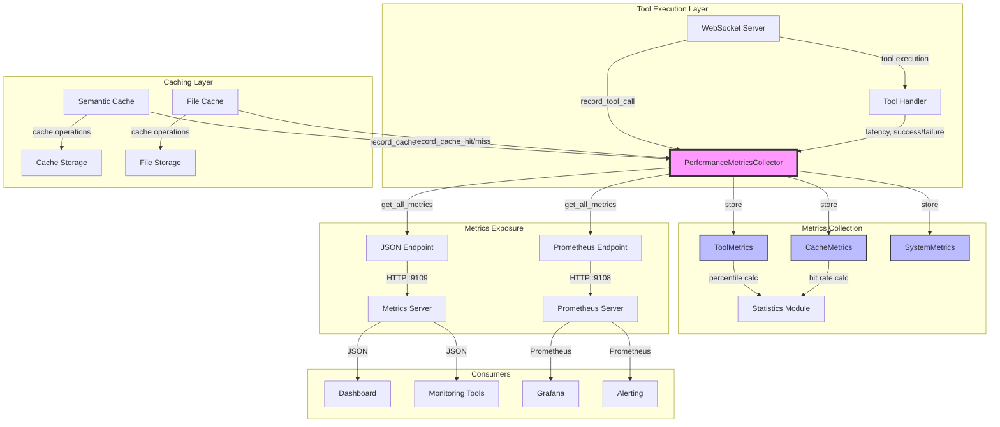
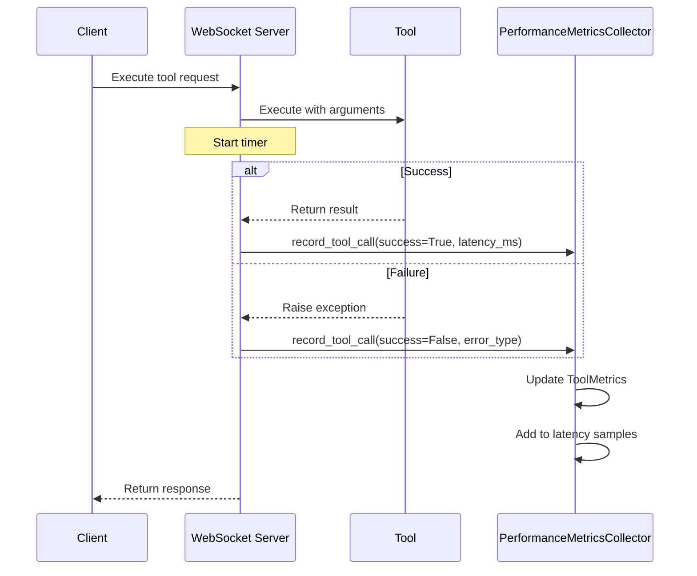
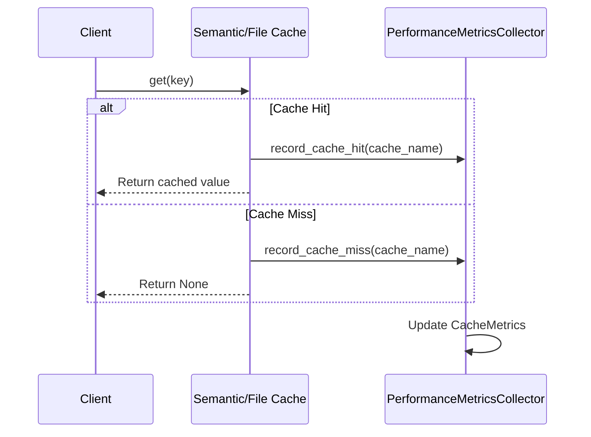
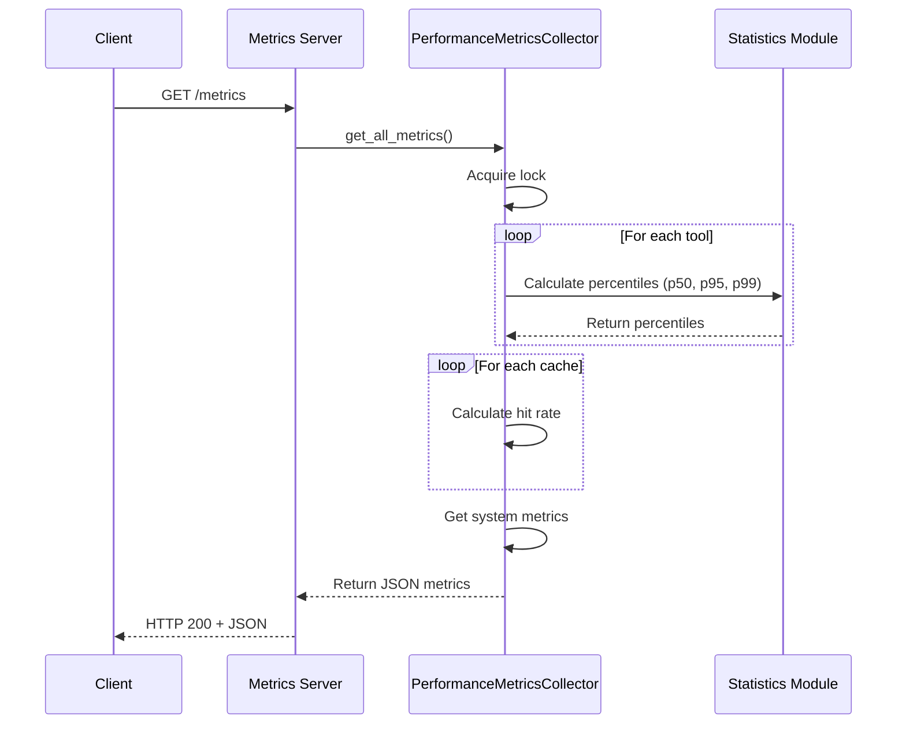

# Performance Metrics Architecture
**Last Updated:** 2025-10-11 (Phase 2 Cleanup, Task 2.E)

---

## 📊 Overview

The performance metrics system provides comprehensive tracking of tool execution, cache performance, and system health with minimal overhead (<1%).

---

## 🏗️ Architecture Diagram



---

## 🔄 Data Flow

### 1. Tool Execution Metrics



---

### 2. Cache Metrics



---

### 3. Metrics Retrieval



---

## 🧩 Component Details

### PerformanceMetricsCollector

**Singleton Class** - Thread-safe metrics collection

**Responsibilities:**
- Collect tool execution metrics
- Collect cache performance metrics
- Track system-wide metrics
- Calculate percentiles and statistics
- Provide JSON-serializable output

**Thread Safety:**
- Uses `threading.RLock` for all operations
- Safe for concurrent access from multiple threads
- No race conditions or data corruption

**Memory Management:**
- Sliding window for latency samples (default: 1000)
- Bounded memory usage
- Old samples automatically evicted

---

### ToolMetrics

**Dataclass** - Per-tool performance tracking

**Fields:**
- `tool_name` - Tool identifier
- `total_calls` - Total number of calls
- `successful_calls` - Number of successful calls
- `failed_calls` - Number of failed calls
- `total_latency_ms` - Sum of all latencies
- `latency_samples` - Deque of recent latencies (bounded)
- `error_types` - Dictionary of error type frequencies

**Methods:**
- `record_call()` - Record a tool call
- `get_stats()` - Calculate and return statistics

---

### CacheMetrics

**Dataclass** - Per-cache performance tracking

**Fields:**
- `cache_name` - Cache identifier
- `hits` - Number of cache hits
- `misses` - Number of cache misses
- `evictions` - Number of evictions
- `size_rejections` - Number of size rejections

**Methods:**
- `record_hit()` - Record cache hit
- `record_miss()` - Record cache miss
- `record_eviction()` - Record eviction
- `record_size_rejection()` - Record size rejection
- `get_stats()` - Calculate and return statistics

---

## 📊 Percentile Calculation

### Algorithm

Uses Python's `statistics.quantiles()` for accurate percentile calculation:

```python
def calculate_percentiles(samples):
    if len(samples) < 2:
        return None, None, None
    
    quantiles = statistics.quantiles(samples, n=100)
    
    return (
        quantiles[49],  # p50 (median)
        quantiles[94],  # p95
        quantiles[98]   # p99
    )
```

### Sliding Window

- Maintains last N samples (default: 1000)
- Uses `collections.deque(maxlen=N)`
- Automatically evicts oldest samples
- Prevents unbounded memory growth

---

## 🔧 Configuration

### Environment Variables

```bash
# Enable/disable metrics collection
PERFORMANCE_METRICS_ENABLED=true

# Sliding window size for percentiles
METRICS_WINDOW_SIZE=1000

# JSON endpoint configuration
METRICS_JSON_ENDPOINT_ENABLED=true
METRICS_JSON_PORT=9109

# Prometheus configuration (optional)
PROMETHEUS_ENABLED=false
PROMETHEUS_PORT=9108
```

---

## 🎯 Design Decisions

### 1. Singleton Pattern

**Why:** Ensures single global collector for consistent metrics

**Benefits:**
- All components record to same collector
- No metric duplication or inconsistency
- Simple API (no need to pass collector around)

**Trade-offs:**
- Global state (acceptable for metrics)
- Testing requires reset between tests

---

### 2. Thread-Safe Design

**Why:** WebSocket server is multi-threaded

**Implementation:**
- `threading.RLock` for all operations
- Atomic updates to metrics
- No race conditions

**Performance:**
- Lock contention is minimal
- <0.1ms overhead per operation

---

### 3. Sliding Window

**Why:** Prevent unbounded memory growth

**Benefits:**
- Bounded memory usage
- Recent samples more relevant
- Accurate percentiles for current behavior

**Trade-offs:**
- Historical data not retained
- Window size affects accuracy

---

### 4. Graceful Degradation

**Why:** Metrics failures shouldn't break the application

**Implementation:**
- Try/except around all metric recording
- Optional import with fallback no-ops
- Metrics disabled if module unavailable

**Benefits:**
- System continues working if metrics fail
- Can disable metrics without code changes

---

## 📈 Performance Characteristics

### Overhead

| Operation | Overhead | Impact |
|-----------|----------|--------|
| Tool call recording | <0.5ms | Negligible |
| Cache hit/miss recording | <0.1ms | Negligible |
| Percentile calculation | <1ms | Only on retrieval |
| JSON serialization | <5ms | Only on endpoint access |

**Total Impact:** <1% overhead on tool execution

---

### Scalability

| Metric | Limit | Notes |
|--------|-------|-------|
| Tools tracked | Unlimited | One ToolMetrics per tool |
| Caches tracked | Unlimited | One CacheMetrics per cache |
| Latency samples | 1000 per tool | Configurable via METRICS_WINDOW_SIZE |
| Memory usage | ~1MB | For 100 tools with 1000 samples each |
| Concurrent threads | Unlimited | Thread-safe with RLock |

---

## 🚀 Future Enhancements

### Phase 3 Roadmap

1. **Historical Trend Analysis**
   - Store metrics to database
   - Track trends over time
   - Identify performance regressions

2. **Grafana Dashboard**
   - Pre-built dashboard templates
   - Real-time visualization
   - Custom alerts

3. **Cost Tracking**
   - Track API costs per tool
   - Track token usage
   - Cost optimization recommendations

4. **Alerting System**
   - Alert on high error rates
   - Alert on slow tools
   - Alert on low cache hit rates

---

**Status:** ✅ ARCHITECTURE DOCUMENTATION COMPLETE  
**Next:** Complete Task 2.E and move to Task 2.F


