# ARCHITECTURE VISUAL GUIDE (TOP-DOWN DESIGN)
**Date:** 2025-10-10 4:15 PM AEDT (UPDATED with Top-Down Design)
**Purpose:** Visual diagrams to understand the complete system architecture
**Status:** CRITICAL - Use this to maintain context!

---

## WHY THIS EXISTS

**User Feedback:**
> "This is getting quite big, which if I can barely handle it, then I can't imagine you have all this context information stored right now in you."

> "Should be more like Top-Down Design (Stepwise Refinement or Decomposition) so it like splits into categories."

> "I would consider the top being even to the point of the entrance point, which is the daemon and mcp server point right?"

**Response:** You're RIGHT! We need visual diagrams to:
- ✅ See the big picture (TRUE top-down from entry points)
- ✅ Understand dependencies at a glance
- ✅ Make informed refactoring decisions
- ✅ Maintain context across conversations
- ✅ Avoid getting lost in details
- ✅ Organize by conceptual categories (not implementation details)

---

## DIAGRAM 0: TRUE TOP-DOWN FLOW (Entry Points to Providers)

**User Feedback:** "I would consider the top being even to the point of the entrance point, which is the daemon and mcp server point right?"

**Response:** YES! This diagram shows the TRUE top-down flow starting from the user.

```mermaid
graph TD
    U[USER] -->|Types request| IDE[Augment IDE<br/>VSCode]
    IDE -->|stdio protocol| MCP[MCP Server<br/>mcp_server.py]
    MCP -->|WebSocket| WS[WebSocket Daemon<br/>ws_daemon.py<br/>Port 8079]
    WS -->|Tool dispatch| TR[Tool Registry<br/>SERVER_TOOLS dict]

    TR -->|Route to framework| TF{Tool Framework?}

    TF -->|Simple tools| ST[SimpleTool Framework<br/>4 tools]
    TF -->|Workflow tools| WT[WorkflowTool Framework<br/>12 tools]

    ST --> STFLOW[SimpleTool Flow<br/>definition → intake →<br/>preparation → execution → delivery]
    WT --> WTFLOW[WorkflowTool Flow<br/>definition → intake →<br/>orchestration → delivery]

    STFLOW --> BASE[Base Infrastructure<br/>BaseTool + Mixins + Utils]
    WTFLOW --> BASE

    BASE --> PROV{AI Provider?}

    PROV -->|Kimi| KIMI[Kimi API<br/>Moonshot]
    PROV -->|GLM| GLM[GLM API<br/>ZhipuAI]

    KIMI -->|Response| BASE
    GLM -->|Response| BASE

    BASE -->|Format| STFLOW
    BASE -->|Format| WTFLOW

    STFLOW -->|Return| TR
    WTFLOW -->|Return| TR

    TR -->|Response| WS
    WS -->|Response| MCP
    MCP -->|Response| IDE
    IDE -->|Display| U

    classDef entry fill:#e1f5ff,stroke:#01579b,stroke-width:3px
    classDef framework fill:#fff9c4,stroke:#f57f17,stroke-width:3px
    classDef infra fill:#f3e5f5,stroke:#4a148c,stroke-width:2px
    classDef provider fill:#e8f5e9,stroke:#1b5e20,stroke-width:2px

    class U,IDE,MCP,WS,TR entry
    class ST,WT,STFLOW,WTFLOW framework
    class BASE infra
    class KIMI,GLM provider
```

**Key Insights:**
- **TRUE top-down** starts from USER, not from tools!
- Entry points: User → IDE → MCP Server → Daemon → Tool Registry
- Tool frameworks organize by conceptual flow (definition → intake → preparation → execution → delivery)
- Base infrastructure supports all tools
- AI providers are at the bottom of the stack

---

## DIAGRAM 1: COMPLETE SYSTEM ARCHITECTURE (4 TIERS)

This shows the ENTIRE system from foundation to implementation.

**Key Insights:**
- **4 Simple Tools** depend on SimpleTool (55.3KB)
- **12 Workflow Tools** depend on WorkflowTool + BaseWorkflowMixin
- **BaseWorkflowMixin** is composed of 5 mixins (including ExpertAnalysisMixin 34.1KB)
- **Everything** depends on utils/ (Tier 1 foundation)

---

## DIAGRAM 2: SIMPLETOOL ECOSYSTEM (TOP-DOWN DESIGN - OPTION C)

This shows what we're refactoring RIGHT NOW using **Top-Down Design (Option C - Hybrid)**.

```mermaid
graph TB
    subgraph "USERS (4 Tools)"
        AT[ActivityTool<br/>tools/activity.py]
        CT[ChallengeTool<br/>tools/challenge.py]
        CHT[ChatTool<br/>tools/chat.py<br/>HEAVILY USES SimpleTool]
        RT[RecommendTool<br/>tools/capabilities/recommend.py]
    end
    
    subgraph "SIMPLETOOL (55.3KB - REFACTORING TARGET)"
        ST[SimpleTool<br/>tools/simple/base.py<br/>1220 lines]
        
        subgraph "PUBLIC INTERFACE (CANNOT CHANGE)"
            PI1[prepare_chat_style_prompt]
            PI2[build_standard_prompt]
            PI3[handle_prompt_file_with_fallback]
            PI4[get_request_* methods x13]
            PI5[get_validated_temperature]
            PI6[get_input_schema]
            PI7[Abstract: get_tool_fields]
            PI8[Abstract: get_required_fields]
            PI9[Hook: format_response]
        end
        
        subgraph "TOP-DOWN MODULES (OPTION C - CONCEPTUAL CATEGORIES)"
            M1[definition/schema.py<br/>~150-200 lines<br/>Tool Contract]
            M2[intake/accessor.py<br/>~200-250 lines<br/>Request Access]
            M3[intake/validator.py<br/>~150-200 lines<br/>Request Validation]
            M4[preparation/prompt.py<br/>~200-250 lines<br/>Prompt Building]
            M5[preparation/files.py<br/>~80-100 lines<br/>File Handling]
            M6[execution/caller.py<br/>~200-250 lines<br/>Model Calling]
            M7[delivery/formatter.py<br/>~150-200 lines<br/>Response Formatting]
        end

        subgraph "CONCEPTUAL FLOW"
            F1[1. DEFINITION<br/>What does tool promise?]
            F2[2. INTAKE<br/>What did user ask?]
            F3[3. PREPARATION<br/>How do we ask AI?]
            F4[4. EXECUTION<br/>How do we call AI?]
            F5[5. DELIVERY<br/>How do we deliver result?]
        end
    end
    
    subgraph "DEPENDENCIES (INHERITED)"
        WSM[WebSearchMixin]
        TCM[ToolCallMixin]
        STM[StreamingMixin]
        CM[ContinuationMixin]
        BT[BaseTool]
    end
    
    subgraph "UTILS (IMPORTED)"
        U1[utils/client_info]
        U2[utils/progress]
        U3[utils/progress_messages]
    end
    
    %% Users call SimpleTool methods
    CHT -.calls.-> PI1
    CHT -.calls.-> PI2
    AT -.calls.-> PI4
    CT -.calls.-> PI5
    
    %% SimpleTool delegates to modules (FACADE)
    PI1 -.delegates.-> M4
    PI2 -.delegates.-> M4
    PI3 -.delegates.-> M5
    PI4 -.delegates.-> M2
    PI5 -.delegates.-> M3
    PI6 -.delegates.-> M1

    %% Conceptual flow
    M1 --> F1
    M2 --> F2
    M3 --> F2
    M4 --> F3
    M5 --> F3
    M6 --> F4
    M7 --> F5
    
    %% SimpleTool inherits from
    ST --> WSM
    ST --> TCM
    ST --> STM
    ST --> CM
    ST --> BT
    
    %% SimpleTool imports from
    ST --> U1
    ST --> U2
    ST --> U3
    
    %% Styling
    classDef user fill:#e1f5ff,stroke:#01579b,stroke-width:2px
    classDef target fill:#ffebee,stroke:#b71c1c,stroke-width:4px
    classDef public fill:#fff9c4,stroke:#f57f17,stroke-width:2px
    classDef module fill:#e8f5e9,stroke:#1b5e20,stroke-width:2px
    classDef dep fill:#f3e5f5,stroke:#4a148c,stroke-width:2px
    
    class AT,CT,CHT,RT user
    class ST target
    class PI1,PI2,PI3,PI4,PI5,PI6,PI7,PI8,PI9 public
    class M1,M2,M3,M4,M5,M6,M7 module
    class F1,F2,F3,F4,F5 flow
    class WSM,TCM,STM,CM,BT,U1,U2,U3 dep
```

**Key Insights (Top-Down Design):**
- **ChatTool** heavily uses SimpleTool methods (prepare_chat_style_prompt, build_standard_prompt)
- **Public interface** has 9 critical methods that CANNOT change
- **Facade Pattern**: SimpleTool keeps public methods, delegates to conceptual modules
- **7 modules (5 folders)** organized by conceptual responsibility (NOT implementation details!)
- **Conceptual flow**: definition → intake → preparation → execution → delivery
- **Domain language**: Each module name describes WHAT it represents, not what code it contains

---

## DIAGRAM 3: WORKFLOWTOOL ECOSYSTEM (POTENTIAL NEXT TARGET)

This shows what we MIGHT refactor after SimpleTool.

**Key Insights:**
- **12 Workflow Tools** depend on WorkflowTool (HIGH IMPACT!)
- **BaseWorkflowMixin** is composed of 5 mixins
- **ExpertAnalysisMixin (34.1KB)** is the largest mixin
- **OrchestrationMixin (26.9KB)** is the main workflow engine
- **Higher risk** than SimpleTool (12 tools vs 4 tools)

---

## DIAGRAM 4: PHASE 1 REFACTORING ROADMAP

This shows the ORDER we should tackle refactoring.

**Key Decision Points:**
1. **SimpleTool (CURRENT)** - 4 tools, MEDIUM risk ✅
2. **Next target?** - Need to decide:
   - Continue with SimpleTool ecosystem? (lower risk)
   - Move to WorkflowTool ecosystem? (higher impact)
   - Focus on shared infrastructure? (highest risk)

---

## SUMMARY: WHAT THIS TELLS US

### Current Status:
- ✅ Phase 0 complete (architectural mapping)
- 🔄 Phase 1.1 in progress (SimpleTool dependency analysis done)
- ❓ Need to decide next target

### Risk Levels:
- **MEDIUM:** SimpleTool (4 tools depend on it)
- **HIGH:** WorkflowTool ecosystem (12 tools depend on it)
- **CRITICAL:** Shared infrastructure (ALL tools depend on it)

### Recommendation:
**FINISH SimpleTool first** (lower risk, already started) before moving to WorkflowTool ecosystem.

**Rationale:**
1. Already invested time in SimpleTool analysis
2. Lower risk (4 tools vs 12 tools)
3. Learn Facade Pattern approach on smaller ecosystem
4. Build confidence before tackling higher-risk refactoring

---

## NEXT STEPS

**User Decision Needed:**
1. Should we continue with SimpleTool (finish what we started)?
2. Or pivot to WorkflowTool ecosystem (higher impact)?
3. Or focus on shared infrastructure (highest risk)?

**Once decided, I will:**
1. Complete dependency analysis for chosen target
2. Create design intent with Facade pattern
3. Propose module breakdown
4. Create integration test plan
5. Get your approval
6. Execute refactoring

---

**STATUS:** Visual guide complete - ready for user decision on next target

