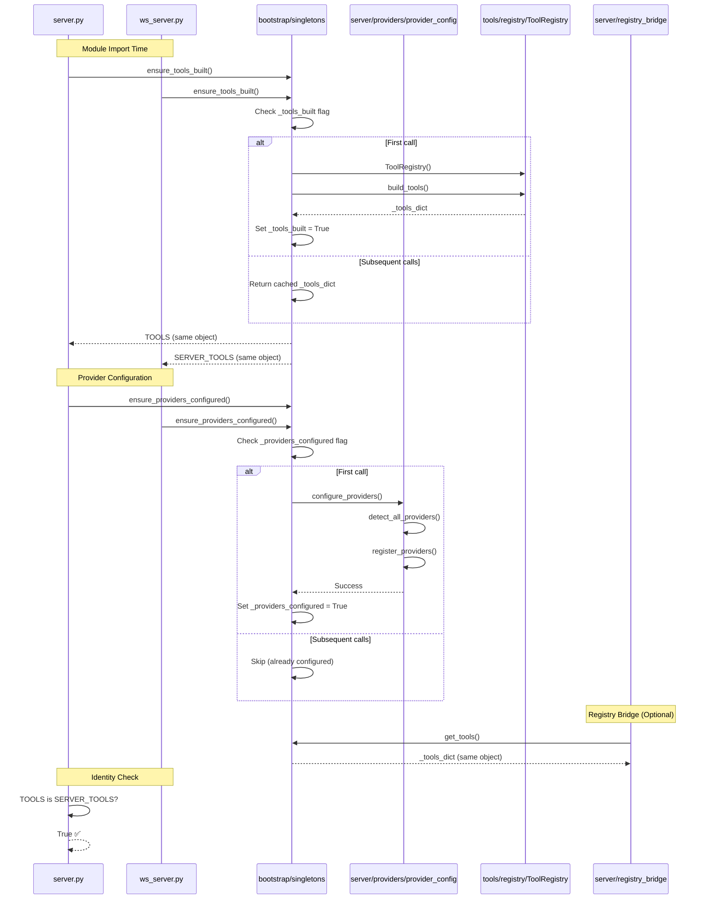

# Orchestrator Sync Task List - v2.0.2

**Date:** 2025-01-08  
**Branch:** `refactor/orchestrator-sync-v2.0.2`  
**Status:** 📋 TASK LIST READY

---

## Task Priority Legend

- **P0 (Critical):** Must fix - breaks system
- **P1 (High):** Should fix - prevents future issues
- **P2 (Medium):** Nice to have - improves maintainability
- **P3 (Low):** Optional - documentation/cleanup

---

## P0 Tasks: NONE ✅

**No critical issues found.** System is working correctly.

---

## P1 Tasks: Preventive Hardening

### [ ] Task 1.1: Make registry_bridge use singleton ToolRegistry

**File:** `src/server/registry_bridge.py`  
**Lines:** 21-32  
**Change:** 8 lines

**Before:**
```python
class _RegistryBridge:
    def __init__(self) -> None:
        self._reg = ToolRegistry()  # Creates second instance
        self._built = False
        self._lock = RLock()
```

**After:**
```python
class _RegistryBridge:
    def __init__(self) -> None:
        from src.bootstrap.singletons import get_tools, ensure_tools_built
        self._ensure_tools_built = ensure_tools_built
        self._get_tools = get_tools
        self._lock = RLock()
```

**Verification:**
```bash
python -c "from src.server.registry_bridge import get_registry; from server import TOOLS; r = get_registry(); r.build(); print('SAME:', r.list_tools() is TOOLS)"
# Expected: SAME: True
```

---

### [ ] Task 1.2: Update registry_bridge.build() to use singleton

**File:** `src/server/registry_bridge.py`  
**Lines:** 27-32  
**Change:** 5 lines

**Before:**
```python
def build(self, force: bool = False) -> None:
    with self._lock:
        if not self._built or force:
            self._reg.build_tools()
            self._built = True
```

**After:**
```python
def build(self, force: bool = False) -> None:
    with self._lock:
        # Delegate to singleton - idempotent
        self._ensure_tools_built()
```

**Verification:**
```bash
python -c "from server import TOOLS; from src.daemon.ws_server import SERVER_TOOLS; print('SAME OBJECT:', TOOLS is SERVER_TOOLS)"
# Expected: SAME OBJECT: True
```

---

### [ ] Task 1.3: Update registry_bridge.list_tools() to use singleton

**File:** `src/server/registry_bridge.py`  
**Lines:** 34-36  
**Change:** 3 lines

**Before:**
```python
def list_tools(self) -> Dict[str, Any]:
    return self._reg.list_tools()
```

**After:**
```python
def list_tools(self) -> Dict[str, Any]:
    tools = self._get_tools()
    return tools if tools is not None else {}
```

**Verification:**
```bash
python -c "from src.server.registry_bridge import registry; from server import TOOLS; print('SAME:', registry.list_tools() is TOOLS)"
# Expected: SAME: True
```

---

### [ ] Task 1.4: Update registry_bridge.get_tool() to use singleton

**File:** `src/server/registry_bridge.py`  
**Lines:** 41-46  
**Change:** 6 lines

**Before:**
```python
def get_tool(self, name: str) -> Any:
    tools = self._reg.list_tools()
    if name in tools:
        return tools[name]
    return self._reg.get_tool(name)
```

**After:**
```python
def get_tool(self, name: str) -> Any:
    tools = self._get_tools()
    if tools and name in tools:
        return tools[name]
    raise KeyError(f"Tool '{name}' not found in registry")
```

**Verification:**
```bash
python -c "from src.server.registry_bridge import registry; print('chat' in registry.list_tools())"
# Expected: True
```

---

## P2 Tasks: Documentation

### [ ] Task 2.1: Add cross-reference comment in singletons.py

**File:** `src/bootstrap/singletons.py`  
**Lines:** 64  
**Change:** 3 lines

**Before:**
```python
    try:
        from src.server.providers import configure_providers
```

**After:**
```python
    try:
        # NOTE: This imports from src/server/providers/provider_config.py
        # which is a thin orchestrator that delegates to helper modules
        from src.server.providers import configure_providers
```

**Verification:** Visual inspection

---

### [ ] Task 2.2: Add cross-reference comment in provider_config.py

**File:** `src/server/providers/provider_config.py`  
**Lines:** 20  
**Change:** 3 lines

**Before:**
```python
def configure_providers() -> None:
    """
    Configure and validate AI providers based on available API keys.
```

**After:**
```python
def configure_providers() -> None:
    """
    Configure and validate AI providers based on available API keys.
    
    NOTE: This function is called by src/bootstrap/singletons.ensure_providers_configured()
    to ensure idempotent provider initialization across both entry points.
```

**Verification:** Visual inspection

---

### [ ] Task 2.3: Add architecture note to registry_bridge.py

**File:** `src/server/registry_bridge.py`  
**Lines:** 1-13  
**Change:** 5 lines

**Before:**
```python
"""
Registry Bridge for EX MCP Server

Purpose:
- Provide a thin, centralized bridge around tools.registry.ToolRegistry
```

**After:**
```python
"""
Registry Bridge for EX MCP Server

ARCHITECTURE NOTE:
- This module now delegates to src/bootstrap/singletons for tool registry access
- Ensures TOOLS is SERVER_TOOLS identity check always passes
- No longer creates a second ToolRegistry instance

Purpose:
- Provide a thin, centralized bridge around the singleton tool registry
```

**Verification:** Visual inspection

---

## P3 Tasks: Optional Cleanup

### [ ] Task 3.1: Audit registry_bridge usage

**Action:** Search codebase for imports of `registry_bridge`

**Command:**
```bash
grep -r "from src.server.registry_bridge" --include="*.py"
grep -r "import.*registry_bridge" --include="*.py"
```

**Decision:** If unused, consider removing the file entirely.

---

### [ ] Task 3.2: Remove list_descriptors if unused

**File:** `src/server/registry_bridge.py`  
**Lines:** 38-39

**Action:** Check if `list_descriptors()` is called anywhere

**Command:**
```bash
grep -r "list_descriptors" --include="*.py"
```

**Decision:** If unused, remove the method.

---

## Sequence Diagram: Desired Call Flow



---

## Verification Checklist

After completing each task, run:

```bash
# 1. Identity check
python -c "from server import TOOLS; from src.daemon.ws_server import SERVER_TOOLS; print('SAME OBJECT:', TOOLS is SERVER_TOOLS, 'LEN:', len(TOOLS))"

# 2. Singleton state
python -c "from src.bootstrap.singletons import is_providers_configured, is_tools_built; print('providers:', is_providers_configured(), 'tools:', is_tools_built())"

# 3. Tool count
python -c "from server import TOOLS; print('Tool count:', len(TOOLS))"

# 4. Registry bridge (if modified)
python -c "from src.server.registry_bridge import registry; from server import TOOLS; print('Bridge uses singleton:', registry.list_tools() is TOOLS)"
```

**All checks must pass** before proceeding to next task.

---

## Completion Criteria

- [ ] All P1 tasks completed
- [ ] All verification checks pass
- [ ] Identity check: `TOOLS is SERVER_TOOLS` → True
- [ ] Tool count: 29
- [ ] No duplicate initialization warnings in logs
- [ ] Documentation updated
- [ ] Commit tagged as `v2.0.2-orchestrator-sync`

---

## Rollback Plan

If any task breaks the system:

1. Revert the specific file: `git checkout HEAD -- <file>`
2. Re-run verification checks
3. Document the issue
4. Skip to next task

**No task should break backward compatibility.**

