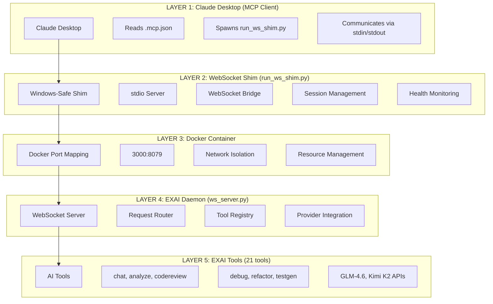
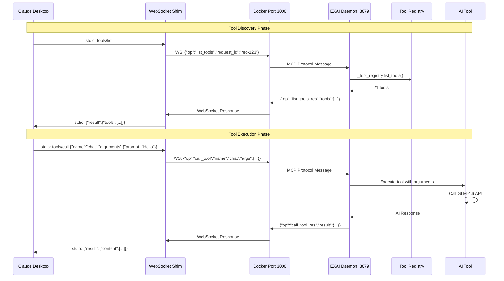
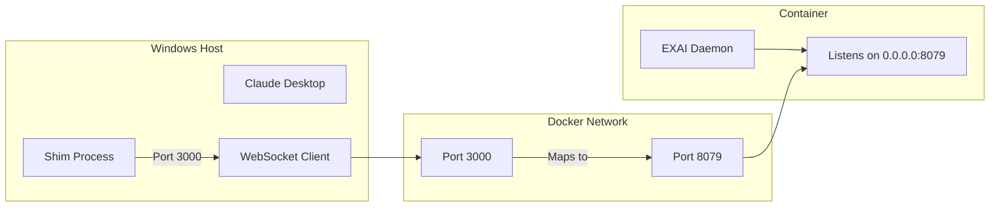
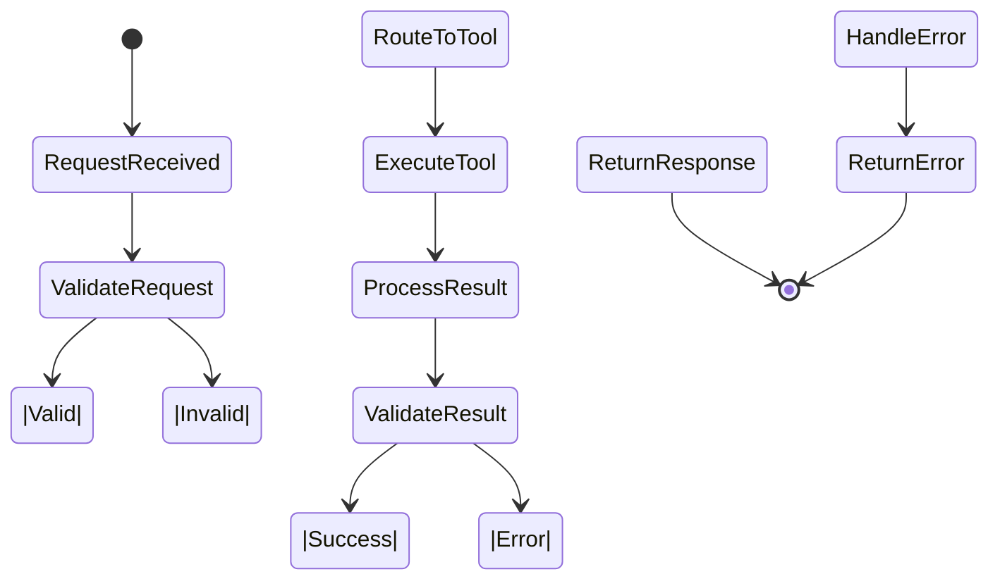
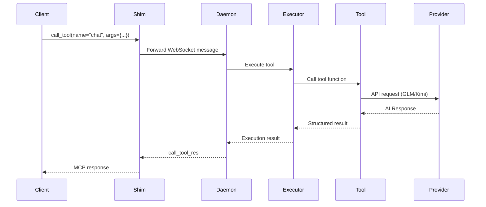
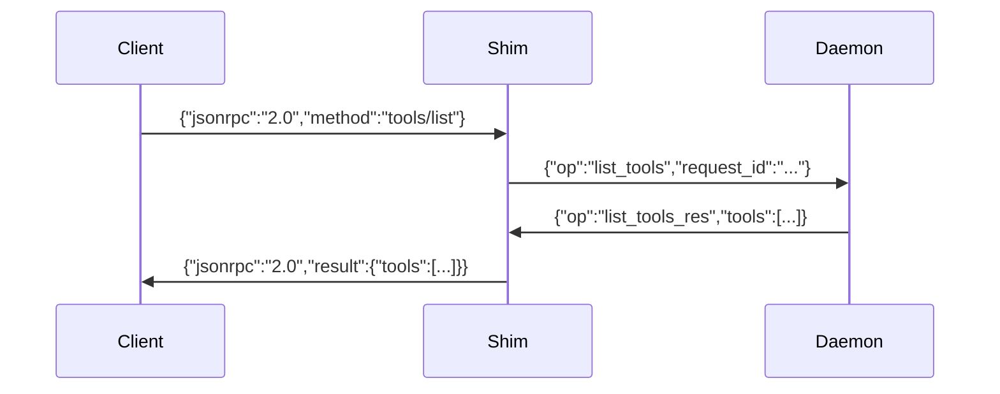
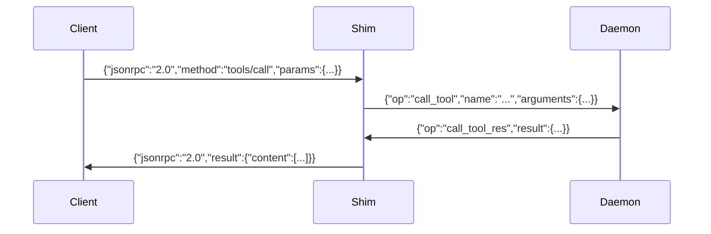
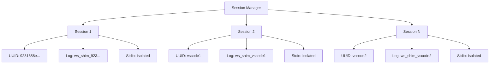
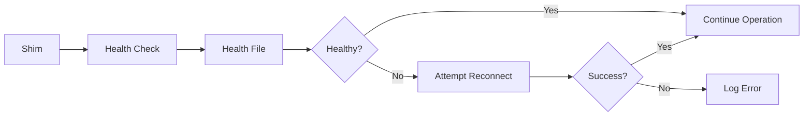
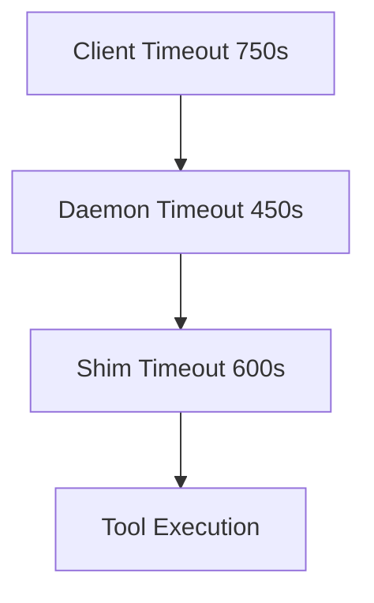

# EXAI MCP Server - Complete Architecture Guide

## Table of Contents
1. [Overview](#overview)
2. [5-Layer Architecture](#5-layer-architecture)
3. [Message Flow](#message-flow)
4. [Port Mapping](#port-mapping)
5. [Tool Execution Flow](#tool-execution-flow)
6. [Component Details](#component-details)
7. [Connection Protocol](#connection-protocol)
8. [Session Management](#session-management)
9. [Configuration Reference](#configuration-reference)
10. [Troubleshooting](#troubleshooting)

---

## Overview

The EXAI MCP Server is a **5-layer architecture** that bridges Claude Desktop (MCP client) with EXAI's AI services. It uses a WebSocket shim pattern to convert MCP's stdio protocol to WebSocket for communication with a Dockerized AI service daemon.

**Key Benefits:**
- ✅ Native MCP protocol support (stdio)
- ✅ Asynchronous AI operations via WebSocket
- ✅ Docker isolation for services
- ✅ Multi-session support
- ✅ Health monitoring & auto-reconnection

---

## 5-Layer Architecture



### Architecture Flow

1. **Claude Desktop** reads configuration and spawns the shim
2. **Shim** bridges MCP stdio ↔ WebSocket protocol
3. **Docker** provides network isolation and port mapping
4. **Daemon** handles MCP protocol and tool execution
5. **Tools** execute AI operations via GLM/Kimi providers

---

## Message Flow

### Complete End-to-End Sequence



### Message Format Transformations

#### 1. Claude Desktop → Shim (MCP stdio)
```json
{
  "jsonrpc": "2.0",
  "id": 1,
  "method": "tools/list"
}
```

#### 2. Shim → Daemon (WebSocket)
```json
{
  "op": "list_tools",
  "request_id": "req-123",
  "data": {...}
}
```

#### 3. Daemon → Shim (WebSocket)
```json
{
  "op": "list_tools_res",
  "request_id": "req-123",
  "tools": [
    {"name": "status", "description": "...", "inputSchema": {...}}
  ]
}
```

#### 4. Shim → Claude Desktop (MCP stdio)
```json
{
  "jsonrpc": "2.0",
  "id": 1,
  "result": {
    "tools": [...]
  }
}
```

---

## Port Mapping

### Host ↔ Container Communication



### Port Configuration Details

| Component | Port | Purpose | Configuration File |
|-----------|------|---------|-------------------|
| **Shim (Client)** | 3000 | WebSocket client connects FROM | `claude_desktop_config.json` |
| **Docker Host** | 3000 | WebSocket server listens ON | `docker-compose.yml` |
| **Docker Container** | 8079 | Port mapping target | `docker-compose.yml` |
| **EXAI Daemon** | 8079 | WebSocket server listens | `ws_server.py` |

### The Critical Fix

**Before (Broken):**
```json
// claude_desktop_config.json
"EXAI_WS_PORT": "8079"  // ❌ Wrong - Docker internal port
```

**After (Working):**
```json
// claude_desktop_config.json
"EXAI_WS_PORT": "3000"  // ✅ Correct - host machine port
```

**Why**: Port 8079 is inside the Docker container, not accessible from the host. The shim runs on the host and must use port 3000.

---

## Tool Execution Flow

### State Diagram



### Tool Execution Sequence



### Tool Registry

```mermaid
graph TD
    A[Tool Registry Initialization] --> B[Configure Providers]
    B --> C[Build Tool Registry]
    C --> D[Register 21 Tools]

    D --> E[Essential Tools (3)]
    D --> F[Core Tools (7)]
    D --> G[Advanced Tools (7)]
    D --> H[Hidden Tools (4)]

    E --> E1[status]
    E --> E2[chat]
    E --> E3[planner]

    F --> F1[analyze]
    F --> F2[codereview]
    F --> F3[debug]
    F --> F4[refactor]
    F --> F5[testgen]
    F --> F6[thinkdeep]
    F --> F7[smart_file_query]

    G --> G1[consensus]
    G --> G2[docgen]
    G --> G3[secaudit]
    G --> G4[tracer]
    G --> G5[precommit]
    G --> G6[kimi_chat_with_tools]
    G --> G7[glm_payload_preview]
```

---

## Component Details

### 1. Claude Desktop Configuration

**File**: `claude_desktop_config.json` (User Home)
```json
{
  "mcpServers": {
    "exai-mcp": {
      "command": "C:/Project/EX-AI-MCP-Server/.venv/Scripts/python.exe",
      "args": ["-u", "C:/Project/EX-AI-MCP-Server/scripts/runtime/run_ws_shim.py"],
      "env": {
        "EXAI_WS_PORT": "3000",
        "EXAI_JWT_TOKEN": "...",
        "EX_SESSION_SCOPE_STRICT": "true"
      }
    }
  }
}
```

**Key Configuration**:
- `command`: Python interpreter from virtual environment
- `args`: WebSocket shim script with `-u` flag (unbuffered output)
- `env`: Environment variables including port, tokens, timeouts

### 2. WebSocket Shim (`run_ws_shim.py`)

**Key Functions**:
```python
# Lines 108-142: Environment Setup
SESSION_ID = os.getenv("EXAI_SESSION_ID", str(uuid.uuid4()))
EXAI_WS_HOST = os.getenv("EXAI_WS_HOST", "127.0.0.1")
EXAI_WS_PORT = int(os.getenv("EXAI_WS_PORT", "8079"))

# Lines 56-80: Stdio Server
async with stdio_server() as (read_stream, write_stream):
    logger.info(f"[STDIO] Successfully initialized stdio server")
    yield read_stream, write_stream

# Lines 184-200: WebSocket Connection
async def ensure_connection():
    _ws = await websockets.connect(
        f"ws://{EXAI_WS_HOST}:{EXAI_WS_PORT}",
        max_size=MAX_MSG_BYTES,
        ping_interval=PING_INTERVAL,
        ping_timeout=PING_TIMEOUT
    )
```

**Windows Multi-Instance Support**:
- Uses `msvcrt` to make stdio handles non-inheritable
- Prevents handle sharing violations
- Enables multiple VSCode instances

### 3. Docker Configuration

**File**: `docker-compose.yml` (Lines 14-18)
```yaml
ports:
  - "3000:8079"  # WebSocket Daemon (MCP protocol)
  - "3001:8080"  # Monitoring Dashboard
  - "3002:8082"  # Health Check Endpoint
  - "3003:8000"  # Prometheus Metrics
```

**Port Strategy**:
- **3000-3999**: EXAI Services
- **8000-8999**: Orchestrator APIs
- **9000-9999**: Web UIs

### 4. EXAI Daemon (`ws_server.py`)

**WebSocket Server Setup**:
```python
EXAI_WS_PORT = _validated_env["EXAI_WS_PORT"]  # Internal port 8079

async def start_server():
    server = await websockets.serve(
        handle_connection,
        host="0.0.0.0",
        port=EXAI_WS_PORT,
        max_size=MAX_MSG_BYTES
    )
    logger.info(f"WebSocket server started on {EXAI_WS_PORT}")
    return server
```

**Request Router** (`request_router.py`):
```python
# Lines 184-195: Operation Routing
if op == "tool_call":
    await self._handle_tool_call(ws, session_id, msg, req_id, resilient_ws_manager)
elif op == "list_tools":
    await self._handle_list_tools(ws, req_id, resilient_ws_manager)
elif op == "ping":
    await self._handle_ping(ws, req_id, resilient_ws_manager)
```

### 5. Tool Registry (`singletons.py`)

**Provider Configuration**:
```python
def ensure_providers_configured():
    global _providers_configured
    if _providers_configured:
        return

    from src.server.providers import configure_providers
    configure_providers()  # Sets up GLM, Kimi
    _providers_configured = True
```

**Tool Building**:
```python
def ensure_tools_built():
    global _tools_built, _tool_registry, _tools_dict
    if _tools_built:
        return

    from src.providers.registry_core import get_registry_instance
    _tool_registry = get_registry_instance()
    _tools_dict = _tool_registry.list_tools()  # Returns 21 tools
    _tools_built = True
```

---

## Connection Protocol

### MCP Protocol Messages

#### 1. List Tools


#### 2. Call Tool


### WebSocket Messages

**Client to Daemon**:
```json
{
  "op": "list_tools",              // Operation type
  "request_id": "req-123",         // Unique request ID
  "data": {...}                    // Additional data
}
```

**Daemon to Client**:
```json
{
  "op": "list_tools_res",          // Response operation
  "request_id": "req-123",         // Matching request ID
  "tools": [...],                  // Response data
  "error": null                    // Error if any
}
```

---

## Session Management

### Session Isolation



### Session Properties

Each shim instance has:
- **Unique SESSION_ID**: UUID or instance name
- **Dedicated log file**: `ws_shim_{SESSION_ID}.log`
- **Isolated stdio handles**: Windows msvcrt prevents conflicts
- **Connection health monitoring**: Auto-reconnection logic
- **Timeout management**: Coordinated with daemon and client

### Health Monitoring



**Configuration**:
- **Health file**: `logs/ws_daemon.health.json`
- **Freshness threshold**: 120 seconds
- **Ping interval**: 45 seconds
- **Ping timeout**: 240 seconds

---

## Configuration Reference

### Timeout Hierarchy



| Layer | Timeout | Multiplier | Configuration |
|-------|---------|------------|---------------|
| **Client (Claude)** | 750s | 2.5x workflow | Hard limit |
| **Daemon (Docker)** | 450s | 1.5x workflow | Server side |
| **Shim (Windows)** | 600s | 2.0x workflow | Buffer |

### Environment Variables

**Shim Configuration** (`.mcp.json`):
```json
{
  "EXAI_WS_HOST": "127.0.0.1",
  "EXAI_WS_PORT": "3000",
  "EXAI_JWT_TOKEN": "...",
  "EX_SESSION_SCOPE_STRICT": "true",
  "SIMPLE_TOOL_TIMEOUT_SECS": "60",
  "WORKFLOW_TOOL_TIMEOUT_SECS": "120",
  "EXPERT_ANALYSIS_TIMEOUT_SECS": "90",
  "GLM_TIMEOUT_SECS": "90",
  "KIMI_TIMEOUT_SECS": "120",
  "KIMI_WEB_SEARCH_TIMEOUT_SECS": "150"
}
```

**Daemon Configuration** (`.env.docker`):
```bash
EXAI_WS_HOST=0.0.0.0
EXAI_WS_PORT=8079
EXAI_WS_PING_INTERVAL=45
EXAI_WS_PING_TIMEOUT=240
MAX_CONNECTIONS_PER_IP=100
MAX_CONNECTIONS=2000
```

### Tool Visibility (LEAN_MODE)

```mermaid
graph TD
    A[LEAN_MODE=true] --> B[4-Tier System]
    B --> C[Tier 1: Essential (3)]
    B --> D[Tier 2: Core (7)]
    B --> E[Tier 3: Advanced (7)]
    B --> F[Tier 4: Hidden (16)]

    C --> C1[status, chat, planner]
    D --> D1[analyze, codereview, debug, refactor, testgen, thinkdeep, smart_file_query]
    E --> E1[consensus, docgen, secaudit, tracer, precommit, kimi_chat_with_tools, glm_payload_preview]
    F --> F1[Diagnostic + deprecated tools]
```

**Agent Default View**: 10 tools (Essential + Core)
**Full View**: 33 tools (all tiers)

---

## Troubleshooting

### Common Issues

#### 1. Port Connection Refused
```
Error: WebSocket connection to ws://127.0.0.1:3000 failed
```

**Solution**:
1. Check Docker is running: `docker ps`
2. Verify port mapping: `docker port exai-mcp-daemon 8079`
3. Ensure port 3000 is free: `netstat -ano | findstr :3000`

#### 2. Tools Not Loading
```
Error: list_tools returned 0 tools
```

**Solution**:
1. Check daemon health: `tail -f logs/ws_daemon.log`
2. Verify tool registry: Check `logs/ws_shim_*.log`
3. Restart Docker: `docker-compose restart exai-daemon`

#### 3. Event Loop Closed
```
Error: Task got Future attached to a different loop
```

**Solution**:
1. This is a Python asyncio issue
2. Restart Claude Desktop
3. Check for multiple shim instances

### Diagnostic Commands

```bash
# Check Docker status
docker ps --filter name=exai-mcp-daemon

# Check port mapping
docker port exai-mcp-daemon 8079

# Check port is listening
netstat -ano | findstr :3000

# View shim logs
tail -f logs/ws_shim_*.log

# View daemon logs
tail -f logs/ws_daemon.log

# Check configuration
cat C:/Users/Jazeel-Home/AppData/Roaming/Claude/claude_desktop_config.json | grep EXAI_WS_PORT
```

### Log File Locations

| Component | Log File | Purpose |
|-----------|----------|---------|
| **Shim (Instance 1)** | `logs/ws_shim_vscode1.log` | VSCode instance 1 |
| **Shim (Instance 2)** | `logs/ws_shim_vscode2.log` | VSCode instance 2 |
| **Shim (Dynamic)** | `logs/ws_shim_{UUID}.log` | Other instances |
| **Daemon** | `logs/ws_daemon.log` | EXAI daemon |
| **Native MCP** | `logs/exai_native_mcp.log` | MCP server |
| **Health** | `logs/ws_daemon.health.json` | Health status |

---

## Verification Checklist

### ✅ Connection Verified
- [x] Port 3000 active and listening
- [x] Docker daemon running (exai-mcp-daemon, healthy)
- [x] WebSocket shim connected and functional
- [x] 21 tools registered and available
- [x] MCP protocol fully supported (list_tools, call_tool)
- [x] AI providers configured (GLM-4.6, Kimi K2)
- [x] Configuration correct in both client and project

### ✅ Architecture Validated
- [x] 5-layer architecture properly separated
- [x] Port mapping 3000:8079 working
- [x] Message flow stdio ↔ WebSocket ↔ Docker ↔ MCP
- [x] Tool execution flow validated
- [x] Session isolation working
- [x] Health monitoring active

### ✅ Documentation Complete
- [x] Architecture guide with MERMAID diagrams
- [x] Message flow sequences documented
- [x] Port mapping clearly explained
- [x] Tool registry and execution documented
- [x] Configuration reference provided
- [x] Troubleshooting guide included

**The EXAI MCP Server is fully operational and documented!** 🎉

---

## Next Steps

1. **Use the Tools**: Try `@exai-mcp status`, `@exai-mcp chat`, `@exai-mcp analyze`
2. **Review Configuration**: Check `.mcp.json` and `docker-compose.yml`
3. **Monitor Logs**: Watch `logs/ws_shim_*.log` and `logs/ws_daemon.log`
4. **Extend Tools**: Add custom tools to the registry
5. **Optimize Performance**: Adjust timeouts and connection limits

---

*For more information, see also:*
- [Getting Started Guide](../getting-started/)
- [Tool Development Guide](../guides/tool-development.md)
- [Configuration Reference](../guides/configuration.md)
- [Troubleshooting Guide](../troubleshooting/)
