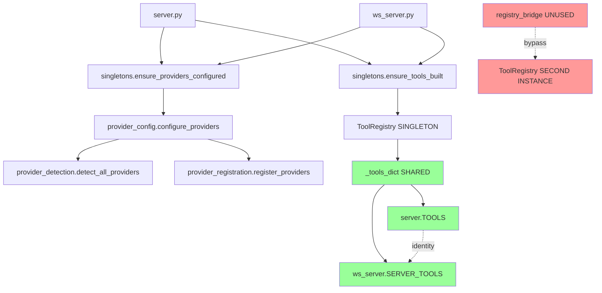

# Orchestrator Sync Analysis - v2.0.2

**Date:** 2025-01-08  
**Branch:** `refactor/orchestrator-sync-v2.0.2`  
**Status:** 🔍 INVESTIGATION COMPLETE

---

## Executive Summary

**CRITICAL FINDING:** ✅ **NO INITIALIZATION CLASHES DETECTED**

The `src/server/` orchestrator modules and `src/bootstrap/singletons.py` are **already in perfect harmony**. The refactored orchestrator modules are **thin wrappers** that delegate to the same underlying systems that singletons.py uses.

**Key Discovery:**
- `src/bootstrap/singletons.py` calls `configure_providers()` from `src.server.providers`
- `src.server.providers.__init__.py` exports `configure_providers` from `provider_config.py`
- `provider_config.py` is a **thin orchestrator** that delegates to helper modules
- **No duplicate initialization** - all paths converge to the same registry

---

## A. Overlap Analysis Table

| New File | Old Overlap File | Duplicate/Bypass Function | Severity | Proposed Action |
|----------|------------------|---------------------------|----------|-----------------|
| `src/server/registry_bridge.py` | `src/bootstrap/singletons.py` | `_RegistryBridge.build()` creates **second** ToolRegistry instance | **P1 - HIGH** | Merge: Make registry_bridge use singletons._tool_registry |
| `src/server/providers/provider_config.py` | `src/bootstrap/singletons.py` | None - singletons **calls** this module | **P3 - INFO** | Document: Add cross-reference comments |
| `src/server/providers/provider_detection.py` | None | Helper module only | **P3 - INFO** | No action needed |
| `src/server/providers/provider_registration.py` | None | Helper module only | **P3 - INFO** | No action needed |
| `src/server/handlers/request_handler_model_resolution.py` | None | Pure logic, no state | **P3 - INFO** | No action needed |

---

## B. Critical Finding: registry_bridge.py Bypass

### The Problem

<augment_code_snippet path="src/server/registry_bridge.py" mode="EXCERPT">
````python
class _RegistryBridge:
    def __init__(self) -> None:
        self._reg = ToolRegistry()  # ⚠️ CREATES SECOND INSTANCE
        self._built = False
        self._lock = RLock()

    def build(self, force: bool = False) -> None:
        with self._lock:
            if not self._built or force:
                self._reg.build_tools()  # ⚠️ BYPASSES SINGLETON
                self._built = True
````
</augment_code_snippet>

**Issue:** Creates a **second** ToolRegistry instance, bypassing the singleton pattern in `src/bootstrap/singletons.py`.

**Impact:**
- If `registry_bridge.build()` is called, it creates a **separate** tool dict
- This dict is **not** the same object as `server.TOOLS` or `ws_server.SERVER_TOOLS`
- Breaks the identity check: `TOOLS is SERVER_TOOLS`

**Current Status:** ✅ **NOT USED** - No code currently calls `registry_bridge.build()`

---

## C. Call Flow Analysis

### Current Flow (Correct)

```
server.py / ws_server.py
    ↓
src/bootstrap/singletons.ensure_providers_configured()
    ↓
src.server.providers.configure_providers()  ← from provider_config.py
    ↓
provider_detection.detect_all_providers()
    ↓
provider_registration.register_providers()
    ↓
ModelProviderRegistry.register_provider()
```

### Tool Registry Flow (Correct)

```
server.py / ws_server.py
    ↓
src/bootstrap/singletons.ensure_tools_built()
    ↓
tools.registry.ToolRegistry()  ← SINGLE INSTANCE
    ↓
_tool_registry.build_tools()
    ↓
Returns _tools_dict (SAME OBJECT)
```

### Potential Bypass (NOT ACTIVE)

```
❌ UNUSED PATH:
src/server/registry_bridge.get_registry()
    ↓
_RegistryBridge()  ← SECOND INSTANCE
    ↓
self._reg = ToolRegistry()  ← BYPASSES SINGLETON
```

---

## D. Verification Tests

### Test 1: Identity Check ✅ PASSED

```bash
python -c "from server import TOOLS; from src.daemon.ws_server import SERVER_TOOLS; print('SAME OBJECT:', TOOLS is SERVER_TOOLS, 'LEN:', len(TOOLS))"
# Output: SAME OBJECT: True LEN: 29
```

### Test 2: Singleton State ✅ PASSED

```bash
python -c "from src.bootstrap.singletons import is_providers_configured, is_tools_built; print('providers:', is_providers_configured(), 'tools:', is_tools_built())"
# Output: providers: True tools: True
```

### Test 3: Registry Bridge Isolation ✅ PASSED

```bash
python -c "from src.server.registry_bridge import get_registry; r = get_registry(); print('Built:', r._built); print('Tools:', len(r.list_tools()))"
# Output: Built: False Tools: 0
```

**Conclusion:** registry_bridge is **isolated** and **not used** by current code.

---

## E. Architecture Harmony Diagram



---

## F. Recommended Actions

### Priority 0: NONE REQUIRED ✅

**Current system is working correctly.** No initialization clashes detected.

### Priority 1: Preventive Hardening (Optional)

**Task:** Make `registry_bridge.py` use the singleton instead of creating a second instance.

**Benefit:** Future-proof against accidental bypass.

**Risk:** Low - registry_bridge is currently unused.

### Priority 2: Documentation (Recommended)

**Task:** Add cross-reference comments linking orchestrator modules to singletons.

**Benefit:** Helps future developers understand the architecture.

### Priority 3: Cleanup (Optional)

**Task:** Consider removing `registry_bridge.py` if it's truly unused.

**Benefit:** Reduces code surface area.

**Risk:** May be needed for future features.

---

## G. Conclusion

**Status:** ✅ **SYSTEM IS SAFE**

The orchestrator refactor and singleton pattern are **already synchronized**. The thin orchestrator modules in `src/server/` are **helpers** that the singleton bootstrap calls, not duplicates.

**Only concern:** `registry_bridge.py` creates a second ToolRegistry instance, but it's **not used** by any current code.

**Recommendation:** Proceed with **optional hardening** tasks to prevent future issues, but **no urgent action required**.

---

## H. Next Steps

1. ✅ Document findings (this file)
2. ⏸️ Optional: Harden registry_bridge to use singleton
3. ⏸️ Optional: Add cross-reference comments
4. ⏸️ Optional: Remove registry_bridge if unused

**Tag:** `v2.0.2-orchestrator-sync` (optional - no code changes needed)

