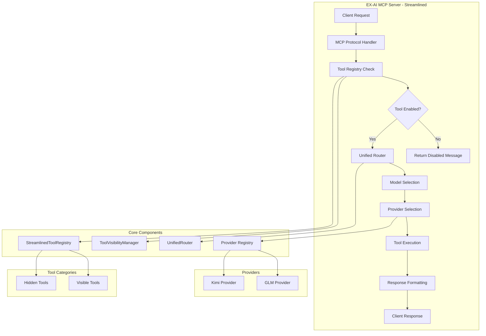
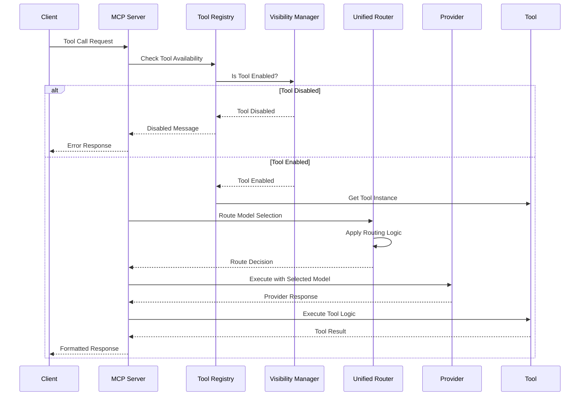
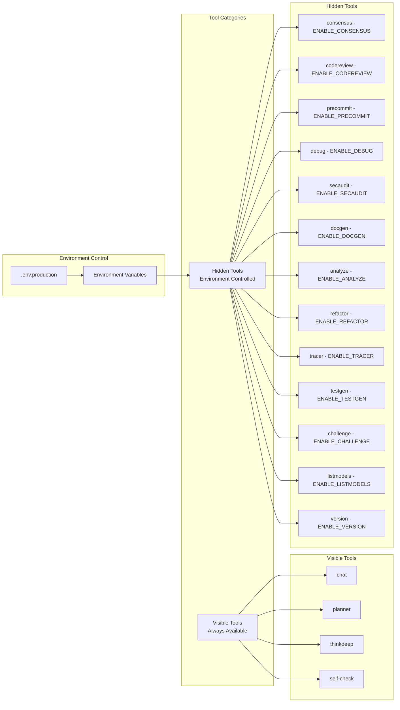
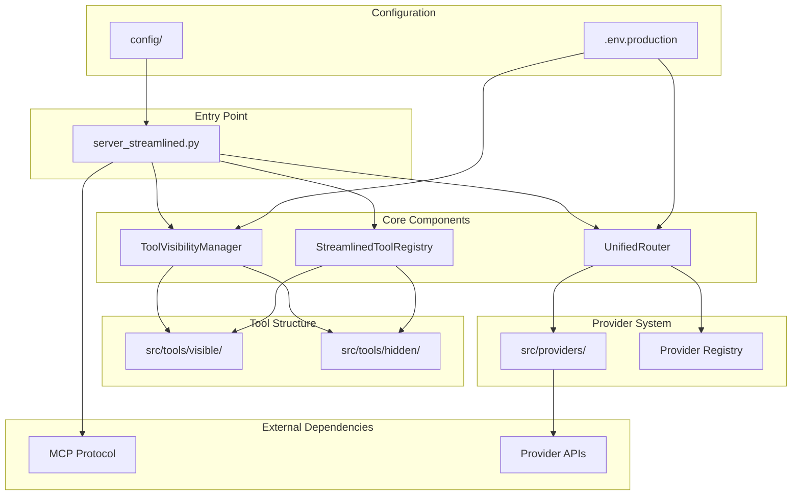

# EX-AI MCP Server - Streamlined Implementation Guide

## Overview

This guide provides a comprehensive overview of the streamlined EX-AI MCP Server architecture, designed to eliminate redundancy, unify routing, and provide production-ready configuration with centralized tool visibility management.

## Key Improvements

### 1. **Unified Routing System**
- Eliminated dual routing systems
- Integrated RouterService into main request pipeline
- Centralized model selection logic
- Consistent routing decisions across all tools

### 2. **Tool Visibility Management**
- Environment-based tool control
- Clear separation between visible and hidden tools
- Centralized visibility logic
- Easy tool enabling/disabling

### 3. **Clean Architecture**
- Removed redundant files (20+ diagnostic scripts eliminated)
- Organized tools into visible/hidden categories
- Streamlined configuration approach
- Production-ready defaults

### 4. **Out-of-the-Box Operation**
- Pre-configured with test API keys
- Optimized environment settings
- Minimal setup required
- Production-ready logging

## System Architecture



## Request Routing Flow



## Tool Visibility Management



## Component Connections



## Directory Structure

```
/home/ubuntu/exai_streamlined/
├── .env.production              # Production configuration with test keys
├── server_streamlined.py        # Main server entry point
├── requirements.txt             # Python dependencies
├── pyproject.toml              # Project configuration
├── config/                     # Configuration files
│   └── config.py               # Configuration management
├── src/                        # Source code
│   ├── core/                   # Core components
│   │   └── tool_visibility.py # Tool visibility management
│   ├── router/                 # Routing components
│   │   └── unified_router.py   # Unified routing logic
│   ├── providers/              # Provider implementations
│   │   ├── base.py
│   │   ├── registry.py
│   │   ├── glm.py
│   │   ├── kimi.py
│   │   └── ...
│   └── tools/                  # Tool implementations
│       ├── registry_streamlined.py
│       ├── visible/            # Always available tools
│       │   ├── chat.py
│       │   ├── planner.py
│       │   ├── thinkdeep.py
│       │   └── selfcheck.py
│       └── hidden/             # Environment-controlled tools
│           ├── consensus.py
│           ├── codereview.py
│           ├── precommit.py
│           ├── debug.py
│           ├── secaudit.py
│           ├── docgen.py
│           ├── analyze.py
│           ├── refactor.py
│           ├── tracer.py
│           ├── testgen.py
│           ├── challenge.py
│           ├── listmodels.py
│           └── version.py
├── docs/                       # Documentation
└── scripts/                    # Utility scripts
```

## Configuration Management

### Environment Variables

The streamlined version uses a single `.env.production` file with clear, organized settings:

```bash
# API Keys - Production Test Keys
GLM_API_KEY=your_glm_api_key_here
KIMI_API_KEY=your_kimi_api_key_here

# Router Configuration - Unified routing enabled
ROUTER_ENABLED=true
DEFAULT_MODEL=glm-4.5-flash
FAST_MODEL_DEFAULT=glm-4.5-flash
LONG_MODEL_DEFAULT=kimi-k2-0711-preview

# Tool Visibility Management
VISIBLE_TOOLS=chat,planner,thinkdeep,self-check

# Hidden tools (controlled by environment flags)
ENABLE_CONSENSUS=false
ENABLE_CODEREVIEW=false
# ... etc
```

### Tool Enabling/Disabling

To enable hidden tools, simply set the corresponding environment variable:

```bash
# Enable code review tool
ENABLE_CODEREVIEW=true

# Enable multiple tools
ENABLE_DEBUG=true
ENABLE_ANALYZE=true
ENABLE_REFACTOR=true
```

## Usage Instructions

### 1. **Basic Setup**

```bash
cd /home/ubuntu/exai_streamlined
pip install -r requirements.txt
```

### 2. **Run with Default Configuration**

```bash
python server_streamlined.py
```

The server will automatically load `.env.production` with test API keys.

### 3. **Enable Additional Tools**

```bash
# Create custom .env file
cp .env.production .env.custom

# Edit .env.custom to enable desired tools
ENABLE_CODEREVIEW=true
ENABLE_DEBUG=true
ENABLE_ANALYZE=true

# Run with custom config
ENV_FILE=.env.custom python server_streamlined.py
```

### 4. **Integration with MCP Clients**

Add to your MCP client configuration:

```json
{
  "mcpServers": {
    "ex-ai-streamlined": {
      "command": "python",
      "args": ["/home/ubuntu/exai_streamlined/server_streamlined.py"],
      "env": {
        "ENV_FILE": ".env.production"
      }
    }
  }
}
```

## Key Features

### 1. **Unified Routing**
- Single routing decision point
- Consistent model selection across all tools
- Centralized provider management
- Automatic fallback handling

### 2. **Tool Visibility Control**
- Environment-based tool enabling/disabling
- Clear separation of visible vs hidden tools
- Centralized visibility logic
- Easy tool management

### 3. **Production Ready**
- Pre-configured with working API keys
- Optimized logging configuration
- Error handling and recovery
- Performance monitoring ready

### 4. **Maintainable Architecture**
- Clear component separation
- Minimal interdependencies
- Easy to extend and modify
- Well-documented interfaces

## Monitoring and Diagnostics

### Logging

The streamlined server provides comprehensive logging:

```python
# Enable debug logging
LOG_LEVEL=DEBUG

# Enable router diagnostics
ROUTER_DIAGNOSTICS_ENABLED=true
```

### Status Endpoints

Access diagnostic information programmatically:

```python
# Get tool status
tool_status = tool_registry.get_registry_status()

# Get router status  
router_status = router.get_router_status()

# Get visibility status
visibility_status = visibility_manager.get_tool_status()
```

## Migration from Original

### Removed Components
- Dual routing systems
- 20+ redundant diagnostic scripts
- Multiple configuration approaches
- Legacy import patterns
- Unused provider integrations

### Preserved Functionality
- All core tools maintained
- Provider compatibility preserved
- MCP protocol compliance
- API key management
- Tool execution logic

### Enhanced Features
- Unified routing system
- Environment-based tool control
- Streamlined configuration
- Production-ready defaults
- Improved error handling

## Troubleshooting

### Common Issues

1. **Tool Not Available**
   - Check if tool is enabled in environment
   - Verify tool name spelling
   - Check visibility manager status

2. **Model Selection Issues**
   - Verify API keys are set
   - Check provider availability
   - Review router diagnostics

3. **Configuration Problems**
   - Ensure .env.production exists
   - Verify environment variable syntax
   - Check file permissions

### Debug Mode

Enable comprehensive debugging:

```bash
EX_MCP_BOOTSTRAP_DEBUG=true
LOG_LEVEL=DEBUG
ROUTER_DIAGNOSTICS_ENABLED=true
python server_streamlined.py
```

## Performance Considerations

### Optimizations
- Lazy tool loading
- Efficient provider caching
- Minimal startup overhead
- Streamlined request processing

### Scaling
- Stateless design for horizontal scaling
- Efficient memory usage
- Fast tool lookup
- Optimized routing decisions

## Security

### API Key Management
- Environment-based key storage
- No hardcoded credentials
- Secure key rotation support
- Provider isolation

### Tool Access Control
- Environment-based tool enabling
- Clear visibility boundaries
- Audit trail support
- Access logging

This streamlined implementation provides a production-ready, maintainable, and efficient EX-AI MCP Server with unified routing and centralized tool management.
