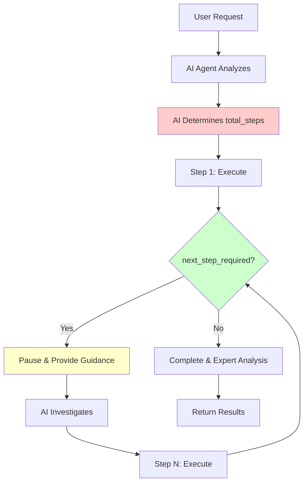

# Current Step Management Architecture

**Date:** 2025-10-01  
**Purpose:** Document how EXAI workflow tools currently manage steps and workflow progression  
**Status:** ✅ COMPLETE

---

## Executive Summary

EXAI workflow tools use a **fixed-step, user-driven** approach where the AI agent (Claude/Augment) determines the total number of steps upfront and manually tracks progress. The system enforces investigation between steps through pause mechanisms but does not dynamically adjust step counts based on complexity or confidence.

**Key Finding:** Step management is currently **static and manual** - the AI decides `total_steps` in step 1 and must manually adjust if needed. There is no AI manager or dynamic step allocation system.

---

## Architecture Overview

### 1. Step Management Location

**Where steps are determined:**
- ✅ **AI Agent (Claude/Augment):** Decides `total_steps` in step 1 based on task complexity
- ✅ **System Prompts:** Provide guidance but don't enforce specific step counts
- ❌ **Tool Code:** Does NOT determine steps - only validates and enforces workflow rules
- ❌ **AI Manager:** Does NOT exist - no dynamic step allocation

**Control Flow:**
```
User Request → AI Agent → Determines total_steps → Tool validates → Workflow executes
                ↓
         (Manual adjustment if needed)
```

### 2. Core Components

#### A. Base Models (`tools/shared/base_models.py`)

**BaseWorkflowRequest:**
```python
class BaseWorkflowRequest(ToolRequest):
    step: str = Field(..., description="Current work step content")
    step_number: int = Field(..., ge=1, description="Current step number (starts at 1)")
    total_steps: int = Field(..., ge=1, description="Estimated total steps needed")
    next_step_required: bool = Field(..., description="Whether another step is needed")
```

**Key Points:**
- `step_number` and `total_steps` are **required fields** for all workflow tools
- Validation ensures `step_number >= 1` and `total_steps >= 1`
- No dynamic calculation - values come from AI agent

#### B. Workflow Orchestration (`tools/workflow/orchestration.py`)

**execute_workflow() method:**
```python
async def execute_workflow(self, arguments: dict[str, Any]) -> list:
    # Validate request
    request = self.get_workflow_request_model()(**arguments)
    
    # Adjust total steps if needed (manual override)
    if request.step_number > request.total_steps:
        request.total_steps = request.step_number  # Auto-adjust upward
    
    # Create thread for first step
    if not continuation_id and request.step_number == 1:
        continuation_id = create_thread(self.get_name(), clean_args)
    
    # Process step and determine next action
    if request.next_step_required:
        return self.handle_work_continuation(response_data, request)
    else:
        return await self.handle_work_completion(response_data, request, arguments)
```

**Key Features:**
- ✅ Auto-adjusts `total_steps` upward if `step_number` exceeds it
- ✅ Enforces pause between steps via `handle_work_continuation()`
- ✅ Supports backtracking to earlier steps
- ❌ Does NOT dynamically calculate optimal step count
- ❌ Does NOT use AI manager to determine steps

#### C. Pause Enforcement (`handle_work_continuation()`)

**Purpose:** Force investigation between steps

```python
def handle_work_continuation(self, response_data: dict, request) -> dict:
    response_data["status"] = f"pause_for_{self.get_name()}"
    response_data[f"{self.get_name()}_required"] = True
    
    # Get tool-specific required actions
    required_actions = self.get_required_actions(
        request.step_number, confidence, findings, total_steps
    )
    response_data["required_actions"] = required_actions
    
    # Provide guidance for next step
    response_data["next_steps"] = "STOP! Do NOT call {tool} again yet..."
    response_data["next_step_number"] = request.step_number + 1
    
    return response_data
```

**Key Points:**
- ✅ Prevents recursive calls without investigation
- ✅ Provides clear guidance on what to investigate
- ✅ Specifies next step number
- ❌ Does NOT assess if more/fewer steps are needed
- ❌ Does NOT dynamically adjust `total_steps`

### 3. Tool-Specific Variations

#### A. Standard Workflow Tools (analyze, debug, codereview, precommit, refactor, secaudit, testgen, tracer)

**Step Count:** Fixed by AI agent in step 1
**Typical Range:** 3-5 steps
**Example (analyze):** 5 steps (discovery → analysis → deep dive → comparison → synthesis)

#### B. Consensus Tool (Special Case)

**Step Count:** Dynamically calculated based on number of models
**Formula:** `total_steps = len(models_to_consult)`
**Example:** 3 models → 3 steps (one per model consultation)

**Code:**
```python
if request.step_number == 1:
    self.models_to_consult = request.models or []
    request.total_steps = len(self.models_to_consult)  # Dynamic!
```

**Key Insight:** Consensus tool demonstrates that dynamic step calculation IS possible!

#### C. Docgen Tool (Special Case)

**Step Count:** Dynamically calculated based on number of files
**Formula:** `total_steps = 1 + total_files_to_document`
**Example:** 5 files → 6 steps (1 discovery + 5 documentation steps)

**Code:**
```python
def prepare_step_data(self, request) -> dict:
    total_files_to_document = self.get_request_total_files_to_document(request)
    if total_files_to_document > 0:
        calculated_total_steps = 1 + total_files_to_document
    else:
        calculated_total_steps = request.total_steps
```

**Key Insight:** Docgen tool also demonstrates dynamic step calculation!

### 4. Current Limitations

#### A. No AI Manager

**Current State:**
- AI agent (Claude/Augment) manually determines `total_steps`
- No centralized intelligence for step allocation
- No complexity assessment or confidence-based adjustment

**Impact:**
- Inconsistent step counts across similar tasks
- No optimization for simple vs. complex requests
- Manual adjustment required if initial estimate is wrong

#### B. Fixed Step Counts

**Current State:**
- Most tools use fixed step counts (e.g., analyze always uses 5 steps)
- AI agent must manually adjust if more steps are needed
- No early termination if high confidence is reached

**Impact:**
- Unnecessary steps for simple tasks
- Insufficient steps for complex tasks
- Wasted time and tokens

#### C. No Confidence-Based Termination

**Current State:**
- Tools track confidence but don't use it for early termination
- Must complete all planned steps even if high confidence is reached
- `next_step_required` is manually set by AI agent

**Impact:**
- Inefficient workflow execution
- No adaptive behavior based on progress
- Missed opportunity for optimization

---

## Current Workflow Execution Flow



**Red (Manual):** AI agent manually determines steps  
**Green (Automated):** Tool enforces workflow rules  
**Yellow (Pause):** Investigation required between steps

---

## Key Findings

### ✅ What Works Well

1. **Pause Enforcement:** Prevents recursive calls, ensures investigation
2. **Backtracking Support:** Allows revision of earlier steps
3. **Continuation IDs:** Maintains conversation context across steps
4. **Progress Tracking:** Clear breadcrumbs and status updates
5. **Tool-Specific Customization:** Each tool can override behavior
6. **Dynamic Examples:** Consensus and docgen show dynamic step calculation is possible

### ❌ What Needs Improvement

1. **No AI Manager:** No centralized intelligence for step allocation
2. **Manual Step Determination:** AI agent must guess `total_steps` upfront
3. **No Confidence-Based Termination:** Can't end early if high confidence reached
4. **No Complexity Assessment:** Same step count for simple and complex tasks
5. **No Dynamic Adjustment:** Can't increase steps mid-workflow (except manual override)
6. **Inconsistent Patterns:** Some tools use dynamic steps (consensus, docgen), others don't

---

## Opportunities for Enhancement

### 1. AI Manager for Dynamic Step Allocation

**Concept:** GLM-4.5-flash analyzes request and determines optimal step count

**Benefits:**
- Consistent step allocation across tools
- Complexity-aware planning
- Reduced manual guesswork

### 2. Confidence-Based Early Termination

**Concept:** Allow tools to terminate early if `confidence == "certain"`

**Benefits:**
- Faster execution for simple tasks
- Reduced token usage
- Adaptive behavior

### 3. Mid-Workflow Step Adjustment

**Concept:** Allow tools to request additional steps if needed

**Benefits:**
- Better handling of complex tasks
- No upfront commitment to step count
- More flexible workflows

### 4. Agentic Self-Assessment

**Concept:** Tools assess their own progress and determine next actions

**Benefits:**
- Goal-oriented behavior
- Self-correcting workflows
- Reduced human intervention

---

## Next Steps

1. ✅ **Document Current Architecture** (THIS DOCUMENT)
2. ⏳ **Design AI Manager System** (Next)
3. ⏳ **Design Agentic Enhancements** (Next)
4. ⏳ **Implement Dynamic Step Management** (Next)

---

**Document Status:** ✅ COMPLETE  
**Last Updated:** 2025-10-01  
**Next Document:** AI Manager Design for Dynamic Step Allocation

