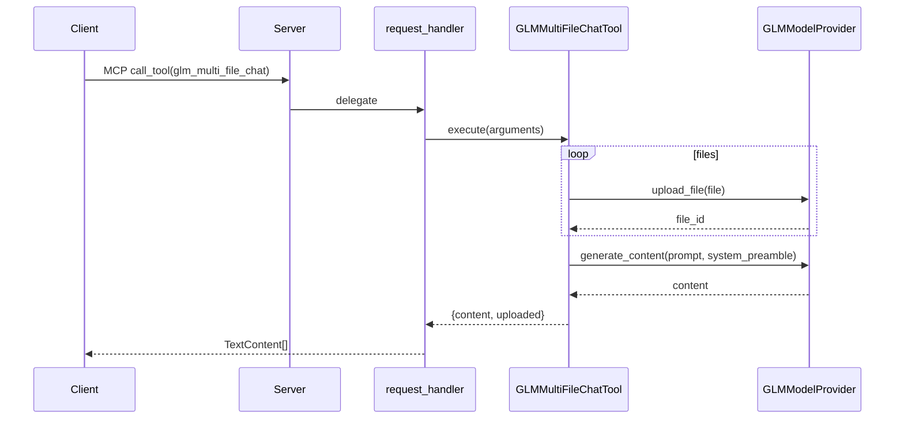
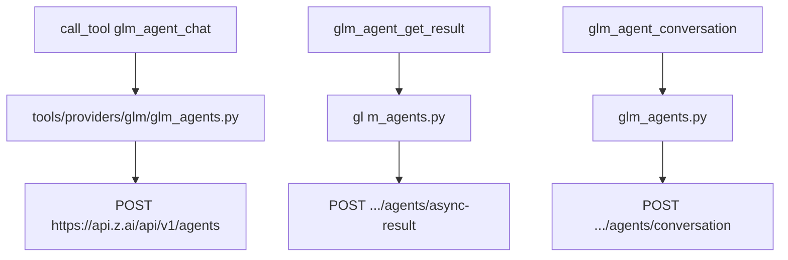
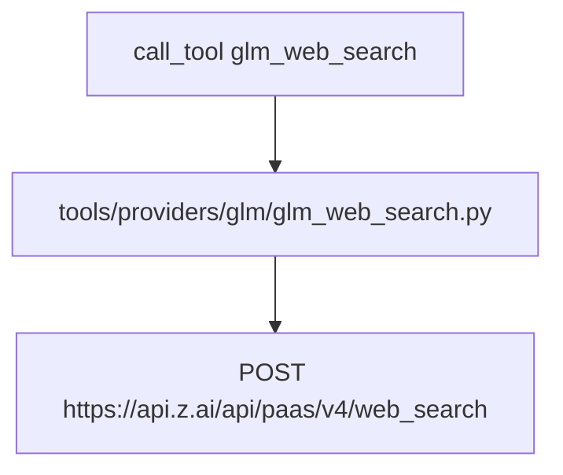
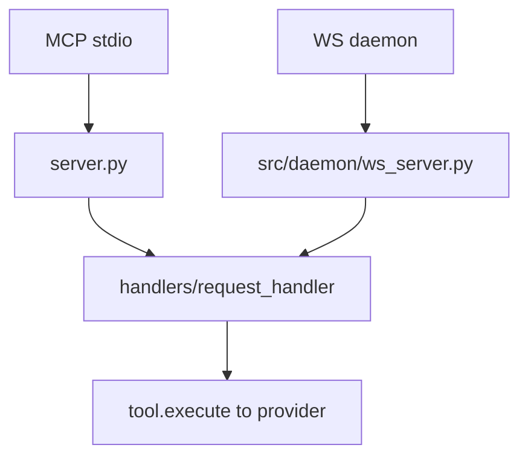

# GLM/Z.ai Execution Flows

This doc focuses purely on GLM tool flows and includes functional Mermaid diagrams.

## glm_multi_file_chat

## glm_agent_*

## glm_web_search

## Stdio vs WS transport (both converge)

