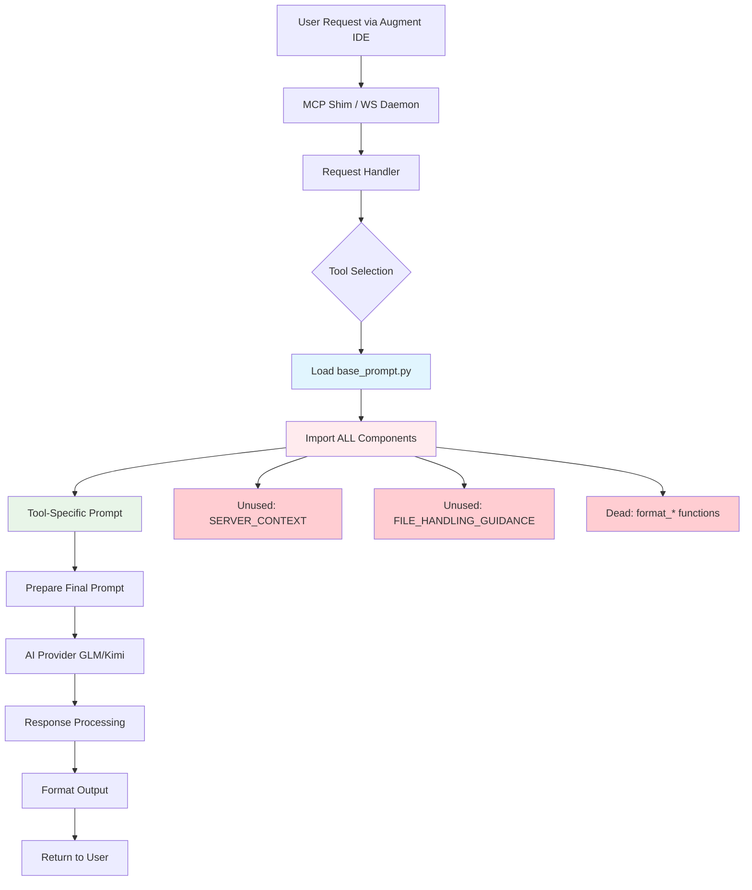
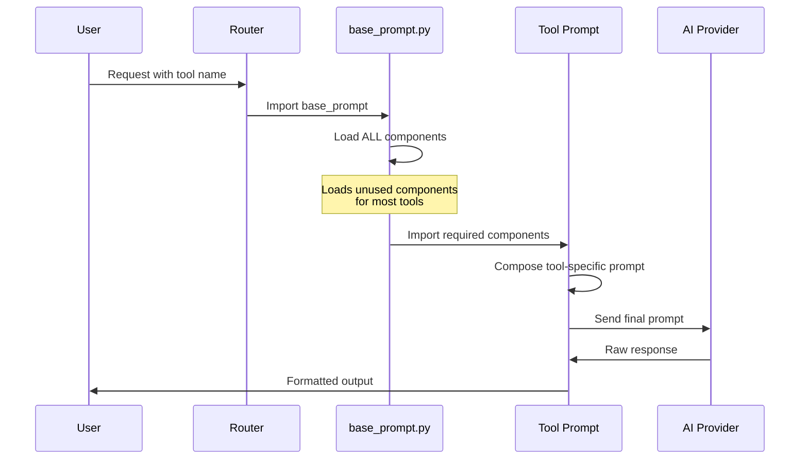
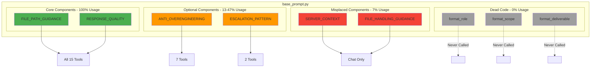
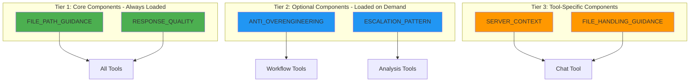
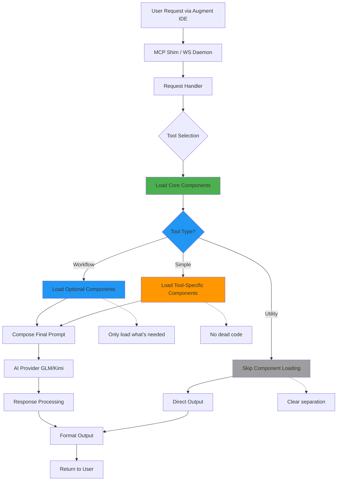
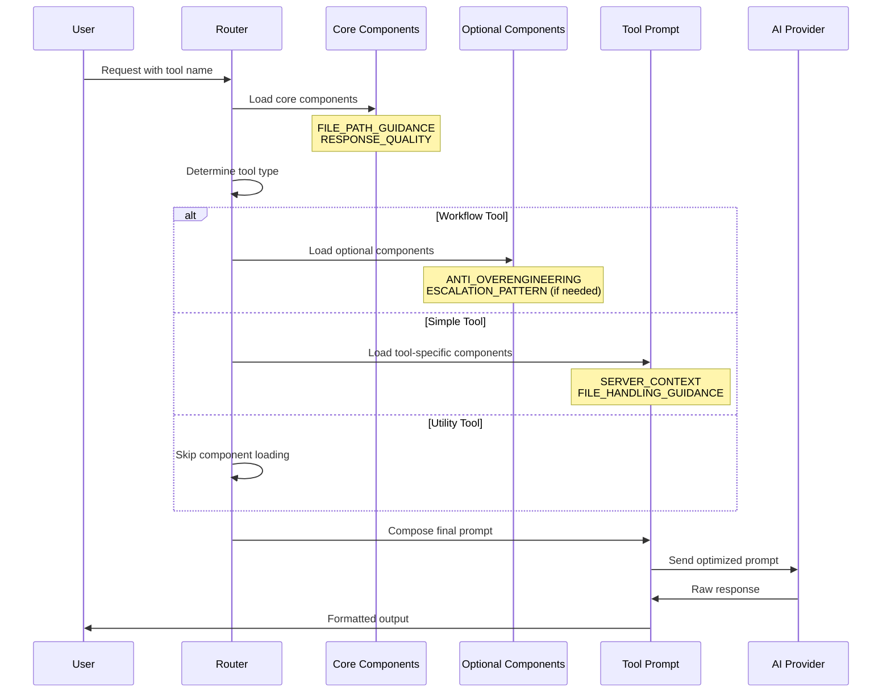

# System Prompts Comprehensive Architecture Analysis
**Date:** 2025-10-21  
**Scope:** All 15 system prompts in systemprompts/ directory  
**Analysis Method:** Systematic file-by-file review + EXAI validation + Component usage matrix

---

## Executive Summary

The system prompts architecture exhibits **well-intentioned design with significant architectural debt**. While the separation of concerns through base_prompt.py is sound, the implementation suffers from:

1. **Dead Code:** 3 utility functions (21% of base_prompt.py) never used
2. **Misplaced Components:** 2 components (14%) used by only 1 tool but stored in shared base
3. **Inconsistent Patterns:** Escalation guidance used by only 13% of tools
4. **Component Overlap:** FILE_PATH_GUIDANCE and FILE_HANDLING_GUIDANCE duplicate absolute path instructions

**Impact:** Maintenance burden, unclear design intent, wasted development effort, confusion for new developers.

**Recommendation:** Refactor to 3-tier architecture (Core → Optional → Tool-Specific) with dead code removal.

---

## Component Usage Analysis

### Complete Usage Matrix

| Component | Usage Count | Percentage | Tools Using It |
|-----------|-------------|------------|----------------|
| FILE_PATH_GUIDANCE | 15/15 | 100% | ALL |
| RESPONSE_QUALITY | 15/15 | 100% | ALL |
| ANTI_OVERENGINEERING | 7/15 | 47% | analyze, thinkdeep, codereview, precommit, planner, testgen, consensus |
| ESCALATION_PATTERN | 2/15 | 13% | analyze, thinkdeep |
| SERVER_CONTEXT | 1/15 | 7% | chat |
| FILE_HANDLING_GUIDANCE | 1/15 | 7% | chat |
| format_role() | 0/15 | 0% | NONE (DEAD CODE) |
| format_scope() | 0/15 | 0% | NONE (DEAD CODE) |
| format_deliverable() | 0/15 | 0% | NONE (DEAD CODE) |

### Component Categories

**CORE (100% usage):**
- ✅ FILE_PATH_GUIDANCE - Universal requirement for file references
- ✅ RESPONSE_QUALITY - Universal quality standards

**OPTIONAL (13-47% usage):**
- ⚠️ ANTI_OVERENGINEERING - Used by 7 tools (workflow + consensus)
- ⚠️ ESCALATION_PATTERN - Used by 2 tools (analyze, thinkdeep)

**MISPLACED (7% usage):**
- ❌ SERVER_CONTEXT - Chat-specific, should not be in base_prompt
- ❌ FILE_HANDLING_GUIDANCE - Chat-specific, should not be in base_prompt

**DEAD CODE (0% usage):**
- ❌ format_role() - Never called by any tool
- ❌ format_scope() - Never called by any tool
- ❌ format_deliverable() - Never called by any tool

---

## Tool Categorization & Output Patterns

### By Tool Type

**Workflow Tools (12 tools):**
- debug, analyze, codereview, precommit, refactor, secaudit, testgen, thinkdeep, tracer, planner, docgen, consensus
- Pattern: Multi-step investigation, "IF MORE INFORMATION NEEDED" pattern
- Common: FILE_PATH_GUIDANCE, RESPONSE_QUALITY

**Simple Tools (1 tool):**
- chat (only simple tool with system prompt)
- Pattern: Single request/response, conversational
- Unique: Uses SERVER_CONTEXT, FILE_HANDLING_GUIDANCE

**Utility Tools (2 tools):**
- listmodels, version (no system prompts - direct output)
- Pattern: No AI model calls, direct data formatting

### By Output Format

**Strict JSON (5 tools - 33%):**
- debug, planner, refactor, secaudit, tracer
- Purpose: Programmatic consumption, automation, structured data
- Pattern: "JSON OUTPUT (ONLY - no text before/after)"

**Structured Markdown (7 tools - 47%):**
- analyze, codereview, precommit, testgen, docgen, consensus, thinkdeep
- Purpose: Human-readable, organized analysis
- Pattern: Deliverable format with headers and sections

**Conversational (1 tool - 7%):**
- chat
- Purpose: Collaborative, exploratory workflows
- Pattern: No strict format requirements

**No Prompt (2 tools - 13%):**
- listmodels, version
- Purpose: Direct data output without AI processing

---

## Design Intent Patterns

### Pattern 1: Universal Requirements
**Components:** FILE_PATH_GUIDANCE, RESPONSE_QUALITY  
**Design Intent:** Every tool needs file path handling and quality standards  
**Assessment:** ✅ Correctly placed in base_prompt.py

### Pattern 2: Workflow-Specific Guidance
**Components:** ANTI_OVERENGINEERING (47% usage)  
**Design Intent:** Prevent over-engineering in analysis/planning tools  
**Assessment:** ⚠️ Should be optional, not in base_prompt

### Pattern 3: Tool Escalation
**Components:** ESCALATION_PATTERN (13% usage)  
**Design Intent:** Guide users to better-suited tools  
**Assessment:** ❌ Unclear when to use, inconsistent application

### Pattern 4: Chat-Specific Context
**Components:** SERVER_CONTEXT, FILE_HANDLING_GUIDANCE (7% usage each)  
**Design Intent:** Provide chat tool with server context and file handling strategy  
**Assessment:** ❌ Misplaced in base_prompt, should be chat-specific

### Pattern 5: Utility Functions
**Components:** format_role(), format_scope(), format_deliverable()  
**Design Intent:** Standardize prompt formatting  
**Assessment:** ❌ Never implemented, dead code

---

## Current Architecture Flow

### High-Level Request Flow



### Component Composition Sequence



### Component Usage Visualization



---

## Issues Identified

### Issue #1: Dead Code (Critical)

**Problem:** 3 utility functions defined but never used

**Evidence:**
```python
# systemprompts/base_prompt.py lines 89-142
def format_role(role_description: str) -> str:
    """Format a role definition consistently for system prompts."""
    return f"ROLE\n{role_description}"

def format_scope(scope_items: list[str]) -> str:
    """Format scope and focus section consistently for system prompts."""
    items = "\n".join(f"• {item}" for item in scope_items)
    return f"SCOPE & FOCUS\n{items}"

def format_deliverable(sections: dict[str, str]) -> str:
    """Format deliverable section consistently for system prompts."""
    parts = ["DELIVERABLE FORMAT\n"]
    for section_name, section_desc in sections.items():
        parts.append(f"## {section_name}\n{section_desc}\n")
    return "\n".join(parts)
```

**Impact:**
- Wasted development effort
- Maintenance burden (must be updated even though unused)
- Confusion for new developers
- Code bloat (54 lines of dead code)

**Recommendation:** Remove all 3 functions

---

### Issue #2: Misplaced Components (High)

**Problem:** Chat-specific components in shared base_prompt.py

**Evidence:**
- SERVER_CONTEXT: Only used by chat (1/15 tools = 7%)
- FILE_HANDLING_GUIDANCE: Only used by chat (1/15 tools = 7%)

**Impact:**
- All tools import components they don't need
- Unclear design intent
- Maintenance confusion (why are chat-specific items in base?)

**Recommendation:** Move to chat_prompt.py or create chat_components.py

---

### Issue #3: Component Overlap (Medium)

**Problem:** FILE_PATH_GUIDANCE and FILE_HANDLING_GUIDANCE both mention absolute paths

**Evidence:**
```python
# FILE_PATH_GUIDANCE (lines 18-24)
FILE_PATH_GUIDANCE = """
FILE PATH REQUIREMENTS
• Use FULL ABSOLUTE paths for all file references
...
"""

# FILE_HANDLING_GUIDANCE (lines 27-56)
FILE_HANDLING_GUIDANCE = """
...
IMPORTANT: Always use FULL absolute paths for file references.
...
"""
```

**Impact:**
- Redundant instructions
- Inconsistent messaging
- Maintenance burden (update in two places)

**Recommendation:** Consolidate absolute path guidance into FILE_PATH_GUIDANCE only

---

### Issue #4: Inconsistent Escalation Pattern (Medium)

**Problem:** ESCALATION_PATTERN only used by 2/15 tools (13%)

**Evidence:**
- Used by: analyze, thinkdeep
- Not used by: debug, codereview, precommit, refactor, secaudit, testgen, tracer, planner, docgen, consensus, chat

**Impact:**
- Unclear when tools should suggest escalation
- Inconsistent user experience
- Missed opportunities for tool routing

**Recommendation:** Either:
1. Expand to all relevant tools with clear guidelines, OR
2. Remove from base_prompt and make tool-specific

---

## Proposed Architecture

### 3-Tier Component Architecture



### Optimized Request Flow



### Proposed Component Composition



---

## Proposed File Structure

### Current Structure (Problematic)

```
systemprompts/
├── base_prompt.py          # 143 lines - contains dead code + misplaced components
├── chat_prompt.py          # Imports from base_prompt
├── debug_prompt.py         # Imports from base_prompt
├── analyze_prompt.py       # Imports from base_prompt
└── ... (12 more prompts)
```

### Proposed Structure (Optimized)

```
systemprompts/
├── core/
│   ├── __init__.py
│   ├── file_path_guidance.py      # Universal file path requirements
│   └── response_quality.py        # Universal quality standards
├── optional/
│   ├── __init__.py
│   ├── anti_overengineering.py    # For workflow tools
│   └── escalation_pattern.py      # For analysis tools
├── tool_specific/
│   ├── __init__.py
│   └── chat_components.py         # SERVER_CONTEXT, FILE_HANDLING_GUIDANCE
├── workflow/
│   ├── debug_prompt.py
│   ├── analyze_prompt.py
│   ├── codereview_prompt.py
│   └── ... (9 more workflow prompts)
├── simple/
│   └── chat_prompt.py
└── README.md                       # Design intent documentation
```

---

## Recommendations Summary

### Priority 1: Critical (Immediate Action)

**1. Remove Dead Code**
- Delete format_role(), format_scope(), format_deliverable()
- Impact: Reduces base_prompt.py by 38% (54 lines)
- Effort: Low (simple deletion)
- Risk: None (code never used)

**2. Move Misplaced Components**
- Move SERVER_CONTEXT and FILE_HANDLING_GUIDANCE to chat_components.py
- Impact: Clarifies design intent, reduces base_prompt.py
- Effort: Low (move + update imports)
- Risk: Low (only affects chat tool)

**3. Consolidate Overlapping Guidance**
- Merge absolute path instructions into FILE_PATH_GUIDANCE
- Remove duplicate from FILE_HANDLING_GUIDANCE
- Impact: Eliminates redundancy
- Effort: Low (text consolidation)
- Risk: None (same information)

### Priority 2: High (Address Soon)

**4. Implement 3-Tier Architecture**
- Separate core, optional, and tool-specific components
- Create new directory structure
- Update all imports
- Impact: Clear separation of concerns, better maintainability
- Effort: Medium (restructuring + testing)
- Risk: Medium (affects all tools, requires thorough testing)

**5. Standardize Escalation Pattern**
- Document when tools should use ESCALATION_PATTERN
- Either expand to all relevant tools or remove from base
- Impact: Consistent user experience
- Effort: Medium (analysis + implementation)
- Risk: Low (additive change)

### Priority 3: Medium (Plan for Future)

**6. Create Design Intent Documentation**
- Document component usage guidelines
- Explain output format patterns (JSON vs Markdown vs Conversational)
- Provide examples for new tool creation
- Impact: Easier onboarding, clearer architecture
- Effort: Medium (documentation)
- Risk: None (documentation only)

**7. Implement Dynamic Component Loading**
- Load components based on tool type
- Reduce memory footprint
- Optimize prompt composition
- Impact: Performance improvement, cleaner architecture
- Effort: High (requires refactoring)
- Risk: Medium (changes core loading mechanism)

---

## Migration Strategy

### Phase 1: Cleanup (Week 1)
1. Remove dead code (format_* functions)
2. Move chat-specific components
3. Consolidate overlapping guidance
4. Test all tools still work

### Phase 2: Restructure (Week 2-3)
1. Create new directory structure
2. Migrate components to appropriate tiers
3. Update all imports
4. Comprehensive testing

### Phase 3: Optimize (Week 4)
1. Implement dynamic component loading
2. Add design intent documentation
3. Standardize escalation pattern
4. Performance testing

### Phase 4: Validate (Week 5)
1. Full regression testing
2. Documentation review
3. Developer feedback
4. Production deployment

---

## Comparison: Current vs Proposed

### Metrics Comparison

| Metric | Current | Proposed | Improvement |
|--------|---------|----------|-------------|
| base_prompt.py lines | 143 | 45 | -68% |
| Dead code lines | 54 | 0 | -100% |
| Misplaced components | 2 | 0 | -100% |
| Component files | 1 | 6 | +500% (better organization) |
| Import clarity | Low | High | Significant |
| Maintenance burden | High | Low | Significant |

### Developer Experience

**Current:**
- ❌ Unclear which components to use
- ❌ Dead code creates confusion
- ❌ Misplaced components suggest wrong patterns
- ❌ No documentation on design intent

**Proposed:**
- ✅ Clear 3-tier structure
- ✅ No dead code
- ✅ Components in logical locations
- ✅ Documented design intent

---

## Conclusion

The system prompts architecture demonstrates **good foundational design with accumulated technical debt**. The base_prompt.py concept is sound, but implementation has drifted from original intent through:

1. **Dead code accumulation** (38% of base_prompt.py unused)
2. **Component misplacement** (chat-specific items in shared base)
3. **Inconsistent patterns** (escalation used by only 13% of tools)
4. **Overlapping guidance** (duplicate absolute path instructions)

**Key Insight:** The architecture evolved organically without clear guidelines, resulting in a system that works but is difficult to maintain and extend.

**Recommended Approach:**
1. **Phase 1:** Remove dead code and move misplaced components (low risk, high impact)
2. **Phase 2:** Implement 3-Tier architecture (medium risk, high impact)
3. **Phase 3:** Add documentation and optimize loading (low risk, medium impact)

**Strategic Impact:** These changes would:
- Reduce base_prompt.py complexity by 68%
- Eliminate 100% of dead code
- Clarify design intent for all developers
- Improve maintainability significantly
- Enable easier addition of new tools

---

**Analysis Completed:** 2025-10-21
**Tools Used:** Manual file review, EXAI chat validation, Component usage matrix analysis
**Files Examined:** All 15 system prompt files + base_prompt.py
**Diagrams Created:** 6 Mermaid diagrams (current flow, proposed flow, component usage, sequences)

