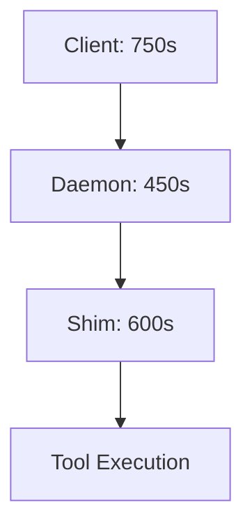

# Configuration Guide

This guide covers all configuration options for EXAI MCP Server.

## 📋 Configuration Files

### Primary Configuration Files

| File | Purpose | Location |
|------|---------|----------|
| `claude_desktop_config.json` | Client config (Claude Desktop) | `%APPDATA%/Claude/` |
| `.mcp.json` | Project config | Project root |
| `docker-compose.yml` | Docker configuration | Project root |
| `.env` | Environment variables (host) | Project root |
| `.env.docker` | Environment variables (container) | Project root |

## 🔌 Port Configuration

### Critical Port Mapping

**docker-compose.yml**:
```yaml
ports:
  - "3000:8079"  # WebSocket Daemon (MCP protocol)
  - "3001:8080"  # Monitoring Dashboard
  - "3002:8082"  # Health Check Endpoint
  - "3003:8000"  # Prometheus Metrics
```

**Port Strategy**:
- **3000-3999**: EXAI Services
- **8000-8999**: Orchestrator APIs
- **9000-9999**: Web UIs

### Client Port Configuration

**claude_desktop_config.json**:
```json
{
  "mcpServers": {
    "exai-mcp": {
      "env": {
        "EXAI_WS_PORT": "3000",  // ✅ Correct
        "EXAI_WS_HOST": "127.0.0.1"
      }
    }
  }
}
```

**❌ Common Error**: Using port 8079 (Docker internal) instead of 3000 (host)

## ⏱️ Timeout Configuration

### Timeout Hierarchy



### Timeout Settings

**.env (Shim Configuration)**:
```bash
# Tool-level timeouts
SIMPLE_TOOL_TIMEOUT_SECS=60           # Simple operations
WORKFLOW_TOOL_TIMEOUT_SECS=120        # Complex operations
EXPERT_ANALYSIS_TIMEOUT_SECS=90       # AI analysis

# Provider-specific timeouts
GLM_TIMEOUT_SECS=90                   # GLM API calls
KIMI_TIMEOUT_SECS=120                 # Kimi API calls
KIMI_WEB_SEARCH_TIMEOUT_SECS=150      # Kimi with web search

# WebSocket timeouts
EXAI_WS_PING_INTERVAL=45              # Heartbeat interval
EXAI_WS_PING_TIMEOUT=240              # Connection timeout
```

**.env.docker (Daemon Configuration)**:
```bash
# Same values as .env, enforced by container
WORKFLOW_TOOL_TIMEOUT_SECS=120
EXAI_WS_PING_INTERVAL=45
EXAI_WS_PING_TIMEOUT=240
```

## 🔐 Authentication Configuration

### JWT Token Setup

**.env**:
```bash
# JWT authentication (added 2025-11-03)
# Each MCP client has its own unique JWT token

# VSCode Instance 1
EXAI_JWT_TOKEN_VSCODE1=eyJhbGciOiJIUzI1NiIsInR5cCI6IkpXVCJ9...

# VSCode Instance 2
EXAI_JWT_TOKEN_VSCODE2=eyJhbGciOiJIUzI1NiIsInR5cCI6IkpXVCJ9...

# Claude Desktop
EXAI_JWT_TOKEN_CLAUDE=eyJhbGciOiJIUzI1NiIsInR5cCI6IkpXVCJ9...
```

**claude_desktop_config.json**:
```json
{
  "env": {
    "EXAI_JWT_TOKEN": "eyJhbGciOiJIUzI1NiIsInR5cCI6IkpXVCJ9..."
  }
}
```

### Legacy Token (Optional)

**.env**:
```bash
# Legacy auth token (for backward compatibility)
EXAI_WS_TOKEN=test-token-12345
```

## 🎛️ Session Management

### Session Configuration

**.env**:
```bash
# Session scope control
EX_SESSION_SCOPE_STRICT=true                    # Enable strict scoping
EX_SESSION_SCOPE_ALLOW_CROSS_SESSION=false      # No cross-session access

# Shim instance configuration
EXAI_SESSION_ID=vscode-instance-1               # Explicit session ID
MCP_SERVER_ID=exai-ws-vscode1                   # MCP server ID
EXAI_SHIM_ID=shim-vscode1                       # Shim instance ID
EXAI_LOG_PREFIX=vscode1                         # Log file prefix
```

### Multi-Instance Support

Each shim instance gets:
- **Unique SESSION_ID**: UUID or instance name
- **Dedicated log file**: `ws_shim_{SESSION_ID}.log`
- **Isolated stdio handles**: Prevents conflicts on Windows

## 🛠️ Tool Visibility Configuration

### LEAN_MODE System

**.env**:
```bash
# Enable 4-tier tool visibility system
LEAN_MODE=true

# When LEAN_MODE=true:
# - Essential (3): status, chat, planner
# - Core (7): analyze, codereview, debug, refactor, testgen, thinkdeep, smart_file_query
# - Advanced (7): consensus, docgen, tracer, etc.
# - Hidden (4): Diagnostic tools
```

**Agent Default View**: 10 tools (Essential + Core)
**Full View**: 33 tools (all tiers)

### Manual Tool Control

**Individual tool visibility** (advanced):
```bash
# Show/hide specific tools (if supported)
EXAI_SHOW_TOOL_ANALYZE=true
EXAI_SHOW_TOOL_DEBUG=false
```

## 📊 Resource Limits

### Docker Resource Limits

**docker-compose.yml**:
```yaml
deploy:
  resources:
    limits:
      cpus: '2.0'
      memory: 2G
    reservations:
      cpus: '0.5'
      memory: 512M
```

### Connection Limits

**.env.docker**:
```bash
# Connection limits (2025-10-26)
MAX_CONNECTIONS_PER_IP=100          # Per IP address
MAX_CONNECTIONS=2000                 # Global maximum
```

### File Descriptor Limits

**docker-compose.yml**:
```yaml
ulimits:
  nofile:
    soft: 4096
    hard: 8192
```

## 📝 Logging Configuration

### Log Levels

**.env**:
```bash
# Logging level
LOG_LEVEL=INFO                       # DEBUG, INFO, WARNING, ERROR

# Per-module logging
LOG_LEVEL_REQUEST_ROUTER=ERROR       # Suppress noisy logs
LOG_SAMPLE_RATE_REQUEST_ROUTER=0.05  # 5% sample rate
```

### Log File Locations

| Component | Log File | Format |
|-----------|----------|--------|
| **Shim Instance 1** | `logs/ws_shim_vscode1.log` | Text |
| **Shim Instance 2** | `logs/ws_shim_vscode2.log` | Text |
| **Shim Dynamic** | `logs/ws_shim_{UUID}.log` | Text |
| **Daemon** | `logs/ws_daemon.log` | JSON + Text |
| **Native MCP** | `logs/exai_native_mcp.log` | Text |
| **Health** | `logs/ws_daemon.health.json` | JSON |

### Log Rotation

**docker-compose.yml**:
```yaml
logging:
  driver: "json-file"
  options:
    max-size: "10m"       # Rotate at 10MB
    max-file: "3"         # Keep 3 files
```

## 🔌 WebSocket Configuration

### Connection Settings

**.env**:
```bash
# WebSocket connection
EXAI_WS_HOST=127.0.0.1               # Server host
EXAI_WS_PORT=3000                    # Server port
EXAI_WS_CONNECT_TIMEOUT=30           # Connection timeout
EXAI_WS_HANDSHAKE_TIMEOUT=15         # Handshake timeout

# Message settings
EXAI_WS_MAX_BYTES=33554432           # 32MB max message size
EXAI_WS_AUTOSTART=false              # Don't auto-start local daemon
```

### Ping/Pong Configuration

**Purpose**: Keep connection alive and detect dropped connections

```bash
# Heartbeat
EXAI_WS_PING_INTERVAL=45             # Send ping every 45s
EXAI_WS_PING_TIMEOUT=240             # Wait 240s for pong

# Grace period for acknowledgments
EXAI_SHIM_ACK_GRACE_SECS=120         # Wait 120s for tool ack
```

## 🗃️ Data Persistence

### Redis Configuration

**docker-compose.yml**:
```yaml
services:
  redis:
    image: redis:7-alpine
    command: sh -c "redis-server /usr/local/etc/redis/redis.conf --requirepass $$REDIS_PASSWORD"
    ports:
      - "6379:6379"                   # Expose for debugging
    volumes:
      - redis-data:/data
      - ./redis.conf:/usr/local/etc/redis/redis.conf:ro
```

**.env.docker**:
```bash
# Redis connection
REDIS_HOST=redis                     # Container name
REDIS_PORT=6379
REDIS_DB=0
REDIS_PASSWORD=...                   # From .env.docker

# Session persistence
SESSION_TTL_SECS=3600                # 1 hour default
```

### Volume Mounts

**docker-compose.yml**:
```yaml
volumes:
  # Source code (development mode)
  - ./src:/app/src
  - ./scripts:/app/scripts

  # Data directories
  - ./logs:/app/logs
  - ./docs:/app/docs

  # Configuration
  - ./.env.docker:/app/.env:ro

  # Project files (for file uploads)
  - c:/Project:/mnt/project:ro
```

## 🏥 Health Monitoring

### Health Check Configuration

**docker-compose.yml**:
```yaml
healthcheck:
  test: ["CMD", "python", "-c", "import socket; s = socket.socket(); s.settimeout(2); s.connect(('127.0.0.1', 8079)); s.close(); exit(0)"]
  interval: 10s                      # Check every 10s
  timeout: 5s                        # Timeout after 5s
  retries: 3                         # Retry 3 times
  start_period: 30s                  # Wait 30s before first check
```

### Health File

**.env**:
```bash
# Health monitoring
HEALTH_FRESH_SECS=120                # Health file must be <120s old
EXAI_WS_SKIP_HEALTH_CHECK=false      # Enable health checks
```

**Location**: `logs/ws_daemon.health.json`

**Format**:
```json
{
  "timestamp": 1701234567.89,
  "pid": 1,
  "status": "healthy",
  "sessions": 4,
  "uptime_seconds": 3600
}
```

## 🌍 Environment-Specific Configs

### Development

**.env.development**:
```bash
LOG_LEVEL=DEBUG
MAX_CONNECTIONS_PER_IP=100
MAX_CONNECTIONS=2000
LEAN_MODE=true
```

### Production

**.env.production**:
```bash
LOG_LEVEL=WARNING
MAX_CONNECTIONS_PER_IP=20
MAX_CONNECTIONS=1000
LEAN_MODE=true
```

### Testing

**.env.test**:
```bash
LOG_LEVEL=ERROR
EXAI_WS_SKIP_HEALTH_CHECK=true
LEAN_MODE=true
EXAI_WS_TIMEOUT=10
```

## ✅ Configuration Validation

### Check Configuration

```bash
# Validate Docker config
docker-compose config

# Check environment variables
cat .env | grep EXAI_WS

# Verify port mapping
docker port exai-mcp-daemon

# Test configuration
@exai-mcp status
```

### Common Configuration Errors

| Error | Cause | Fix |
|-------|-------|-----|
| `Connection refused` | Wrong port (8079 vs 3000) | Update `claude_desktop_config.json` |
| `Address already in use` | Port conflict | Change port in `docker-compose.yml` |
| `JWT token invalid` | Missing/incorrect token | Update `.env` and restart |
| `Event loop closed` | Multiple instances | Restart Claude Desktop |
| `Tools not loading` | Daemon not healthy | Check `logs/ws_daemon.log` |

## 📚 References

- **[Architecture Guide](../architecture/exai-mcp-architecture.md)** - How configuration fits the architecture
- **[Getting Started](../getting-started/)** - Basic setup
- **[Troubleshooting](../troubleshooting/)** - Fix configuration issues

---

**Tip**: Most configuration issues are port-related. Always verify port 3000 in client config! 🔌
