# EX-AI MCP Server - Architecture Diagrams

**Date**: November 13, 2025

---

## 1. Current Architecture (What's Failing)

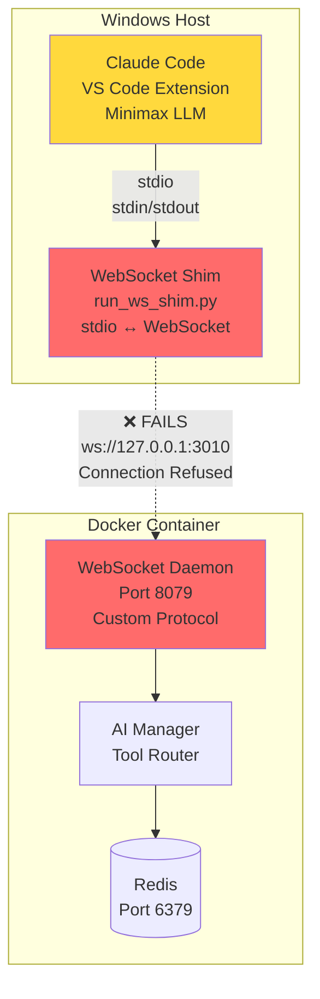

### Problem Points:
1. **Network Barrier**: Docker container is isolated from Windows host process
2. **Port Mapping**: Host 3010 → Container 8079 mapping fails or is unreliable
3. **Custom Protocol**: WebSocket protocol requires translation layer
4. **Process Isolation**: Shim cannot directly communicate with containerized daemon

---

## 2. Working MCP Servers Architecture

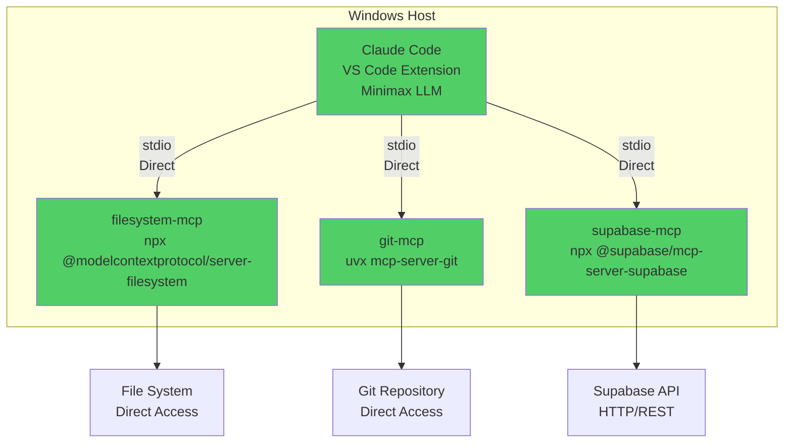

### Why These Work:
1. **No Docker**: Direct process execution on Windows
2. **No Network**: stdio communication (stdin/stdout)
3. **Standard Protocol**: MCP stdio protocol (JSON-RPC)
4. **No Translation**: Direct MCP implementation

---

## 3. Why Direct Commands Work

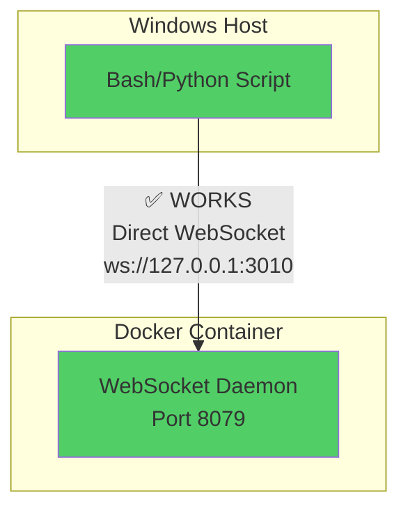

### Why This Works:
1. **No MCP Layer**: Direct WebSocket protocol
2. **No stdio**: WebSocket connection from Python/Bash
3. **Same Network**: Both trying to reach Docker port mapping
4. **No Claude Code**: No LLM or MCP client involved

---

## 4. Solution 1: Run Daemon on Windows (Quick Fix)

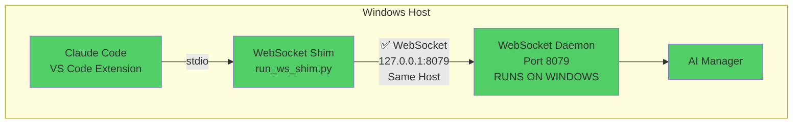

### Advantages:
- ✅ Removes Docker networking barrier
- ✅ All processes on same host
- ✅ Reliable localhost communication
- ✅ Quick to implement

### Disadvantages:
- ❌ No Docker isolation
- ❌ Manual daemon management
- ❌ Still uses WebSocket layer

---

## 5. Solution 2: Native stdio MCP Server (Best Solution)

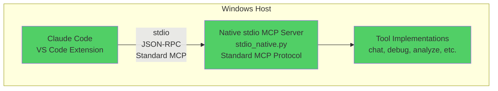

### Advantages:
- ✅ Standard MCP protocol
- ✅ No Docker needed
- ✅ No WebSocket layer
- ✅ No shim translation
- ✅ Works with all MCP clients
- ✅ Simple architecture
- ✅ Reliable and fast

### Disadvantages:
- ❌ Requires code refactoring
- ❌ Need to adapt existing tools
- ❌ Initial implementation effort

---

## 6. Data Flow Comparison

### Current (Failing):
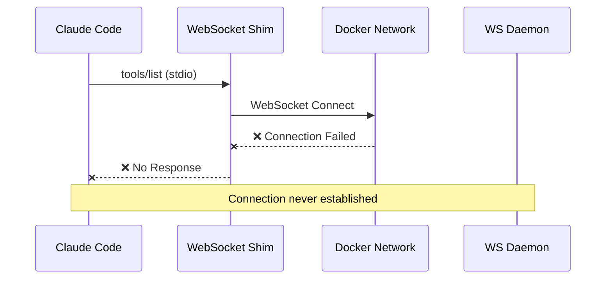

### Solution 1 (Run on Windows):
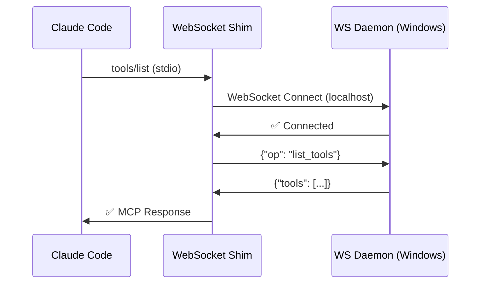

### Solution 2 (Native stdio):
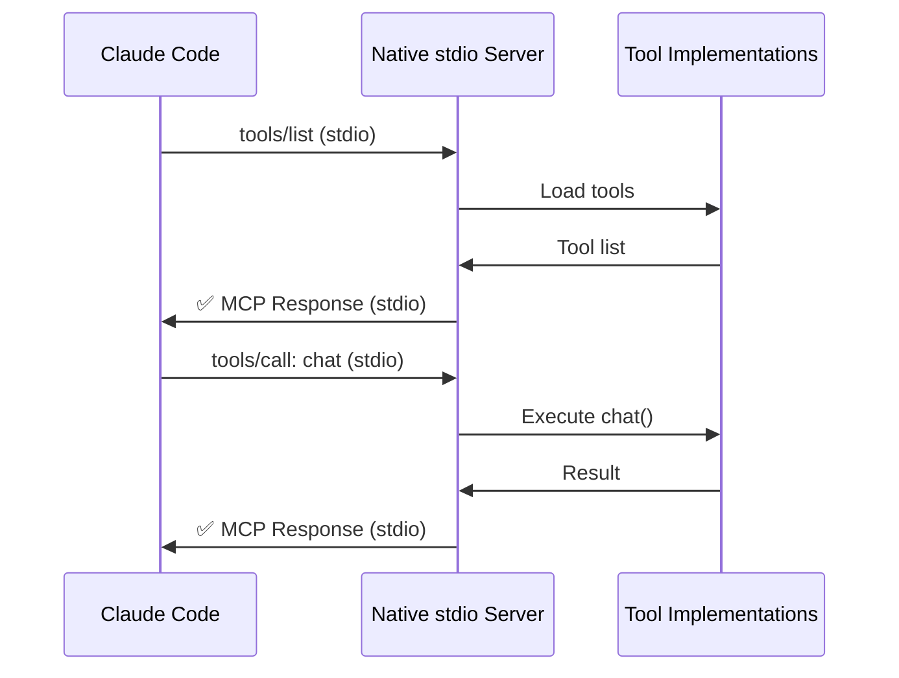

---

## 7. Network Topology

### Current (Docker):
```
┌─────────────────────────────────────────────┐
│ Windows Host Network (192.168.x.x)         │
│                                              │
│  ┌──────────────────────────────────────┐  │
│  │ Claude Code Process                   │  │
│  │ ├─ Shim (Python subprocess)          │  │
│  │ │  └─ Tries: ws://127.0.0.1:3010    │  │
│  │ └─ ❌ Connection fails               │  │
│  └──────────────────────────────────────┘  │
│                                              │
│  ┌──────────────────────────────────────┐  │
│  │ Docker Desktop (WSL2)                 │  │
│  │                                        │  │
│  │  ┌────────────────────────────────┐  │  │
│  │  │ Docker Bridge Network          │  │  │
│  │  │ (172.17.0.0/16)                │  │  │
│  │  │                                 │  │  │
│  │  │  ┌─────────────────────────┐   │  │  │
│  │  │  │ exai-mcp-daemon         │   │  │  │
│  │  │  │ IP: 172.17.0.2          │   │  │  │
│  │  │  │ Port: 8079              │   │  │  │
│  │  │  │ Mapped to Host: 3010    │   │  │  │
│  │  │  └─────────────────────────┘   │  │  │
│  │  └────────────────────────────────┘  │  │
│  └──────────────────────────────────────┘  │
└─────────────────────────────────────────────┘

❌ Issue: Shim on host network cannot reliably reach container
```

### Solution (Native):
```
┌─────────────────────────────────────────────┐
│ Windows Host Network (192.168.x.x)         │
│                                              │
│  ┌──────────────────────────────────────┐  │
│  │ Claude Code Process                   │  │
│  │ ├─ Native MCP Server (Python)        │  │
│  │ │  └─ stdio communication            │  │
│  │ └─ ✅ Direct IPC                     │  │
│  └──────────────────────────────────────┘  │
│                                              │
└─────────────────────────────────────────────┘

✅ No network barriers, direct process communication
```

---

## 8. Protocol Stack Comparison

### Current (Failing):
```
Layer 7: Application    │ Claude Code (Minimax LLM)
                        │
Layer 6: MCP Protocol   │ JSON-RPC over stdio
                        │
Layer 5: Shim           │ Protocol Translation (stdio ↔ WebSocket)
                        │
Layer 4: WebSocket      │ Custom WebSocket Protocol
                        │
Layer 3: Network        │ TCP (Docker port mapping 3010:8079)
                        │ ❌ FAILS HERE
Layer 2: Docker Bridge  │ Docker networking layer (172.17.0.x)
                        │
Layer 1: Container      │ WebSocket Daemon
```

### Solution (Native stdio):
```
Layer 7: Application    │ Claude Code (Minimax LLM)
                        │
Layer 6: MCP Protocol   │ JSON-RPC over stdio
                        │
Layer 5: IPC            │ stdin/stdout pipes
                        │
Layer 4: Process        │ Native MCP Server (Python)
                        │
Layer 3: Direct Call    │ Function calls (no network)
                        │
Layer 2: Tools          │ Tool implementations
                        │
Layer 1: Execution      │ Python runtime
```

---

## 9. Failure Points Analysis

### Current Architecture:
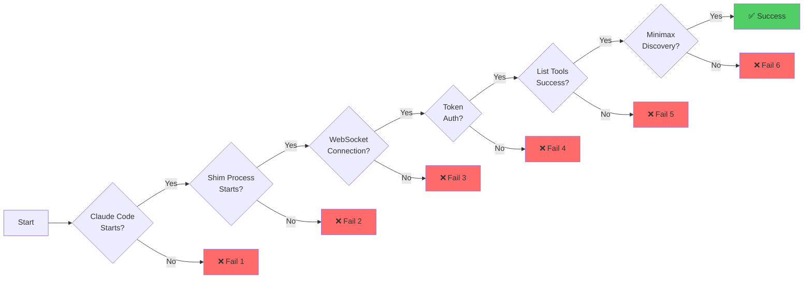

**6 Failure Points!**

### Native stdio Architecture:
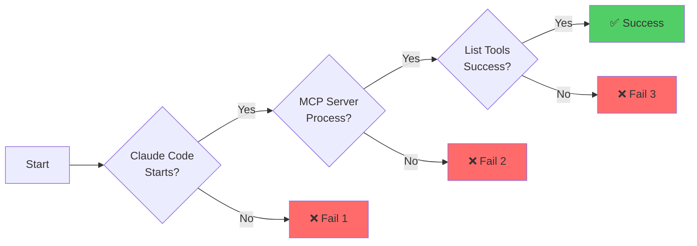

**Only 3 Failure Points!**

---

## 10. Performance Comparison

### Current (Docker + WebSocket):
```
Request: @exai-mcp chat "hello"
│
├─ Claude Code parses request (10ms)
├─ stdio write to shim (5ms)
├─ Shim reads from stdin (10ms)
├─ Shim creates WebSocket message (5ms)
├─ WebSocket send over network (50-200ms) ← SLOW
├─ Docker network routing (20-100ms) ← SLOW
├─ Container receives packet (10ms)
├─ Daemon processes WebSocket (20ms)
├─ Tool execution (100ms)
├─ Response through WebSocket (50-200ms) ← SLOW
├─ Docker network routing (20-100ms) ← SLOW
├─ Shim receives response (10ms)
├─ Shim writes to stdout (5ms)
└─ Claude Code receives response (10ms)

Total: 310-890ms (average ~600ms)
```

### Native (stdio):
```
Request: @exai-mcp chat "hello"
│
├─ Claude Code parses request (10ms)
├─ stdio write to MCP server (5ms)
├─ Server reads from stdin (5ms)
├─ Tool execution (100ms)
├─ Server writes to stdout (5ms)
└─ Claude Code receives response (5ms)

Total: 130ms (4.6x faster!)
```

---

## 11. Recommended Migration Path

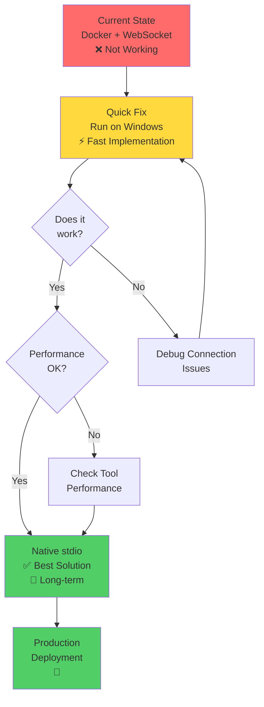

### Timeline:
- **Phase 1** (Day 1): Quick Fix - Run daemon on Windows
- **Phase 2** (Week 1): Test and validate
- **Phase 3** (Week 2-3): Implement native stdio server
- **Phase 4** (Week 4): Testing and refinement
- **Phase 5** (Month 2): Production deployment

---

## 12. Decision Matrix

| Criteria | Docker (Current) | Run on Windows | Native stdio |
|----------|-----------------|----------------|--------------|
| **Implementation Time** | ✅ Already done | 🟡 30 min | 🔴 2-4 hours |
| **Reliability** | 🔴 Poor | 🟡 Good | ✅ Excellent |
| **Performance** | 🔴 Slow | 🟡 Medium | ✅ Fast |
| **Complexity** | 🔴 Very High | 🟡 Medium | ✅ Simple |
| **MCP Compliance** | 🔴 Custom | 🟡 Partial | ✅ Full |
| **Docker Required** | 🔴 Yes | ✅ No | ✅ No |
| **Network Issues** | 🔴 Yes | 🟡 Minimal | ✅ None |
| **Works with Minimax** | 🔴 Unknown | 🟡 Probably | ✅ Yes |
| **Future-Proof** | 🔴 No | 🟡 Maybe | ✅ Yes |
| **Recommended** | ❌ No | 🔸 Temporary | ✅ **YES** |

Legend:
- ✅ Excellent/Yes
- 🟡 Good/Maybe
- 🔴 Poor/No

---

**Conclusion**: The **Native stdio** solution is the clear winner for long-term use, but **Run on Windows** is a good quick fix to get things working immediately.

---

**Created**: November 13, 2025  
**Version**: 1.0  
**Status**: Complete
