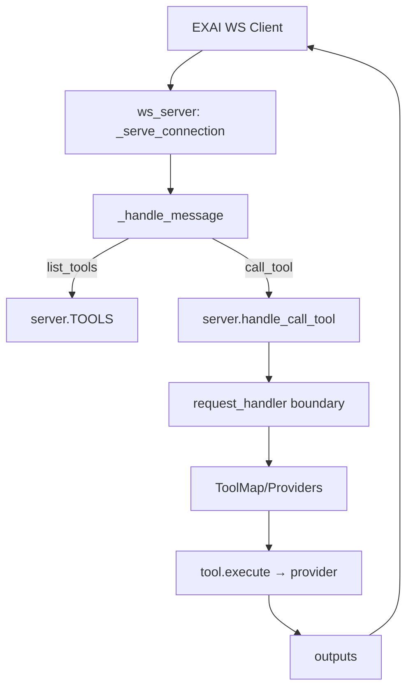
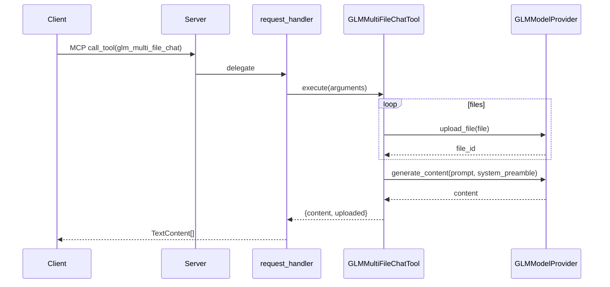

# EX-AI MCP Server: Execution Flow and Dependencies (GLM/Z.ai Focus)

Last updated: {{today}}

## Scope
- Entry points from external clients to response delivery (stdio MCP and WS daemon)
- Inter-script dependencies (imports/calls) along the critical path
- GLM/Z.ai flows: glm_multi_file_chat, glm_agent_* and glm_web_search
- Cleanup preparation: critical vs legacy/duplicate vs orphaned vs dev-only
- Staging strategy for safe removals

---

## 1) Entry Point Analysis

### 1.1 Stdio MCP Path (primary)
1) server.py
   - setup_logging() → initialize loggers (metrics, router, toolcalls)
   - Server("EX MCP Server") → registers MCP handlers
   - register_provider_specific_tools() → optional GLM/Kimi tools
   - main() → configure_providers() → filter_disabled_tools/filter_by_provider_capabilities → stdio_server() → server.run(...)
2) MCP handlers in server.py
   - list_tools_handler() → src/server/handlers/mcp_handlers.list_tools
   - call_tool_handler(name,args)
     - _ensure_providers_configured() (idempotent)
     - register_provider_specific_tools() (best-effort)
     - handle_call_tool(name,args) → src/server/handlers/request_handler.handle_call_tool
   - list_prompts_handler / get_prompt_handler → src/server/handlers/mcp_handlers
3) Request boundary: src/server/handlers/request_handler.handle_call_tool
   - Builds tool registry via src/server/registry_bridge
   - Tool routing: model auto-selection, thinking rules, fallbacks
   - Provider availability check via src/providers/registry.ModelProviderRegistry
   - Creates ModelContext and applies file-size checks
   - Executes tool.execute(arguments) with watchdog + heartbeats
   - Optional auto-continue for workflow tools; attaches progress

Result: returns list[mcp.types.TextContent] back to Server.run → client.

### 1.2 WebSocket Daemon Path (secondary channel)
1) src/daemon/ws_server.py
   - websockets.serve(_serve_connection, host, port)
   - Hello/ACK, token auth, session manager, capacity semaphores
2) Message handling
   - op=list_tools → reads server.TOOLS and returns descriptors
   - op=call_tool → normalizes name → ensures providers/tools → looks up server.TOOLS → delegates to server.handle_call_tool (same core path as stdio) with progress heartbeats, duplicate coalescing, global/provider/session concurrency guards

Result: emits {op:"call_tool_res", outputs:[...]} to the WS client.

---

## 2) Script Interconnection Mapping (imports/calls)

Legend: A → B means "A imports or calls B".

- server.py
  - → src/server/providers/provider_config.configure_providers
  - → src/server/handlers.{mcp_handlers,request_handler}
  - → src/server/tools.{filter_disabled_tools,filter_by_provider_capabilities}
  - → tools.* classes for base tools (ChatTool, AnalyzeTool, ...)
  - → register_provider_specific_tools() dynamically imports:
    - tools/providers/glm/{glm_files.py, glm_agents.py, glm_web_search.py}
    - tools/providers/kimi/* (if available)

- src/server/handlers/request_handler.py
  - → src/server/registry_bridge.get_registry (tool discovery)
  - → src/providers/registry.ModelProviderRegistry (model/provider resolution, fallbacks)
  - → config.DEFAULT_MODEL, src/server/utils, utils.progress, utils.file_utils, utils.model_context
  - → tools.models.ToolOutput (error envelopes)

- src/providers/registry.py (central registry)
  - → src/providers/base.{ModelProvider,ProviderType}
  - → utils.health, utils.metrics, utils.observability, utils.model_restrictions
  - Provides: register_provider, get_provider, get_provider_for_model, get_available_models, cost-aware ordering, telemetry

- src/server/providers/provider_config.py
  - Detects API keys/env → registers concrete providers with ModelProviderRegistry
  - Registers GLMModelProvider (src/providers/glm.py), KimiModelProvider, Custom, OpenRouter

- src/providers/glm.py (GLMModelProvider)
  - Prefers zhipuai SDK; falls back to utils.http_client.HttpClient
  - Endpoints (HTTP fallback):
    - POST /chat/completions
    - POST /files (multipart upload)

- tools/providers/glm/glm_files.py
  - GLMUploadFileTool.run → GLMModelProvider.upload_file → returns file_id (with FileCache reuse)
  - GLMMultiFileChatTool.run → uploads N files, builds system preamble, calls GLMModelProvider.generate_content

- tools/providers/glm/glm_agents.py
  - Direct requests to Z.ai Agents API:
    - POST /v1/agents
    - POST /v1/agents/async-result
    - POST /v1/agents/conversation

- tools/providers/glm/glm_web_search.py
  - Direct requests to Z.ai Web Search:
    - POST /api/paas/v4/web_search

- src/daemon/ws_server.py
  - Reuses server.TOOLS, server.register_provider_specific_tools, and server.handle_call_tool

---

## 3) GLM/Z.ai Component Flows

### 3.1 glm_multi_file_chat (tools/providers/glm/glm_files.py)
Flow:
- MCP call → request_handler.handle_call_tool → ToolMap["glm_multi_file_chat"].execute
- GLMMultiFileChatTool.run:
  1) For each file: GLMUploadFileTool.run → ModelProviderRegistry.get_provider_for_model(model) → GLMModelProvider.upload_file
     - SDK path (if available) else HTTP multipart POST {GLM_API_URL}/files → returns file_id
  2) Build system message listing uploaded filenames (and ids)
  3) Resolve GLM provider (registry) → GLMModelProvider.generate_content(prompt, model, system_prompt)
     - SDK: client.chat.completions.create(...)
     - HTTP: POST {GLM_API_URL}/chat/completions
- Returns {model, content, uploaded[]} → request_handler normalizes to TextContent

Auth: Bearer GLM_API_KEY. Base URL: GLM_API_URL or default https://api.z.ai/api/paas/v4.

### 3.2 glm_agent_* (tools/providers/glm/glm_agents.py)
Flow:
- Direct HTTP (requests) calls, no ModelProvider abstraction:
  - glm_agent_chat → POST {GLM_AGENT_API_URL or https://api.z.ai/api/v1}/agents
  - glm_agent_get_result → POST .../agents/async-result
  - glm_agent_conversation → POST .../agents/conversation
- Returns raw JSON text in TextContent for caller parsing.

### 3.3 glm_web_search (tools/providers/glm/glm_web_search.py)
Flow:
- Direct HTTP (requests) to POST {GLM_WEBSEARCH_BASE or https://api.z.ai/api/paas/v4}/web_search
- Returns raw JSON text with search_result list

---

## 4) Cleanup Preparation (categorization)

- Critical Path
  - server.py (MCP entry + handler registration)
  - src/server/handlers/{mcp_handlers.py, request_handler.py}
  - src/server/providers/provider_config.py
  - src/providers/{base.py, registry.py}
  - src/providers/glm.py (GLM provider)
  - tools/providers/glm/{glm_files.py, glm_agents.py, glm_web_search.py}
  - src/daemon/ws_server.py (if WS shim is used)

- Likely Legacy/Duplicate (verify before removal)
  - providers.py (repo root): appears to be an older/alternate abstraction; server.py relies on src/providers/* now. Action: verify imports; if unused, deprecate.
  - src/providers/zhipu/ (if present) — verify usage; src/providers/glm.py seems to supersede it.

- Orphaned/Low-Use (verify callers)
  - src/server/fallback_orchestrator.py: referenced in comments/logs; not explicitly imported on hot path
  - tools/providers/glm/glm_files_cleanup.py: CLI-style maintenance; not part of production requests

- Dev/Testing Only
  - tools/providers/glm/glm_files_cleanup.py (account hygiene/cleanup scripts)
  - Any ad-hoc scripts under docs/, scripts/ (not on critical runtime path)

Notes: mark “verify” items with a quick ripgrep/import graph before deletion.

---

## 5) Staging Strategy for Safe Removals

- Phase 1 (No behavior change; disable surface)
  - Remove registrations/exports of clearly dev-only tools from any central registries (none currently auto-registered).
  - Add a DEPRECATED header to providers.py (root) and src/providers/zhipu/* (if unused). Keep files committed but not referenced.
  - CI gate: run unit tests and a smoke MCP stdio handshake + list_tools.

- Phase 2 (Consolidation)
  - If providers.py (root) is confirmed unused, delete it; ensure all imports point to src/providers/*.
  - If src/providers/zhipu/* is unused, delete it; ensure GLM provider only lives in src/providers/glm.py.
  - Normalize GLM base URLs/envs: ensure GLM_API_URL is the single source, aliases (ZHIPUAI_API_URL, ZAI_API_KEY) remain supported.

- Phase 3 (Refinements)
  - Consider unifying glm_agent_* into a thin adapter layer under src/providers if you want provider-mediated auth/telemetry.
  - Optional: Merge duplicate http wrappers (requests → utils.http_client) for consistency.
  - Remove src/server/fallback_orchestrator.py if verified unused by grep/tests.

Validation after each phase:
- stdio: ex-mcp-server list_tools, call_tool=version, call_tool=chat with a trivial prompt (model=glm-4.5-flash)
- WS: optional shim smoke (hello → list_tools → call_tool=version)
- GLM: run glm_upload_file (small file), glm_multi_file_chat, glm_web_search; for agents, run glm_agent_chat against a known agent_id (if available)

---

## 6) Diagrams (Mermaid)

### 6.1 Stdio MCP (entry → response)
```mermaid
graph TD
  A[VSCode MCP Client]-->B[scripts/run_ws_shim.py]
  B-->C[mcp.server (stdio) → ws client]
  C-->D[WS Daemon: src/daemon/ws_server.py]
  D-->E[Server handlers]
  E--list_tools/get_prompt-->F[src/server/handlers/mcp_handlers]
  E--call_tool(name,args)-->G[src/server/handlers/request_handler]
  G-->H[registry_bridge → ToolMap]
  G-->I[ModelProviderRegistry]
  I-->J[GLM/Kimi/Custom Providers]
  G-->K[tool.execute(arguments)]
  K-->L[Provider HTTP/SDK]
  L-->M[TextContent[]]
  M-->A
```

### 6.2 WS Daemon (shim)


### 6.3 GLM Multi-file Chat


---

## 7) Observations / Risks
- Two GLM base families: /api/paas/v4 (chat, web_search, files) vs /api/v1 (agents). Ensure env vars cover both (GLM_API_URL, GLM_AGENT_API_URL, GLM_WEBSEARCH_BASE).
- Mixed HTTP stacks (httpx in utils.HttpClient vs requests in GLM tools). Consider standardizing on one.
- Root-level providers.py and any src/providers/zhipu/* look redundant next to src/providers/glm.py → candidate for removal after verification.

---

## 8) Next Actions
- Confirm orphan status by searching imports of providers.py and src/providers/zhipu/*.
- If orphaned, proceed with Phase 1/2 plan.
- Add unit smoke scripts to validate stdio list_tools + minimal call_tool on GLM.

