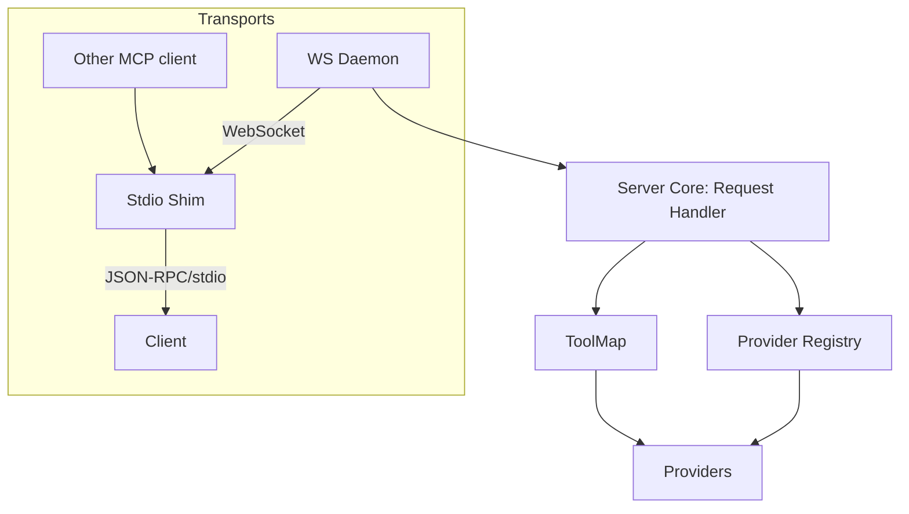

# Server Transports Overview (WS Daemon + Stdio Shim)

## TL;DR
- Primary entry: WebSocket daemon on loopback (ws://127.0.0.1:<port>), single instance; handles multi-client concurrency and backpressure.
- Compatibility: A small stdio shim runs per client and forwards to the daemon. MCP clients see a normal stdio server.

## Clean mental model
- Transport adapters (stdio shim, WS server) call the same server core boundary: src/server/handlers/request_handler.handle_call_tool.
- Tools + Provider registry remain transport-agnostic.

## File map (key)
- src/daemon/ws_server.py   # WebSocket daemon
- scripts/run_ws_daemon.py  # Launch daemon
- scripts/run_ws_shim.py    # MCP stdio shim → connects to WS daemon
- docs/architecture/ws_daemon/*  # Design, runbook, examples

## Why this way (not inverted)?
- Avoid double serialization/stdio loopbacks and extra process lifecycle.
- Centralize concurrency/backpressure in one place (daemon) instead of replicating in stdio servers per window.
- Keep adapters thin; keep core logic shared.

